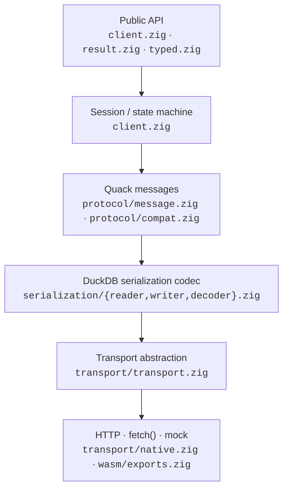
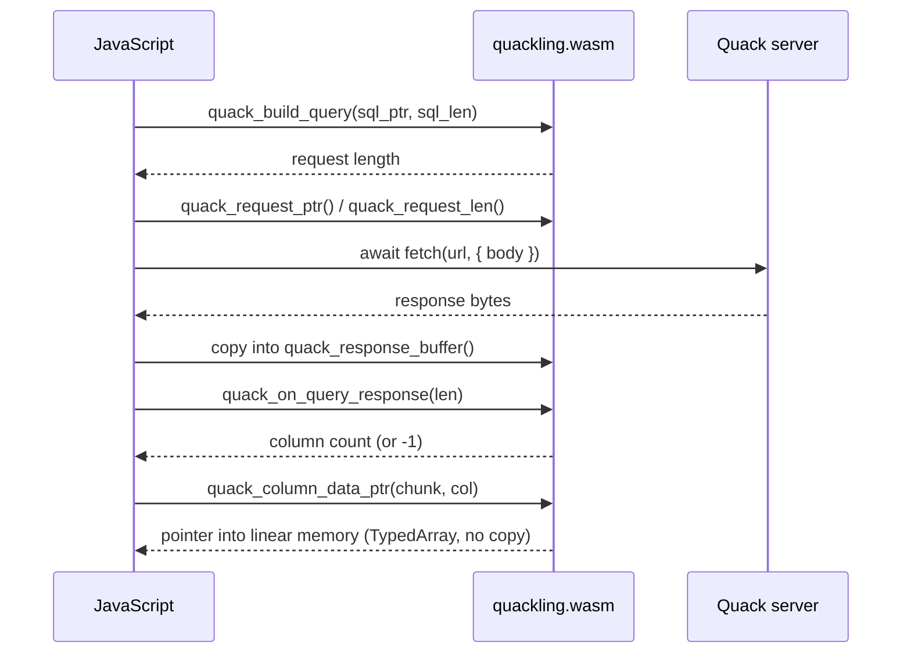
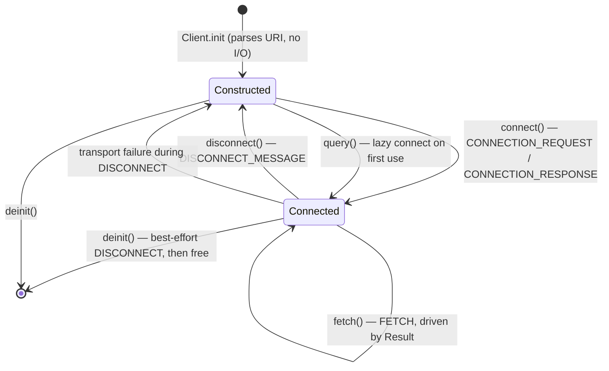
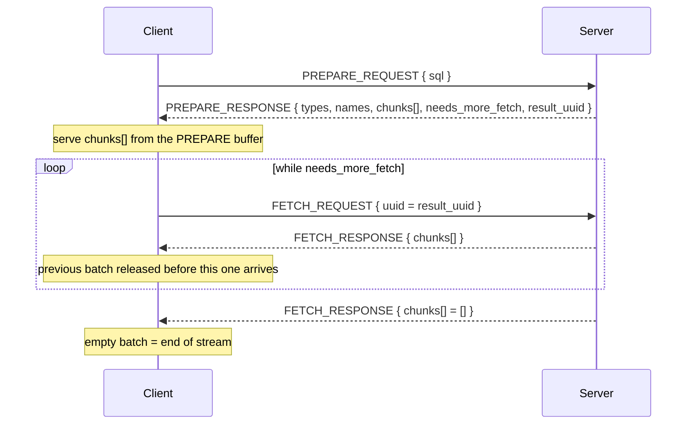

# Quackling Architecture

**English** · [日本語](../ja/ARCHITECTURE.md)
→ [Documentation index](./README.md)

This document describes how Quackling is put together: the layering rule that
makes a `wasm32-freestanding` build possible, the session state machine, the
single-cursor correctness property behind `error.ResultSuperseded`, memory
ownership, the error taxonomy, and the extension points.

The wire format itself is a separate document: [`PROTOCOL.md`](./PROTOCOL.md).

---

## 1. The layering rule

**Each layer depends only on the layer below it. The protocol core never touches
a socket.**



The same diagram in the plain form used by the [README](../../README.md):

```
             Public API          client.zig, result.zig, typed.zig
                  ↓
        Session / state machine  client.zig
                  ↓
            Quack messages       protocol/message.zig, protocol/compat.zig
                  ↓
     DuckDB serialization codec  serialization/{reader,writer,decoder}.zig
                  ↓
       Transport abstraction     transport/transport.zig
                  ↓
      HTTP · fetch() · mock      transport/native.zig, src/wasm/exports.zig
```

### Why the rule exists

Everything from `protocol/` downwards is *pure computation over byte slices*.
Given `[]const u8` in, it produces decoded values or a typed error. It performs
no syscalls, opens no descriptors, spawns no threads, and links no libc.

That is not an aesthetic preference — it is the precondition for the WASM build.
A `wasm32-freestanding` target has no OS, no sockets, no filesystem and no libc.
If the decoder called into `std.net` or `std.http` anywhere, the module would
simply not compile for that target. Because I/O is *injected* instead, the same
decoder source serves native Linux/macOS/Windows, WASI, and a browser tab where
JavaScript performs `fetch()`. `build.zig` states this in the module comment for
the `quackling` module ([`../../build.zig:9`](../../build.zig)).

### What enforces it

Nothing in Zig marks a module as "no I/O", so the rule is enforced structurally
and mechanically rather than by convention alone:

| Mechanism | Where | Effect |
|---|---|---|
| Import direction | `src/protocol`, `src/serialization`, `src/types` import only each other and `std` | An upward import would be visible in a one-line `grep` of the import block |
| Conditional export | [`../../src/root.zig:55`](../../src/root.zig) | `NativeTransport` is a `@compileError` on wasm targets, so a wasm consumer cannot even name it |
| Single socket-aware file | [`../../src/transport/native.zig`](../../src/transport/native.zig) | Its own header states it is "the only place in the library that knows sockets exist"; the protocol core never imports it |
| `zig build check` | [`../../build.zig:47`](../../build.zig) | Builds the library *only* (no CLI), so it can be compiled for any target — including ones where the CLI cannot exist |
| `zig build wasm` | [`../../build.zig:214`](../../build.zig) | Compiles `src/wasm/exports.zig` for `wasm32-freestanding` with `entry = .disabled`. A native-only dependency anywhere below the API layer fails this step |

The second half of the rule appears as design constraint 1 in the README: the
core library depends on nothing *above* it either. The CLI
([`../../src/cli/main.zig`](../../src/cli/main.zig)) and the WASM bridge are both
*consumers* of the `quackling` module — `build.zig` wires them with
`.imports = &.{ .{ .name = "quackling", .module = quackling } }`, the same way an
external project would.

---

## 2. The `src/` tree

```
src/
├── root.zig            public surface: re-exports, nothing else
├── client.zig          connection identity + session state machine
├── result.zig          streaming cursor (chunks, rows, scalar, drain)
├── typed.zig           comptime struct mapping over a Result
├── params.zig          client-side `?` binding with strict escaping
├── pool.zig            mutex-guarded connection pool + Lease
├── uri.zig             quack:/http:/https: parsing + validation
├── error.zig           error taxonomy (the error sets, and ErrorInfo)
├── stats.zig           Stats counters + the Observer hook
├── protocol/
│   ├── message.zig     MessageType, MessageHeader, request/response bodies
│   └── compat.zig      every protocol constant, in one file
├── serialization/
│   ├── reader.zig      bounds-checked primitive decoding + Limits
│   ├── writer.zig      primitive encoding into a caller-owned ArrayList
│   └── decoder.zig     LogicalType / Vector / DataChunk + their field ids
├── types/
│   ├── logical_type.zig  LogicalTypeId wire enum, fixedWidth(), ExtraTypeInfo
│   ├── value.zig         flat Value union (ergonomic path)
│   ├── vector.zig        Vector, VectorType, Storage (vectorized path)
│   ├── data_chunk.zig    DataChunk, Row, RowIterator
│   └── validity.zig      ValidityMask over borrowed wire bytes
├── transport/
│   ├── transport.zig   Transport vtable + Request/Response + CancelToken + MockTransport
│   └── native.zig      std.http.Client (the only socket-aware file)
├── cli/main.zig        quackling — a consumer, not a special case
└── wasm/exports.zig    browser FFI: JS supplies fetch(), Zig decodes
```

Notes worth reading off the tree:

- `root.zig` contains no logic. It re-exports the public names and, in its
  `test` block, explicitly `_ = @import(...)`s every module so `zig build test`
  actually runs each file's tests ([`../../src/root.zig:91`](../../src/root.zig)).
- Layered modules are re-exported under `serialization` and `protocol`
  namespaces for advanced use and testing, so a caller can drive the codec
  directly without a client.
- `params.zig` sits at the API layer, not in `protocol/`: Quack v1 has no wire
  format for parameters, so binding is a SQL-text transformation performed
  *before* a message is built.

---

## 3. Dependency injection of `Transport`

### The interface

`Transport` is a runtime vtable, not a comptime interface
([`../../src/transport/transport.zig:86`](../../src/transport/transport.zig)):

```zig
pub const Transport = struct {
    ptr: *anyopaque,
    vtable: *const VTable,

    pub const VTable = struct {
        send: *const fn (ptr: *anyopaque, allocator: std.mem.Allocator, req: Request) Error!Response,
        close: ?*const fn (ptr: *anyopaque) void = null,
    };

    pub fn send(self: Transport, allocator: std.mem.Allocator, req: Request) Error!Response { ... }
    pub fn close(self: Transport) void { ... }
};
```

One required method: one request in, one response out. `close` is optional and
defaults to null.

The vtable choice is deliberate, and the file says why: a comptime interface
would make `Client` generic over its transport, and that type parameter would
then leak into every downstream signature (`Result`, `RowStream`, `Pool`,
`Lease`). A vtable also lets a caller select a transport at *runtime*.

`Request` and `Response`:

```zig
pub const Request = struct {
    url: []const u8,
    body: []const u8,
    content_type: []const u8,
    headers: []const Header = &.{},
    timeout_ms: ?u32 = null,
    cancel: ?*CancelToken = null,
};

pub const Response = struct {
    status: u16,
    body: []const u8,
    owned: bool = false,

    pub fn deinit(self: *Response, allocator: std.mem.Allocator) void { ... }
};
```

`Response.owned` is the lifetime contract, made explicit
([`../../src/transport/transport.zig:74`](../../src/transport/transport.zig)). A
transport that can hand back a borrowed view of its own buffer sets
`owned = false` and copies nothing; one that allocates sets `owned = true` and
the caller frees. Section 5 explains why this single bit is what keeps the whole
decode path zero-copy.

### Why the library never opens a socket

`Client.Options.transport` is a required field with no default
([`../../src/client.zig:35`](../../src/client.zig)) — you cannot construct a
`Client` without supplying one. There is no "default transport" fallback, and
therefore no code path in which the core library reaches for the network on its
own. Three consequences:

1. The core compiles for targets that have no network stack at all.
2. Tests need no server (below).
3. A caller with an existing event loop supplies their own `std.Io`; nothing is
   imposed. `NativeTransport.initWithIo(allocator, io, .{})` is that seam
   ([`../../src/transport/native.zig:50`](../../src/transport/native.zig)).

### `NativeTransport`

The only socket-aware file. Built on `std.http.Client` — pure Zig standard
library, no libcurl, no C dependency. It owns a `std.Io.Threaded` only when it
created one itself (`owned_io`), maps `std.http` errors into the flat
`transport.Error` set via `mapError`, checks the cancel token both before
connecting and after the fetch returns, and enforces
`Options.max_response_bytes` before handing the body back.

### `MockTransport` — server-free tests

`MockTransport` ([`../../src/transport/transport.zig:110`](../../src/transport/transport.zig))
replays canned response bodies in order:

```zig
var mock = quackling.MockTransport{ .responses = &.{ connect_reply, prepare_reply } };
defer mock.deinit();

var client = try quackling.Client.init(.{
    .allocator = allocator,
    .endpoint = "quack:localhost:9494",
    .token = "t",
    .transport = mock.transport(),
});
defer client.deinit();
```

Its fields are the whole testing surface:

| Field | Purpose |
|---|---|
| `responses: []const []const u8` | One body handed out per `send` call; a call past the end returns `error.NetworkError` |
| `status: u16 = 200` | HTTP status returned alongside each body, for exercising the non-2xx path |
| `sent` + `record_allocator` | Captures each request body, so a test can assert on the bytes actually encoded |
| `fail_with: ?Error` | Makes `send` return that error instead of a response, for transport-failure paths |

Because it returns `owned = false` (the fixture outlives the response), the mock
also exercises the borrowed-buffer path rather than a copy — the same path a
zero-copy transport takes. This is what lets the handshake, error
classification, multi-batch FETCH, cancellation, and statistics all be covered
without DuckDB running: `zig build test` includes `tests/client_test.zig` for
exactly that ([`../../build.zig:102`](../../build.zig)).

### The browser `fetch()` bridge

[`../../src/wasm/exports.zig`](../../src/wasm/exports.zig) is the browser end of
the same idea, but arranged for an environment where I/O is *asynchronous and
outside the module*. Rather than implementing a `Transport` vtable whose `send`
would have to block, it splits the round trip into two halves and lets
JavaScript own the middle:



The boundary is narrow by design: JS moves bytes in and out of linear memory and
never sees JSON. Freestanding wasm has no allocator of its own, so the module
carves fixed-size regions out of linear memory — a 16 MiB
`std.heap.FixedBufferAllocator` for decoding, plus separate request, encode,
input and response buffers — giving the module a predictable footprint that
cannot grow without bound in a tab. `fba.reset()` on each new query response is
the whole deallocation strategy.

---

## 4. The session state machine

A `Client` is one logical Quack connection. It holds no global state, so many
can coexist in one process.



### `init` does no I/O

`Client.init` parses the endpoint and allocates the request URL; that is all
([`../../src/client.zig:77`](../../src/client.zig)). This matters for `Pool`:
`acquire` can create a `Client` *while holding the pool mutex* precisely because
construction performs no network work
([`../../src/pool.zig:228`](../../src/pool.zig)).

### Lazy connect on first query

`queryWithCancel` begins with:

```zig
if (!self.isConnected()) try self.connect(cancel);
```

([`../../src/client.zig:190`](../../src/client.zig)). Calling `connect`
explicitly is optional and idempotent — `connect` returns immediately if already
connected.

### Handshake

`connect` encodes a `CONNECTION_REQUEST` carrying the auth token plus the client
version/platform strings and the supported version range from `compat.zig`, and
then:

1. Decodes the `MessageHeader`. An `ERROR_RESPONSE` here is classified (below);
   any other type is `error.UnexpectedMessageType`.
2. Range-checks `body.quack_version` against
   `compat.min_supported_version`/`max_supported_version` — **both** bounds, so a
   server *below* the supported range is rejected rather than accepted
   ([`../../src/client.zig:145`](../../src/client.zig)).
3. Requires a non-empty `header.connection_id`. The session id travels in the
   *header*, not the body ([`../../src/client.zig:151`](../../src/client.zig)).
4. Duplicates `connection_id`, `server_duckdb_version` and `server_platform`
   into client-owned memory — the response buffer is freed at the end of the
   call, so these cannot be borrowed.

### Session id

`connection_id` *is* the session. `isConnected()` is literally
`self.connection_id.len > 0`, and every post-handshake message carries it in its
header (`PREPARE_REQUEST`, `FETCH_REQUEST`, `DISCONNECT_MESSAGE`).

### What invalidates a session

| Event | Effect on the session |
|---|---|
| `disconnect()` | `connection_id` freed and cleared → back to Constructed. A subsequent `query()` lazily reconnects with a *new* session id |
| Transport failure inside `disconnect()` | Session dropped locally anyway, then the error is returned — teardown is best-effort ([`../../src/client.zig:167`](../../src/client.zig)) |
| Transport failure elsewhere | `connection_id` is *not* cleared: the client still believes it is connected. Retrying reuses the same session id, which is correct when the failure was transient. A caller that suspects desync should `disconnect()`, or `Lease.discard()` if pooled |
| `deinit()` | Best-effort `disconnect()` (errors swallowed), then everything owned is freed |
| Server-side session loss | Surfaces as a `ServerError` on the next request, carrying the server's text in `lastError()` |

Note that a *new query* does **not** invalidate the session — it invalidates the
*result cursor*. That is a different property, and it is the subject of the next
section.

### Error classification at the session layer

The server reports a bad token as an ordinary `ERROR_RESPONSE`, so the only
available signal is the message text. `isAuthMessage`
([`../../src/client.zig:353`](../../src/client.zig)) matches, case-insensitively,
`"authenticat"`, `"invalid token"` or `"unauthorized"`, and maps a hit to
`error.AuthenticationFailed` instead of `error.ServerError`. The matching is
deliberately narrow: a false negative merely reports `ServerError`, which is
still accurate. The verbatim server text is always preserved in
`Client.lastError()`.

`roundTrip` classifies at the transport layer: a non-2xx status records
`last_error.http_status` and returns `error.HttpError`; a body over
`options.max_response_bytes` returns `error.ResponseTooLarge`. Both increment
`stats.transport_errors`.

---

## 5. The single-cursor constraint and `error.ResultSuperseded`

This is a real correctness property, not an ergonomic restriction, so it is
worth stating precisely.

### The protocol fact

A Quack connection has **exactly one server-side result cursor**. The server
resets it (`duckdb_query_result.reset()`) as soon as it *accepts* a
`PREPARE_REQUEST` — **before** it runs the SQL. So the previous cursor is gone
even if the new query then fails.

### What would go wrong without a guard

A `FETCH_REQUEST` names a `result_uuid`, but the cursor it advances is the
connection's *current* one. If a stale `Result` were allowed to keep fetching
after a second query had been issued, the client would advance the new query's
cursor and hand the caller rows from the wrong query — with correct-looking types
and no error anywhere. Silent data corruption, in other words. This is one of the
defects the README records as found by mutation testing: *"Result not invalidated
by a new query — a stale result silently streamed the next query's rows."*

### The mechanism

A monotone generation counter, compared at FETCH time.

`Client.query_generation` starts at 0 and is incremented in `queryWithCancel`
immediately after the `PREPARE_REQUEST` is encoded and **before** the round trip
completes ([`../../src/client.zig:202`](../../src/client.zig)):

```zig
self.query_generation += 1;
```

The placement is the subtle part, and the source comment spells out why: the
server discards the old cursor when it *accepts* the PREPARE, so bumping on
success would leave an older `Result` looking valid after a *failed* query whose
cursor no longer exists.

Each `Result` records the generation it was born with
([`../../src/result.zig:99`](../../src/result.zig)):

```zig
.generation = client.query_generation,
```

and `fetchNextBatch` checks it before every FETCH
([`../../src/result.zig:177`](../../src/result.zig)):

```zig
if (self.generation != self.client.query_generation) {
    self.finished = true;
    return errors.ProtocolError.ResultSuperseded;
}
```

The result also marks itself `finished`, so a caller who ignores the error does
not get a second chance to read the wrong rows.

### What a caller sees

```zig
var a = try client.query("SELECT * FROM big");
var b = try client.query("SELECT 1");   // discards a's cursor server-side
_ = try a.nextChunk();                  // error.ResultSuperseded
```

Two important boundary cases:

- Chunks **already in hand** stay readable. The generation is only consulted when
  a *new* FETCH is required, and the already-decoded batch borrows a response
  buffer that `a` still owns. Only crossing into new server state fails.
- A result whose rows all arrived inside the `PREPARE_RESPONSE`
  (`needs_more_fetch == false`) never triggers this, because it never issues a
  FETCH. Small results are unaffected by a subsequent query.

The remedies are: finish or `deinit` a result before the next query, or give each
concurrent query its own connection via [`Pool`](#10-concurrency-model).

---

## 6. Memory ownership and lifetimes

The central rule: **bulk payloads are borrowed from the response buffer; only
the small structural spine is owned.**

### Who owns what

| Data | Ownership | Freed by |
|---|---|---|
| HTTP response body | Owned by the transport's caller when `Response.owned == true`; borrowed when false | `Response.deinit(allocator)` |
| Fixed-width vector payload (`Storage.fixed`) | **Borrowed** — a slice of the response body | nobody |
| String/blob bytes (`Value.varchar`, `.blob`, `Enum.label`) | **Borrowed** | nobody |
| Validity mask bytes | **Borrowed** — `ValidityMask.bytes` points at the wire bytes | nobody |
| Column names (`Result.names[i]`) | **Borrowed** from the PREPARE response body | nobody |
| `MessageHeader.connection_id` (as decoded) | **Borrowed** — hence `Client` dupes it at handshake | nobody |
| The `[]const []const u8` string-slice table | Owned by the `Vector` | `Vector.deinit` |
| Dictionary index arrays, child vectors, LIST entries | Owned by the `Vector` | `Vector.deinit` |
| `DataChunk.columns`, `DataChunk.types` | Owned by the `DataChunk` | `DataChunk.deinit` |
| `PrepareResponse.types/names/chunks` spines | Owned by the `PrepareResponse` | `PrepareResponse.deinit` |
| `Client.url`, `connection_id`, `server_version`, `server_platform`, `send_buf` | Owned by the `Client` | `Client.deinit` |
| `ErrorInfo.message` | Owned when `allocator` is set | `ErrorInfo.deinit` |

One subtlety inside nested types: a `Vector`'s `type` field is **borrowed, not
owned**. The `DataChunk` owns the whole column type tree, and child vectors of a
STRUCT/LIST/MAP share sub-trees of it
([`../../src/types/vector.zig:80`](../../src/types/vector.zig)). A vector that
freed its own type would double-free those shared children. Keeping type
ownership in exactly one place is what makes nested types safe to free once.

### The consequence: a chunk is valid until the next `nextChunk`

`nextChunk` returns `?*const DataChunk` — a pointer into the `Result`'s current
batch. `fetchNextBatch` calls `releaseFetch()` *before* issuing the next FETCH
([`../../src/result.zig:189`](../../src/result.zig)), which frees the previous
batch's response buffer. Every borrowed slice inside the old chunk dangles from
that moment.

So: **consume or copy a chunk before calling `nextChunk` again.**

```zig
while (try result.nextChunk()) |chunk| {
    const col = chunk.column(0).?;

    if (col.asSlice(i64)) |slice| {
        // Truly zero-copy: `slice` aliases the response buffer.
        for (slice) |v| consume(v);
    } else if (col.isFlat(i64)) {
        // Wire payloads carry no alignment guarantee; `at` is always safe.
        for (0..chunk.row_count) |i| consume(col.at(i64, i).?);
    }
}
```

`asSlice(T)` returns null unless the vector is a flat run of `T` *and* the
borrowed bytes happen to be aligned for `T`; payload offsets depend on the
varint lengths that precede them, so alignment is luck. Treat a non-null
`asSlice` as an optimisation and `at()`/`copySlice()` as the normal path
([`../../src/types/vector.zig:187`](../../src/types/vector.zig)). Neither
consults the validity mask — check `Vector.isNull(i)` alongside.

Deliberately released *late*, by contrast, is the PREPARE response: `Result`
holds `prepare_response` for its entire lifetime because `types` and `names`
point into it ([`../../src/result.zig:48`](../../src/result.zig)).

### Why allocations do not scale with row count

Decoding a batch allocates only the structural spine: the chunk array, the
column array per chunk, the type tree, and — for variable-width or compressed
columns — one slice table or index array per vector. Row payloads are never
copied. So 5 000 `BIGINT` rows and 1 row both cost single-digit allocations (the
README's benchmark table: 9 allocations for 5 000 rows, 5 for `SELECT 42`), and a
MAP costs a constant 13 allocations regardless of entry count because its keys
and values are borrowed child vectors.

The same property bounds peak memory while streaming, because only one FETCH
batch is resident at a time: the README's measurements are 100 k rows → 2.6 MB,
1 M rows → 2.7 MB, 5 M rows → 2.9 MB.

Compressed encodings reinforce it: `CONSTANT`, `DICTIONARY` and `SEQUENCE` are
decoded into an index indirection rather than expanded, so a 2048-row constant
vector still costs one value.

---

## 7. The streaming model



### First chunks arrive with the PREPARE

`PREPARE_RESPONSE` carries column metadata *and* an initial `chunks` list, plus a
`needs_more_fetch` flag and the `result_uuid`
([`../../src/protocol/message.zig:193`](../../src/protocol/message.zig)). `Result.init`
seeds `pending` directly from `prepared.chunks`, so a small query — the common
case — completes in **one** round trip with zero FETCHes.

### FETCH round trips keyed by `result_uuid`

When `pending` is exhausted and `needs_more_fetch` is set, `fetchNextBatch`
issues `Client.fetch(self.result_uuid, self.cancel)`, which encodes a
`FETCH_REQUEST { uuid }` under the session's `connection_id`. The response's
chunk list becomes the new `pending`.

Server-side batch size is a server setting (`quack_fetch_batch_chunks`, default
12 chunks × up to 2048 rows); the client reads whatever it is given and never
assumes ([`../../src/protocol/compat.zig:54`](../../src/protocol/compat.zig)).

### End of stream is the *server's* signal

`FETCH_RESPONSE` has **no** `needs_more_fetch` field. The end-of-stream signal is
an **empty chunk list** ([`../../src/result.zig:196`](../../src/result.zig)):

```zig
if (got.body.chunks.len == 0) {
    self.needs_more_fetch = false;
    self.finished = true;
}
```

A non-empty batch therefore always implies "ask again", and a completed stream
always costs one extra round trip that returns nothing.

### Hence the FETCH ceiling

Because termination is controlled entirely by the peer, a server that never sends
an empty batch would loop the client forever. `Result.max_fetches` is the guard
([`../../src/result.zig:82`](../../src/result.zig)):

```zig
max_fetches: u64 = 5_000_000,
```

checked before each FETCH ([`../../src/result.zig:181`](../../src/result.zig)):

```zig
if (self.fetches >= self.max_fetches) {
    self.finished = true;
    return errors.ProtocolError.FetchLimitExceeded;
}
```

At the documented batch size this still permits well over 10¹¹ rows, so
legitimate use cannot reach it. It is purely a liveness guard against a broken or
hostile peer — an unbounded FETCH loop is another of the defects the README lists
as caught by mutation testing. It is a per-`Result` field rather than a constant,
so a caller with an unusual server may raise or lower it.

### Consumption APIs

All three sit on top of the same `nextChunk` loop, so the streaming and lifetime
rules apply identically:

| API | Signature | Notes |
|---|---|---|
| `nextChunk` | `fn (*Result) Error!?*const DataChunk` | The primary API. Invalidated by the following call |
| `rows` | `fn (*Result) RowStream` | `RowStream.next()` walks chunk boundaries transparently; a `Row` is `{ chunk, index }` and copies nothing |
| `drain` | `fn (*Result) Error!u64` | Consumes everything, returns `rows_seen`. For DDL/DML |
| `scalar` | `fn (*Result) Error!?Value` | First row/column of the first chunk; null if empty |
| `typed.iterator` | `fn (comptime T, *Result) Error!Iterator(T)` | Comptime struct mapping; `?T` fields accept NULL, a NULL in a non-optional field is an error |

`nextChunk` also checks the cancel token on every iteration and returns
`error.Cancelled`, so cancellation is observed between chunks even without
transport support ([`../../src/result.zig:152`](../../src/result.zig)).

Per-result counters (`rows_seen`, `chunks_seen`, `fetches`) are maintained
alongside the client-wide `Stats`.

---

## 8. Error taxonomy

[`../../src/error.zig`](../../src/error.zig) groups errors by **cause**, so a
caller can branch on "the network broke" vs "the server rejected my SQL" vs "this
is not valid Quack". Each group is a named error set, and `QueryError` is their
union — defined once, in one place, rather than assembled with `||` at every
layer (otherwise adding a variant means chasing it through every intermediate
signature).

| Set | Meaning | Members | How a caller should react |
|---|---|---|---|
| `TransportError` | Below the protocol: DNS, TCP, TLS, HTTP status, cancellation | `ConnectionFailed`, `Timeout`, `HttpError`, `ResponseTooLarge`, `TlsError`, `InvalidUrl`, `Cancelled`, `Unsupported`, `NetworkError` | Retryable in principle. Check `last_error.http_status` for the HTTP case; treat `Cancelled` as intentional, not a failure |
| `ProtocolError` | Bytes were well-formed, but the exchange did not make sense | `UnexpectedMessageType`, `UnknownMessageType`, `UnsupportedProtocolVersion`, `NotConnected`, `ResultClosed`, `ResultSuperseded`, `FetchLimitExceeded` | Usually a caller or version bug, not transient. `ResultSuperseded` is a caller-sequencing bug; `UnsupportedProtocolVersion` means the server is out of range — do not retry |
| `SerializationError` | The bytes themselves were malformed | `UnexpectedEndOfBuffer`, `VarIntOverflow`, `LengthLimitExceeded`, `UnexpectedFieldId`, `UnexpectedField`, `MalformedVector`, `RowCountTooLarge` | Either a hostile/corrupt peer or an upstream format change. Do not retry; report the endpoint |
| `AuthenticationError` | Credentials refused | `AuthenticationFailed` | Fix the token. Never retry in a loop |
| `ServerError` | The server executed the request and reported a failure (bad SQL, constraint violation) | `ServerError` | Surface `Client.lastError()` to the user — DuckDB's own text is the most useful diagnostic |
| `UnsupportedError` | A type or encoding this client version does not implement | `UnsupportedType`, `UnsupportedVectorType` | A client gap, not a data problem. Cast the column server-side, or file an issue |
| `UriError` | Endpoint parsing | `InvalidUrl`, `EmptyHost`, `InvalidPort` | Configuration error, raised by `Client.init` before any I/O |
| `ParameterError` | Client-side `?` binding | `ParameterCountMismatch`, `UnsupportedParameter`, `InvalidUtf8` | Caller bug, raised before anything is sent |

`QueryError` additionally includes `std.mem.Allocator.Error` and
`error{ColumnOutOfRange}`. `Pool.Error` extends it with `PoolExhausted` and
`PoolClosed` ([`../../src/pool.zig:35`](../../src/pool.zig)).

### `ErrorInfo`: the payload Zig errors cannot carry

Zig error values carry no payload, so detail lives beside them in `ErrorInfo`
([`../../src/error.zig:99`](../../src/error.zig)): the server's message
(duplicated, owned, replaced on each `set`) and an optional `http_status`. Read it
through `Client.lastError()`. Tokens are never logged, printed, or included in
error messages.

### Branching in practice

```zig
var result = client.query(sql) catch |err| switch (err) {
    error.ServerError => {
        // DuckDB's own text — the most useful thing a user gets.
        std.log.err("query failed: {s}", .{client.lastError()});
        return;
    },
    error.AuthenticationFailed => return err,       // config problem, do not retry
    error.ResultSuperseded => unreachable,          // caller-sequencing bug
    error.ConnectionFailed, error.NetworkError => { // transient: retry / re-lease
        return err;
    },
    else => return err,
};
defer result.deinit();
```

---

## 9. Where protocol constants live

Quack is beta and upstream expects breaking changes, so every magic number the
wire format depends on is confined to two places:

- [`../../src/protocol/compat.zig`](../../src/protocol/compat.zig) — 64 lines
  holding the protocol version (`quack_version = 1`, and the
  `min_supported_version`/`max_supported_version` range advertised in the
  handshake), the recorded `serialization_version = 7`, the HTTP surface
  (`http_path = "/quack"`, `content_type = "application/vnd.duckdb"`,
  `default_port = 9494`, `uri_scheme = "quack:"`), the client version/platform
  strings reported for logging, and the informational
  `default_fetch_batch_chunks = 12`.
- [`../../src/serialization/decoder.zig`](../../src/serialization/decoder.zig) —
  the `LogicalType`/`Vector`/`DataChunk` **field ids**, declared as a single
  labelled block near the top of the file (`ty_id`, `vec_type`, `vec_validity`,
  `chunk_rows`, …) rather than inline at each use site.

`client_platform` is derived at comptime from the build target, so it is accurate
for cross-compiled and wasm builds alike without a per-target table.

Two things follow. First, tracking an upstream change is a **local edit**:
version ranges and the HTTP surface in `compat.zig`, field ids in `decoder.zig`,
plus the corresponding update to [`PROTOCOL.md`](./PROTOCOL.md) — not a sweep
through the codec. Second, the version gate is a *range* check on both ends
([`../../src/client.zig:145`](../../src/client.zig)), so a server outside the
supported window is refused rather than guessed at.

Message and header field ids live next to the structs that use them in
[`../../src/protocol/message.zig`](../../src/protocol/message.zig)
(`hdr_type = 1`, `hdr_connection_id = 2`, `hdr_client_query_id = 3`, and small
literal ids inside each body's `encode`/`decode`), because they are meaningful
only in the context of one message shape.

---

## 10. Concurrency model

### A connection is single-threaded, single-cursor

`Client` has no internal locking, mutates `send_buf`, `stats`, `last_error` and
`query_generation` on every request, and can have exactly one live result cursor
server-side. **Do not share one `Client` across threads.** One `Client` per
thread, or one per in-flight query, is the model.

Two things *are* safe to touch concurrently:

- `CancelToken` — a bare `std.atomic.Value(bool)` with acquire/release ordering
  ([`../../src/transport/transport.zig:42`](../../src/transport/transport.zig)).
  Safe to `cancel()` from another thread or a signal handler, and it imposes no
  async model. `nextChunk` polls it between chunks; `NativeTransport` checks it
  before connecting and after the fetch returns.
- Reading `Client.stats` for coarse metrics, accepting that the counters are
  plain `u64` and are not synchronised.

### Concurrency comes from the `Pool`

[`../../src/pool.zig`](../../src/pool.zig) hands out connections and takes them
back. It is guarded by `std.Io.Mutex` with a `std.Io.Condition` signalled
whenever a connection returns to idle
([`../../src/pool.zig:132`](../../src/pool.zig)), holds no global state, and is
safe to share across threads.

`Options` in full ([`../../src/pool.zig:51`](../../src/pool.zig)):

| Field | Default | Notes |
|---|---|---|
| `allocator` | — | Used for pooled `Client`s and the pool's own arrays |
| `endpoint` | — | Same endpoint for every pooled connection |
| `token` | `""` | Same credentials for every pooled connection |
| `transport` | — | **Shared** by every pooled connection, so it must itself be thread-safe when the pool is. `NativeTransport` qualifies, because `std.http.Client` pools its sockets thread-safely |
| `io` | — | Used for the pool's own blocking waits. Pass the same `Io` the transport uses; `std.Io.Threaded` is the usual choice |
| `headers` | `&.{}` | Forwarded to each `Client` |
| `timeout_ms` | `null` | Forwarded to each `Client` |
| `max_response_bytes` | 256 MiB | Forwarded to each `Client` |
| `observer` | `null` | Forwarded to each `Client` |
| `max_connections` | 8 | Hard cap on live connections. `init` rejects 0 with `error.PoolExhausted` |
| `min_connections` | 0 | Opened eagerly at `init` (clamped to `max_connections`); the rest are created on demand |
| `wait_policy` | `.wait` | `.wait` blocks until a connection frees; `.fail` returns `error.PoolExhausted` immediately — load shedding for a request handler that would rather not queue |
| `on_deinit_wait` | `null` | Called by `deinit` when it must block, with the number of leases still out |
| `observer_ctx` | `null` | Opaque context passed to `on_deinit_wait` |

The lifecycle:

- **`acquire(cancel)`** — takes the mutex, then loops: honour the cancel token
  (`error.Cancelled`); pop an idle connection if there is one; otherwise create
  one if below `max_connections` (safe under the lock, since `Client.init` does
  no I/O); otherwise apply `wait_policy` — return `error.PoolExhausted`, or wait
  on the condition and re-check `closed` on wake. After `deinit`, `acquire`
  returns `error.PoolClosed`.
- **`Lease.release()`** — returns the connection to `idle` and signals a waiter.
  A `released` flag makes double release a no-op, which would otherwise corrupt
  the free list. During shutdown the connection stays in `owned` for `deinit` to
  destroy; `release` just reports the lease back.
- **`Lease.discard()`** — retires the connection instead of reusing it, for when
  the caller knows it is in a bad state (protocol desync, transport failure). It
  is removed from `owned` so a fresh one can take its slot, and destroyed
  *outside* the lock.
- **`snapshot()`** — a consistent `Stats` view (`total`, `in_use`, `idle`,
  `acquires`, `creates`, `discards`, `waits`, `timeouts`) taken under the mutex.

### Why `Pool.deinit` waits

`deinit` sets `closed`, broadcasts to wake anyone blocked in `acquire`, and then
blocks while `leased > 0` ([`../../src/pool.zig:192`](../../src/pool.zig)).

The reason is a use-after-free: a `Lease` holds a `*Client`. Freeing that client
while a lease still points at it leaves the lease dangling — the README lists
exactly this as a defect found by mutation testing ("closing a pool with leases
outstanding freed connections still in use"). Waiting is the only safe option
without adding refcounting to every lease.

The trap is that **a thread holding a lease while calling `deinit` waits on
itself.** The pool cannot portably detect that from the inside, and a library has
no business writing to stderr, so the `on_deinit_wait` hook exists to surface it:

```zig
fn onDeinitWait(ctx: ?*anyopaque, outstanding: usize) void {
    _ = ctx;
    std.log.warn("Pool.deinit blocked on {d} outstanding lease(s)", .{outstanding});
}

var pool = try quackling.Pool.init(.{
    // ...
    .on_deinit_wait = onDeinitWait,
});
```

Leaving it null makes `deinit` wait silently. Release your leases first.

Once every lease is back, `deinit` takes ownership of the connection list,
releases the mutex, and only then destroys each `Client` — deliberately outside
the lock, because each destructor sends a best-effort `DISCONNECT`.

> Note: the doc comment on `Pool.deinit`
> ([`../../src/pool.zig:174`](../../src/pool.zig)) says a safety-checked build
> catches self-deadlock "with a clear panic rather than hanging". The current
> implementation contains no such check — it waits in every build mode. Treat the
> wait as the actual behaviour.

The README's roadmap notes that concurrent FETCH across pooled connections is not
yet implemented: today a single result streams over a single connection.

---

## 11. Extension points

### Implementing a custom `Transport`

Anything that can turn a request body into a response body qualifies: a gateway
client, an in-process loopback, a recording proxy, a retrying wrapper. Implement
one function and hand out a vtable. `root.zig` re-exports the module as
`transport_mod` for exactly this
([`../../src/root.zig:51`](../../src/root.zig)):

```zig
const quackling = @import("quackling");
const tr = quackling.transport_mod;

const LoggingTransport = struct {
    inner: quackling.Transport,
    total_bytes: usize = 0,

    fn sendFn(ptr: *anyopaque, allocator: std.mem.Allocator, req: tr.Request) tr.Error!tr.Response {
        const self: *LoggingTransport = @ptrCast(@alignCast(ptr));
        if (req.cancel) |c| if (c.isCancelled()) return tr.Error.Cancelled;
        const res = try self.inner.send(allocator, req);
        self.total_bytes += res.body.len;
        return res;
    }

    pub fn transport(self: *LoggingTransport) quackling.Transport {
        return .{ .ptr = self, .vtable = &.{ .send = sendFn } };
    }
};
```

Contract for an implementation:

1. Return a `Response` whose `owned` bit is truthful. Set `owned = true` if the
   caller must free `body` with the allocator passed to `send`; `false` if the
   body outlives the call (a static fixture, or a buffer the transport keeps).
   Getting this wrong is either a leak or a double free.
2. Report the real HTTP `status`. `roundTrip` treats non-2xx as
   `error.HttpError` and records the status in `ErrorInfo`.
3. Honour `req.cancel` — at minimum check it on entry; ideally also after the
   round trip, as `NativeTransport` does.
4. Map failures into `transport.Error`. Do not leak arbitrary `anyerror`; follow
   `NativeTransport.mapError`.
5. Send `req.body` as `POST` with `req.content_type`, plus `req.headers`.
6. Supply `close` only if there is something to release.

The same seam covers async: `Transport.send` is synchronous today, but the
`std.Io` handoff in `NativeTransport.initWithIo` is where an io_uring/epoll/kqueue
backend arrives, and the README's roadmap lists async I/O on top of this
interface.

### The observer hook

[`../../src/stats.zig`](../../src/stats.zig) offers two dependency-free
mechanisms. No logging framework is imported and nothing is written anywhere by
default.

`Stats` is a plain counter struct read whenever you like — `connects`,
`requests`, `queries`, `fetches`, `chunks_received`, `rows_received`,
`bytes_sent`, `bytes_received`, `server_errors`, `transport_errors`,
`protocol_errors` — with `reset()` and a `format` method for `{f}`.

`Observer` is a struct of optional function pointers, not an interface, so a
caller can supply just the one hook they care about
([`../../src/stats.zig:47`](../../src/stats.zig)):

```zig
const Metrics = struct {
    var requests: usize = 0;
    var rows: usize = 0;

    fn onStart(_: ?*anyopaque, bytes: usize) void { _ = bytes; requests += 1; }
    fn onChunk(_: ?*anyopaque, n: usize) void { rows += n; }
};

var client = try quackling.Client.init(.{
    .allocator = allocator,
    .endpoint = "quack:localhost:9494",
    .token = token,
    .transport = http.transport(),
    .observer = .{
        .on_request_start = Metrics.onStart,
        .on_chunk = Metrics.onChunk,
    },
});
```

| Hook | Signature | Fired |
|---|---|---|
| `on_request_start` | `fn (ctx: ?*anyopaque, bytes: usize) void` | Before every round trip, with the request size ([`../../src/client.zig:320`](../../src/client.zig)) |
| `on_request_end` | `fn (ctx: ?*anyopaque, bytes: usize, failed: bool) void` | After every round trip; `failed = true` and `bytes = 0` on transport failure |
| `on_chunk` | `fn (ctx: ?*anyopaque, rows: usize) void` | Each time `nextChunk` hands a chunk to the caller ([`../../src/result.zig:161`](../../src/result.zig)) |

The client checks each pointer before calling, so a partially filled `Observer`
is safe. `Observer` is forwarded from `Pool.Options` to every pooled `Client`,
and `ctx` carries whatever state the callbacks need.

### Other seams

- **Typed mapping** — `typed.Mapping(T)`, `typed.iterator(T, *Result)`,
  `typed.collect(...)` and `typed.convert(T, Value)` build on the public
  `Result`/`Row` API only, so a caller can write their own mapper the same way.
- **Direct codec access** — `quackling.serialization.{Reader, Writer, decoder}`
  and `quackling.protocol.{message, compat}` are public, so tools can encode or
  decode Quack messages without a `Client`. The fixtures, benchmarks and WASM
  bridge all use precisely this surface.
- **Reader limits** — `Reader.initWithLimits` accepts a `Limits` struct
  (`max_byte_length`, `max_list_length`, `max_depth`) so a caller decoding
  untrusted bytes can tighten the bounds below the defaults.

---

## 12. Build graph

[`../../build.zig`](../../build.zig) declares one module and several consumers.

| Step | What it builds | Why it exists |
|---|---|---|
| (default) | `quackling`, native targets only | Skipped on wasm, which has no native HTTP transport |
| `check` | The library alone, static | Proves the protocol core compiles for *any* target, including ones where the CLI cannot exist |
| `test` | Library tests + golden + decoder-guard + client + fuzz (+ CLI tests on native) | No server needed |
| `test-integration` | `tests/integration_test.zig` against a live server | Off the default step so serverless CI stays green; endpoint/token via `-Dquack-endpoint` / `-Dquack-token` |
| `wasm` | `src/wasm/exports.zig` for `wasm32-freestanding` | `entry = .disabled`, `rdynamic = true` — a reactor-style module. The layering check with teeth |
| `test-wasm` | `node tests/wasm/boundary_test.mjs` | Exercises the FFI boundary with hostile arguments |
| `examples` | `query`, `streaming`, `typed_result`, `pooled` | Each imports the library as an external consumer would |
| `bench` | `bench/bench.zig` | Forces `ReleaseFast` when the top-level mode is Debug, for *both* harness and library — benchmarking a Debug build measures the wrong thing |

Two build details are load-bearing:

- The `quackling` module is created once with `b.addModule` and imported by name
  (`.imports = &.{ .{ .name = "quackling", .module = quackling } }`) by the CLI,
  examples, and each test executable. Consumers therefore see exactly the public
  surface an external project sees.
- The fuzz suite gets its own library module built at `ReleaseSafe` by default
  (`-Dfuzz-optimize` overrides). ~25 000 decodes of mutated input cost ~14 s in
  Debug and ~0.2 s optimised, and `ReleaseSafe` keeps every check the fuzzing
  relies on — bounds, overflow, `unreachable`.

The `wasm` step builds the core module *twice*, once for the bridge and once as
its `quackling` import, both at the wasm target — which is what makes it a real
target check rather than a compile of the host build.

---

## 13. Design constraints, restated

The two rules from the [README](../../README.md#design-constraints), and where
this document shows them at work:

1. **The core library depends on nothing above it.** No CLI, WASM or framework
   concern reaches into `src/protocol`, `src/serialization` or `src/types`
   (§1, §2, §12).
2. **Untrusted bytes are treated as untrusted.** The decoder either produces a
   value or a typed error. It does not guess, and it does not reinterpret wire
   data as native structs (§8, and `SerializationError`/`UnsupportedError` in
   particular).

Everything else in the architecture — dependency injection, the generation
counter, the FETCH ceiling, the ownership split between borrowed payloads and
owned spines — follows from those two plus the protocol's one-cursor-per-
connection reality.
