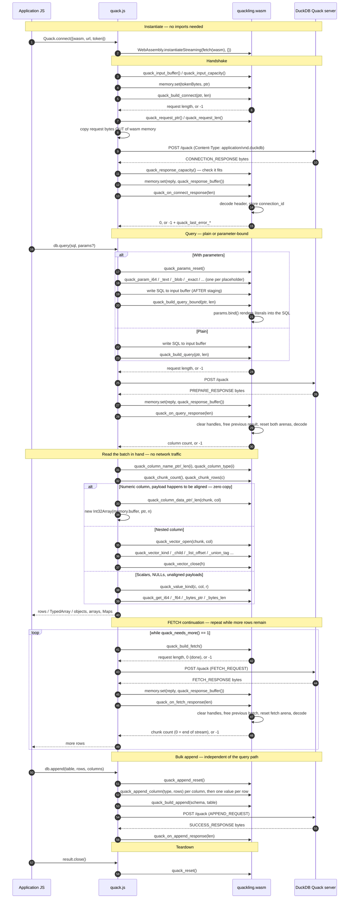

# WebAssembly — Browser Build and FFI Reference

**English** · [日本語](../ja/WASM.md)

→ [Documentation index](./README.md)

Quackling compiles to `wasm32-freestanding` and runs the Quack protocol decoder
inside a browser tab. JavaScript supplies `fetch()`; everything else — framing,
decoding, DuckDB's type system, parameter escaping, nested types — happens in
WASM.

The bridge is [`../../src/wasm/exports.zig`](../../src/wasm/exports.zig)
(**73 exported functions**) and [`../../web/quack.js`](../../web/quack.js)
(the JS side, with declarations in
[`../../web/quack.d.ts`](../../web/quack.d.ts)).

---

## 1. Why this exists

The protocol core is pure computation over byte slices: no sockets, no libc, no
threads, no filesystem, no OS calls. Transport is injected by the caller. That
single constraint — stated in [`../../build.zig`](../../build.zig) as the reason
the module is structured this way — is what makes a browser build possible at
all. Nothing had to be ported; the same decoder that `quackling` uses is
compiled for a different target, and the only thing the host must provide is a
function that turns request bytes into response bytes. In a browser that
function is `fetch()`.

Freestanding wasm has no allocator of its own, so the module carves fixed-size
buffers out of linear memory at compile time (see §11). There is no `malloc`, no
`WASI` import, and no JS glue that the module depends on: it imports **nothing**.
`WebAssembly.instantiate(bytes, {})` — with an empty import object — is the
whole setup, as [`../../tests/wasm/boundary_test.mjs`](../../tests/wasm/boundary_test.mjs)
demonstrates.

### Contrast with DuckDB-Wasm

These are not competitors; they solve different problems.

|                | DuckDB-Wasm | Quackling (wasm) |
|----------------|-------------|------------------|
| What it is | The DuckDB **engine**, compiled to WASM | A **client** for a remote DuckDB |
| Where SQL runs | Locally, in the browser | On the server |
| Payload | Tens of MB of engine | **~73 KB** WASM module |
| Data location | Must reach the browser | Stays on the server |
| Dataset size ceiling | Browser memory / download budget | Whatever the server can hold |
| Freshness | A snapshot you shipped or fetched | Live, every query |
| Access control | Whatever you shipped is readable | Enforced server-side by the token |
| Extensions, larger-than-memory, attached files | Runs locally, subject to browser limits | Whatever the server has |
| Works offline | Yes | No — needs the server |
| Use it when | You want local, offline analytics | You have a shared/large remote database |

The dividing line is where the data lives. DuckDB-Wasm brings the engine to the
data you can ship to the client; Quackling sends the query to data that stays on
the server. For a dashboard over a multi-gigabyte table, or one where rows must
not be exposed beyond what a query returns, downloading an engine is the wrong
shape: you would also have to download the data. A ~73 KB client that POSTs SQL
and receives only the result columns is the right shape.

The corollary is that Quackling in the browser is useless offline and its
latency is a network round trip, whereas DuckDB-Wasm is the reverse. Pick by
those properties, not by size.

---

## 2. Building

```sh
zig build wasm
```

Output, per [`../../build.zig`](../../build.zig):

| Property | Value |
|---|---|
| Paths | `zig-out/bin/quackling.wasm` **and** `web/quackling.wasm` |
| Size | **74,904 bytes** (~73 KiB) as built here |
| Target | `wasm32-freestanding` |
| Optimize | `ReleaseSmall` when the top-level mode is `Debug`, otherwise your chosen mode |
| Entry point | disabled (`wasm.entry = .disabled`) — reactor-style module |
| Symbol export | `wasm.rdynamic = true` |
| Imports | none |

The `wasm` step installs the module twice: once through `addInstallArtifact` to
`zig-out/bin/`, and once through `addInstallFile` to `../web/quackling.wasm`, so
[`../../web/`](../../web/) is a ready-to-publish npm package with no manual copy
step.

`examples/browser/quackling.wasm` is **not** written by the build. The PoC page
loads `./quackling.wasm` relative to itself, so copy it in once by hand — the
same instruction the page carries in its own header comment (lines 9–10 of
[`../../examples/browser/index.html`](../../examples/browser/index.html)):

```sh
zig build wasm                            # writes web/quackling.wasm
cp web/quackling.wasm examples/browser/   # manual: the build does not do this
```

The target is hardcoded in the `wasm` step (`b.resolveTargetQuery`), so
`zig build wasm` produces the same target regardless of `-Dtarget=`. To prove
only that the *library* compiles for another non-native target, use
`zig build check -Dtarget=wasm32-wasi`.

Because a `Debug` top-level build silently becomes `ReleaseSmall` here, the
size above is what you get from a plain `zig build wasm`. Ask for a mode
explicitly if you want something else:

```sh
zig build wasm -Doptimize=ReleaseSmall   # smallest
zig build wasm -Doptimize=ReleaseFast    # faster decode, larger module
```

Test steps that touch this layer:

```sh
zig build test-wasm   # tests/wasm/boundary_test.mjs — hostile FFI arguments (needs node)
zig build test-web    # web/test/*.test.mjs — the JS binding (needs node + a live server)
```

`test-wasm` depends on the `zig-out/bin` install and reads `web/quackling.wasm`;
`test-web` depends on the `web/` install and runs both
[`../../web/test/binding.test.mjs`](../../web/test/binding.test.mjs) (31 tests)
and [`../../web/test/worker.test.mjs`](../../web/test/worker.test.mjs) (6 tests).
Both skip cleanly when no server is reachable.

---

## 3. Export families

Every export from [`../../src/wasm/exports.zig`](../../src/wasm/exports.zig),
grouped by role.

| # | Family | Exports | What it is for |
|---|---|---|---|
| 1 | [Lifecycle & buffers](#4-lifecycle--buffers) | 7 | Buffer addresses, capacities, module reset |
| 2 | [Connect](#5-connect) | 2 | Handshake: build `CONNECTION_REQUEST`, ingest the reply |
| 3 | [Query & parameters](#6-query-plain--bound--parameters) | 11 | Plain and parameter-bound `PREPARE_REQUEST`; parameter staging |
| 4 | [FETCH continuation](#7-fetch-continuation) | 3 | Streaming the rest of a large result |
| 5 | [Result inspection](#8-result-inspection) | 6 | Column names/types, chunk and row counts |
| 6 | [Flat value access](#9-flat-value-access) | 8 | `(chunk, col, row)` scalar reads, zero-copy column payloads |
| 7 | [Nested/vector access](#10-nestedvector-access) | 21 | Handle-based walking of STRUCT/LIST/ARRAY/MAP/UNION |
| 8 | [Bulk append](#11-bulk-append) | 13 | Building and sending an `APPEND_REQUEST` DataChunk |
| 9 | [Errors](#12-errors) | 2 | Last error message |
|   | **Total** | **73** | |

Verify the count yourself:

```sh
grep -c 'export fn' src/wasm/exports.zig   # 73
```

All indices are untrusted inputs and are bounds-checked; none of them can trap.
[`../../tests/wasm/boundary_test.mjs`](../../tests/wasm/boundary_test.mjs) drives
the accessors with `0xFFFFFFF`, `0xFFFFFFFF`, garbage response bodies and
out-of-order calls, and asserts that every one returns its documented sentinel
instead of trapping or reading out of bounds. It also asserts that any pointer
returned from a hostile call lies inside linear memory.

### The status-code convention

One convention, uniformly applied:

| Return shape | Meaning |
|---|---|
| `i32 >= 0` | Success, and the value is meaningful: request length, column count, chunk count, parameter count, column index, or `0` for "succeeded, nothing to report" |
| `i32 == -1` | Failure. Read the message with `quack_last_error_ptr`/`_len` |
| `i32 == 0` from `quack_build_fetch` | Not a failure: there is nothing more to fetch |
| `usize` | A count or a length. Out-of-range inputs yield `0` and set no error |
| `?[*]const u8` | A pointer into linear memory, or `null` (`0` in JS) when the value has no byte run |
| `[*]const u8` | Always a valid pointer; paired with a `_len` that is `0` when there is nothing to read |
| `i64` from a vector accessor | `-1` for "not applicable / invalid handle" where a negative value is impossible for real data (`list_offset`, `list_length`, `array_size`) |
| `void` | Cannot fail |

The accessors deliberately do **not** set an error on an out-of-range index: they
return a sentinel silently, because a caller iterating `0..quack_chunk_rows(c)`
is in bounds by construction and an error channel there would be noise. The
`quack_build_*` and `quack_on_*_response` entry points do set an error, because
those failures are real and actionable.

---

## 4. Lifecycle & buffers

| Export | Signature | Returns | Hostile input |
|---|---|---|---|
| `quack_input_buffer` | `() [*]u8` | Address JS writes input strings to | — |
| `quack_input_capacity` | `() usize` | `262144` (256 KiB) | — |
| `quack_request_ptr` | `() [*]const u8` | Address of the encoded request | — |
| `quack_request_len` | `() usize` | Length of the encoded request, `0` if none built | — |
| `quack_response_buffer` | `() [*]u8` | Address JS writes the HTTP reply to | — |
| `quack_response_capacity` | `() usize` | `16777216` (16 MiB) | — |
| `quack_reset` | `() void` | — | Cannot fail; safe at any time |

`quack_reset` clears the vector-handle table, frees the current result and the
current FETCH batch, resets both arenas, and drops the connection id, request
length, response length and last error. It returns the module to the state it had
immediately after instantiation, so the next call must be a
`quack_build_connect`. The boundary test calls it and then re-reads accessors to
prove reuse is safe.

The four buffer addresses are constants for the life of the instance — they are
addresses of module-level statics, not allocations — but JS must still re-read
`memory.buffer` on every use, because a growth event detaches the old
`ArrayBuffer` (§10.3, §11).

---

## 5. Connect

| Export | Signature | Returns | Hostile input |
|---|---|---|---|
| `quack_build_connect` | `(token_ptr: [*]const u8, token_len: usize) i32` | Encoded request length | `-1` + `"token too large"` when `token_len > 262144`; `-1` + `"request too large"` when the encoding exceeds the 1 MiB request buffer |
| `quack_on_connect_response` | `(len: usize) i32` | `0` on success | `-1` for `len > capacity`, a malformed header, an `ERROR_RESPONSE` (message forwarded verbatim), an unexpected message type, or a missing/oversized connection id |

`quack_build_connect` encodes a `CONNECTION_REQUEST` whose `auth_string` is
`token_ptr[0..token_len]`, which must already be in linear memory. The length is
checked against `input_buf.len` **before** the slice is read, so an
`0x7FFFFFFF` length is a clean refusal rather than an out-of-bounds read — the
boundary test asserts exactly this.

`quack_on_connect_response` stores the server's session id in a 64-byte static.
Every subsequent `quack_build_*` refuses with `"not connected"` until it is set,
which is why the boundary test's "build_query before connect" probe returns `-1`.

An `ERROR_RESPONSE` here is what a bad token looks like: the message is copied
into the error buffer, so JS surfaces DuckDB's own text. `binding.test.mjs`
asserts the rejection matches `/auth/i`.

---

## 6. Query (plain + bound) & parameters

### 6.1 Plain query

| Export | Signature | Returns | Hostile input |
|---|---|---|---|
| `quack_build_query` | `(sql_ptr: [*]const u8, sql_len: usize) i32` | Encoded request length | `-1` + `"not connected"`, `"query too large"` (`sql_len > 262144`), or `"failed to encode query"` |
| `quack_on_query_response` | `(len: usize) i32` | Column count (`>= 0`) | `-1` for over-capacity `len`, malformed header, `ERROR_RESPONSE`, unexpected type, or `"failed to decode result"` |

`quack_on_query_response` is the point at which the previous result is released:
it clears the handle table, deinitialises the current FETCH batch and PREPARE
response, resets **both** arenas, and zeroes the chunk cursor, `needs_more` and
`result_uuid` — then decodes. So every pointer the module previously handed out
is invalidated here, and a decode failure leaves no stale result behind.

Its return value is `current.types.len`, the column count. Zero columns is a
legitimate result, so only a negative value is an error.

### 6.2 Parameter staging

Quack protocol version 1 has **no wire representation for bound parameters** —
`PREPARE_REQUEST` carries exactly one field, the SQL string
([`PROTOCOL.md`](./PROTOCOL.md) §10). Parameters are therefore rendered into the
SQL text, and that rendering is the SQL-injection boundary.

The escaping is **not reimplemented in JavaScript.** JS stages parameters one at
a time into the module, which then calls the same
[`quackling.params.bind`](../../src/params.zig) the native client uses. One
audited implementation, covered by the mutation suite, shared by both clients —
see [`SECURITY.md`](./SECURITY.md) "SQL injection boundary".

| Export | Signature | Returns | Hostile input |
|---|---|---|---|
| `quack_params_reset` | `() void` | — | Cannot fail |
| `quack_param_null` | `() i32` | New parameter count | `-1` + `"too many parameters (max 128)"` |
| `quack_param_bool` | `(v: i32) i32` | New parameter count | Any non-zero `v` is `true` |
| `quack_param_i64` | `(v: i64) i32` | New parameter count | `-1` past 128 parameters |
| `quack_param_f64` | `(v: f64) i32` | New parameter count | `-1` past 128 parameters |
| `quack_param_text` | `(ptr: [*]const u8, len: usize) i32` | New parameter count | `-1` + `"parameter storage exhausted"` past 256 KiB of staged bytes |
| `quack_param_blob` | `(ptr: [*]const u8, len: usize) i32` | New parameter count | as above |
| `quack_param_exact` | `(ptr: [*]const u8, len: usize) i32` | New parameter count | `-1` + `"malformed exact number"` / `"empty exact number"` |
| `quack_build_query_bound` | `(sql_ptr: [*]const u8, sql_len: usize) i32` | Encoded request length | `-1` + `"not connected"`, `"query too large"`, or `"parameter binding failed: <ErrorName>"` |

Text and blob bytes are **copied** into a module-owned 256 KiB store by
`stageBytes`, so the staged slices stay valid until the next
`quack_params_reset`. That matters because JS stages every parameter through the
*same* `quack_input_buffer()` address: without the copy, parameter *n* would
overwrite parameter *n−1*.

**`quack_param_exact` is the wide-number path.** A `HUGEINT` or a
`DECIMAL(30,2)` cannot cross the boundary as `i64` or `f64` without losing
value, so JS passes the number as decimal **text** and the module stages it as
`Param.raw_sql` — a pre-rendered literal inserted verbatim. To keep that from
being an injection hole, the export validates the bytes itself before staging:
digits only, at most one leading `-` or `+`, at most one `.`, and non-empty.
Anything else is `-1`. This is the one place where `raw_sql` is reachable from
JavaScript, and the validation is what makes it safe; the underlying variant
carries the warning in [`SECURITY.md`](./SECURITY.md) "⚠️ WARNING: `.raw_sql`".

### 6.3 The bound-query call sequence

Order matters, because parameters and SQL share the input buffer:

```js
w.quack_params_reset();                    // 1. discard the previous set
// 2. stage each parameter, in placeholder order
w.quack_param_i64(42n);
mem.set(enc.encode("o'brien"), w.quack_input_buffer());
w.quack_param_text(w.quack_input_buffer(), 7);   // bytes are copied out
w.quack_param_null();
// 3. NOW write the SQL — it may reuse the input buffer
mem.set(enc.encode('SELECT ?::INTEGER, ?, ?'), w.quack_input_buffer());
const n = w.quack_build_query_bound(w.quack_input_buffer(), 23);
if (n < 0) throw new Error(lastError());
```

`quack.js` does exactly this in `#bindParams` followed by `#writeString`, and the
comment there says why the order is not incidental. A placeholder/argument count
mismatch is caught by `bind()` **before** the request is sent, surfacing as
`"parameter binding failed: ParameterCountMismatch"` rather than as a server
error — `binding.test.mjs` asserts both the too-few and too-many cases reject.

From JavaScript you never call these directly; pass an array:

```js
const [row] = await db.queryAll(
  `SELECT ?::INTEGER a, ? b, ? c, ?::BOOLEAN d, ?::DOUBLE e,
          ?::BIGINT f, ?::HUGEINT g, ?::BLOB h`,
  [42, "o'brien", null, true, 1.5, 9223372036854775807n,
   170141183460469231731687303715884105727n, new Uint8Array([0, 1, 255])],
);
```

`quack.js` maps JS types onto the exports as follows:

| JS value | Export used |
|---|---|
| `null`, `undefined` | `quack_param_null` |
| `boolean` | `quack_param_bool` |
| `bigint` | `quack_param_exact` (exact decimal text — no precision loss) |
| `number`, integral and within `MAX_SAFE_INTEGER` | `quack_param_i64` |
| `number`, otherwise | `quack_param_f64` |
| `string` | `quack_param_text` |
| `Uint8Array` | `quack_param_blob` |
| `Date` | `quack_param_text` with ISO text, for the server to parse |
| anything else | `QuackError: unsupported parameter type` |

---

## 7. FETCH continuation

A `PREPARE_RESPONSE` carries only the first batch. For
`SELECT ... FROM range(1000000)` that is roughly 2% of the rows — and the server
reports no error about it. A caller that ignores FETCH silently truncates the
result, which is why `quack_needs_more` exists as an explicit gate.

| Export | Signature | Returns | Hostile input |
|---|---|---|---|
| `quack_needs_more` | `() i32` | `1` when more rows remain, else `0` | — |
| `quack_build_fetch` | `() i32` | Request length, or **`0` when there is nothing more** | `-1` + `"not connected"` or `"failed to encode fetch request"` |
| `quack_on_fetch_response` | `(len: usize) i32` | Chunk count in this batch | `-1` for over-capacity `len`, `"no active result"`, malformed header, `ERROR_RESPONSE` (which also clears `needs_more`), unexpected type, or `"failed to decode fetch batch"` |

`quack_build_fetch` returning `0` is the one place a non-negative value means
"stop". `quack.js` treats it that way explicitly (`if (built === 0) return 0`),
because conflating it with an error would turn a normal end-of-stream into a
thrown exception.

`quack_on_fetch_response` clears the handle table and frees the previous batch
**before** decoding the next, then resets `fetch_fba`. Resident memory therefore
tracks one batch rather than the accumulated result — and every pointer and
handle from the previous batch is dead at that moment. `FETCH_RESPONSE` carries
no `needs_more_fetch` field, so an empty batch (`0` chunks) is the server's
end-of-stream signal and clears `needs_more` ([`PROTOCOL.md`](./PROTOCOL.md) §8).

The loop:

```js
do {
  for (let c = 0; c < w.quack_chunk_count(); c++) { /* read chunk c */ }
  if (!w.quack_needs_more()) break;
  const req = w.quack_build_fetch();
  if (req <= 0) break;                       // 0 = done, <0 = error
  // POST, then:
  if (w.quack_on_fetch_response(replyLen) < 0) throw new Error(lastError());
} while (true);
```

Server-side batch size is tunable with the DuckDB setting
`quack_fetch_batch_chunks`, which controls how many chunks the server packs into
one `FETCH_RESPONSE` — larger batches mean fewer round trips and more memory per
batch. It is a server setting, not an export.

---

## 8. Result inspection

| Export | Signature | Returns | Hostile input |
|---|---|---|---|
| `quack_column_count` | `() usize` | Column count | `0` before any query |
| `quack_column_name_ptr` | `(i: usize) [*]const u8` | Pointer to the name bytes | `""` (a valid pointer, length `0`) for `i` out of range or no result |
| `quack_column_name_len` | `(i: usize) usize` | Name length in bytes | `0` |
| `quack_column_type` | `(i: usize) i32` | DuckDB `LogicalTypeId` | `-1` |
| `quack_chunk_count` | `() usize` | Chunks in the batch in hand | `0` |
| `quack_chunk_rows` | `(chunk: usize) usize` | Rows in that chunk | `0` |

Column metadata lives in the **PREPARE** response for the whole result, not in
each batch, because the name and type slices borrow that buffer. `quack.js`
reads it once into `QuackResult.columns` and reuses it across every FETCH batch.
That is also why `quack_on_query_response` resets both arenas but
`quack_on_fetch_response` resets only `fetch_fba`.

`quack_chunk_count` and every chunk accessor operate on the **batch currently in
hand**, resolved by the internal `activeChunks()`: the PREPARE batch until the
first FETCH, then each FETCH batch in turn. Chunk indices restart at `0` in every
batch.

---

## 9. Flat value access

For a scalar column, ask the module how the cell should be read, then read it.
Guessing from `quack_column_type` alone is worse: the module knows whether a
value is actually representable as a scalar.

| Export | Signature | Returns | Hostile input |
|---|---|---|---|
| `quack_value_kind` | `(chunk, col, row: usize) i32` | A `ValueKind` (table below) | `5` (`unsupported`) |
| `quack_is_null` | `(chunk, col, row: usize) i32` | `1` when NULL, else `0` | `1` — an out-of-range cell reads as NULL, never as data |
| `quack_get_i64` | `(chunk, col, row: usize) i64` | The integer value | `0` |
| `quack_get_f64` | `(chunk, col, row: usize) f64` | The float value | `0` |
| `quack_get_bytes_ptr` | `(chunk, col, row: usize) ?[*]const u8` | Pointer to the bytes | `null` |
| `quack_get_bytes_len` | `(chunk, col, row: usize) usize` | Byte length | `0` |
| `quack_column_data_ptr` | `(chunk, col: usize) ?[*]const u8` | Pointer to a flat fixed-width payload | `null`, also for any non-`fixed` storage |
| `quack_column_data_len` | `(chunk, col: usize) usize` | Payload length in bytes | `0` |

### 9.1 `ValueKind`

`quack_value_kind` returns which accessor applies. The numbering is not
sequential — read it from the enum, not from position:

| Value | Kind | Read with | Covers |
|---|---|---|---|
| `0` | `is_null` | nothing | any NULL cell |
| `1` | `integer` | `quack_get_i64` | BOOLEAN, TINYINT…BIGINT, UTINYINT…UBIGINT |
| `2` | `float` | `quack_get_f64` | FLOAT, DOUBLE |
| `3` | `text` | `quack_get_bytes_*`, decode UTF-8 | VARCHAR, ENUM, UUID, INTERVAL, DATE, TIME, TIMESTAMP |
| `4` | `bytes` | `quack_get_bytes_*`, keep as bytes | BLOB |
| `5` | `unsupported` | the vector API (§10) | STRUCT, LIST, ARRAY, MAP, UNION, VARIANT |
| `6` | `exact_number` | `quack_get_bytes_*`, parse the decimal text | HUGEINT, UHUGEINT, DECIMAL |

Two design decisions are visible here.

**Wide numbers are text, not numbers.** `HUGEINT`'s maximum overflows `asI64` —
it used to come back as `0` — and `DECIMAL(30,2)` loses digits through a double.
Both are silent corruption, which is worse than an error and undercuts the point
of a binary protocol. So the module formats them exactly and JS builds a
`BigInt` (integral) or keeps a `string` (fractional). `binding.test.mjs` guards
this as a named regression.

**Temporal and identifier types are canonical text.** A raw day or microsecond
count would push calendar arithmetic onto every caller, so DATE, TIME,
TIMESTAMP, UUID and INTERVAL come back formatted (`"2024-03-15"`,
`"2024-03-15 12:34:56"`). ENUM resolves to its **label**, not its dictionary
index.

Kinds `3`, `4` and `6` share one byte channel. Values that already have a byte
run on the wire (VARCHAR, BLOB, ENUM label) are **borrowed** from the response
buffer; the rest are formatted into a 256-byte `text_scratch` static — which
means a formatted value is only valid until the next `quack_get_bytes_ptr` call
that also needs formatting. Decode immediately.

**`unsupported` is not an error.** It means "this is not a scalar; use the vector
API". `quack.js` routes it to `#nested()` rather than returning `0`.

### 9.2 Zero-copy: when it actually works

For a flat fixed-width column the decoded payload already sits in WASM linear
memory in exactly the layout a JS TypedArray expects, so JS can construct a
**view** over it instead of marshalling per value:

```js
array(col) {
  const Ctor = TYPED_ARRAY_FOR_TYPE[this.columns[col]?.type];
  if (!Ctor) return null;                                   // not a numeric type
  const ptr = this.#w.quack_column_data_ptr(this.#index, col);
  const len = this.#w.quack_column_data_len(this.#index, col);
  if (!ptr || len === 0) return null;                        // not flat fixed-width
  if (ptr % Ctor.BYTES_PER_ELEMENT !== 0) return null;       // unaligned
  return new Ctor(this.#w.memory.buffer, ptr, len / Ctor.BYTES_PER_ELEMENT);
}
```

Three guards, each load-bearing, and each corresponding to a real failure mode.

**Guard 1 — the type must map to a TypedArray.** `TYPED_ARRAY_FOR_TYPE` in
[`../../web/quack.js`](../../web/quack.js) covers 13 `LogicalTypeId`s: BOOLEAN,
TINYINT, SMALLINT, INTEGER, BIGINT, DATE, TIMESTAMP, FLOAT, DOUBLE, UTINYINT,
USMALLINT, UINTEGER, UBIGINT. Everything else — VARCHAR, BLOB, DECIMAL, HUGEINT,
UUID, INTERVAL, every nested type — returns `null` by construction.

**Guard 2 — the storage must be `fixed`.** `Vector.Storage` has ten variants;
`quack_column_data_ptr` returns non-`null` for exactly one of them. A `strings`,
`constant`, `sequence`, `dictionary`, `children`, `list`, `array` or
`unsupported` vector yields `null`. DuckDB emits `sequence` and `constant`
encodings routinely, so this guard fires on ordinary data, not just on nested
types.

**Guard 3 — alignment. This one is subtle, and it is the reason `array()` often
returns `null` for a perfectly ordinary INTEGER column.**

The `fixed` payload is **borrowed from the wire buffer**, not copied into the
arena: the decoder calls `Reader.readRaw(n)`, which hands back a slice of the
bytes JS wrote into `quack_response_buffer()`. So

```
payload address = quack_response_buffer() + (byte offset of the data field in the message)
```

Both terms are hostile to alignment. Measured on this build:

```console
quack_response_buffer() = 34608977      # base % 4 = 1,  base % 8 = 1
```

The base address of `response_buf` is itself odd. And the offset within the
message is whatever the preceding varint-framed fields happen to occupy, which
depends on the column count, the length of every column name, the type
descriptors, and the row count. Nothing in the wire format aligns it. Measured
against a live DuckDB v1.5.5 + quack server:

```console
$ # SELECT i::INTEGER AS i FROM range(N) t(i),  N = 1..40
INTEGER single column, ptr % 4 distribution:  {1: 31,  2: 9}   # never 0

$ # SELECT i::INTEGER a, i::INTEGER b FROM range(3000) t(i)
chunk0 col0  ptr%4=1  array() -> null
chunk0 col1  ptr%4=1  array() -> Int32Array(2048)   # a different chunk/col pair aligns
chunk1 col0  ptr%4=1  array() -> Int32Array(952)
chunk1 col1  ptr%4=3  array() -> null
```

So the honest rule is neither "zero-copy works" nor "zero-copy never works":

- **1-byte element types always succeed** (`ptr % 1 == 0` is a tautology).
  TINYINT, UTINYINT and BOOLEAN take the fast path unconditionally. Measured:
  `SELECT i::TINYINT FROM range(120)` → `Int8Array(120)`.
- **Wider element types succeed only when the payload's byte offset happens to
  align.** It is a property of the individual (batch, chunk, column) — not of
  the query, the type, or the column. Two adjacent chunks of the same column can
  disagree, and the same chunk's two columns can disagree.
- **`SELECT i::INTEGER FROM range(N)` as a single column reliably fails** on this
  build, because the message prefix plus the odd buffer base lands the payload at
  `ptr % 4 ∈ {1, 2}` for every `N` measured.

This is exactly why the passing test
`'numeric columns expose a TypedArray over WASM memory'` in
[`../../web/test/binding.test.mjs`](../../web/test/binding.test.mjs) is written
the way it is. It asserts *conditionally*:

```js
const arr = chunk.array(0);
if (arr) {
  assert.ok(arr instanceof Int32Array, 'INTEGER should map to Int32Array');
  assert.equal(arr.length, chunk.rowCount);
  for (let r = 0; r < chunk.rowCount; r++) assert.equal(arr[r], chunk.value(0, r));
  checked = true;
}
// Alignment is not guaranteed by the wire format, so a null view is a valid
// outcome; the test asserts agreement only when the fast path is available.
assert.ok(checked || true);
```

The test does not prove the fast path is taken — the final assertion is
unconditionally true. What it proves is the property that actually matters: **when
the view exists it is the right constructor, the right length, and agrees with
the per-value path element for element.** For that query on this build the view
does not exist, so the body does not run.

**Consequence for your code: `array()` returning `null` is a normal outcome, not
an error. Always write the `else` branch.** Every shipped example does — the
streaming tests, the Worker's `sum` op, and the PoC page, which reports
`fastPath/chunks` so you can see the ratio live.

```js
for await (const chunk of result.chunks()) {
  const arr = chunk.array(0);
  if (arr) {
    for (const v of arr) sum += BigInt(v);              // zero copy
  } else {
    for (let r = 0; r < chunk.rowCount; r++)            // per-value fallback
      sum += BigInt(chunk.value(0, r));
  }
}
```

If you need the fast path to be reliable rather than probabilistic, the fix
belongs in the module — align `response_buf` to 8 bytes and copy the payload to
an aligned arena address when it is not naturally aligned — not in JS. JS cannot
create a `TypedArray` at a misaligned byte offset; the constructor throws
`RangeError`, which is why the guard returns `null` rather than trying.

What is *not* happening on the fast path: no `JSON.parse`, no per-value FFI call,
no intermediate array, no byte-order conversion (wasm and every JS TypedArray are
little-endian), no copy. A million-element `INTEGER` column costs two FFI calls
and one `Int32Array` construction.

### 9.3 Lifetime hazard

**A TypedArray view over WASM memory is a raw alias into a buffer whose owner can
move or reuse it.** Two things invalidate it:

1. **Memory growth.** If linear memory grows, `WebAssembly.Memory.buffer` is
   replaced and the old `ArrayBuffer` is **detached**: existing views become
   zero-length and throw `TypeError`. This is why `quack.js` re-reads
   `new Uint8Array(this.#w.memory.buffer)` on every use instead of caching it.

2. **`quack_reset()`, the next `quack_on_query_response()`, or the next
   `quack_on_fetch_response()`.** All three reset an arena and reuse the *same
   addresses*, and because `fixed` payloads are borrowed from `response_buf`, the
   next reply overwrites them directly. The view stays valid as a JS object and
   silently reads someone else's data — the dangerous failure, because nothing
   throws. Merely advancing the iterator is enough.

The rule: **treat a view, a byte pointer and a vector handle as valid only until
the next call into WASM**, and in particular only until the next iteration step.
Copy what you need to keep:

```js
for await (const chunk of result.chunks()) {
  const view = chunk.array(0);       // aliases wasm memory
  const owned = view?.slice();       // copies out — safe past this loop
}
```

The same applies to `quack_get_bytes_ptr`, `quack_column_name_ptr` and
`quack_vector_get_bytes_ptr`. `quack.js` handles those by decoding or copying
immediately — `new TextDecoder().decode(...)` produces an independent string, and
the `bytes` case does `.slice()`. Note also that `#post()` copies the request
bytes out with `.slice()` *before* awaiting `fetch()`, because the buffer must not
be aliased across an `await`.

---

## 10. Nested/vector access

A nested value cannot be addressed by `(chunk, col, row)` alone: a STRUCT field
or a LIST element lives in a **child** vector, at a row index only the parent
knows. Flattening nested data into JS objects inside the module would mean
copying it, which defeats the point of decoding in place.

So the module hands JS an opaque **handle** per vector and JS walks the tree
itself. This is the browser-side equivalent of the Zig vector accessors described
in [`TYPES.md`](./TYPES.md) §7.

### 10.1 The handle model

Handles are **indices into a fixed 64-entry table** of `?*const Vector`, so an
invalid handle is rejected rather than dereferenced. `handleGet` bounds-checks
`h < 0 or h >= 64` and returns `null` for an empty slot; every accessor returns
its sentinel from there.

```
h = quack_vector_open(chunk, col)     // the column's vector
quack_vector_kind(h)                  // flat / struct / list / array / map / union
c = quack_vector_child(h, i)          // descend — a NEW handle
...
quack_vector_close(c)                 // release, in reverse order
quack_vector_close(h)
```

Lifetime discipline, in order of how easily each is violated:

1. **Close every handle you open, including children.** The table holds 64
   entries; `handlePut` returns `-1` when full and sets
   `"too many open vector handles"`. A recursive walk over a deeply nested value
   will exhaust it if children leak. `quack.js` closes child handles in a
   `finally` for exactly this reason, so an error mid-walk cannot leak one.
2. **Handles die with the batch.** `handlesClear()` is called at the top of both
   `quack_on_query_response` and `quack_on_fetch_response`, blanking the whole
   table *before* the batch it points into is freed. A handle held across a FETCH
   is not dangling — it is `null`, and accessors return sentinels. That is a
   deliberate trade: silent wrong data is worse than a sentinel.
3. **Re-open per row, not once per result.** `binding.test.mjs` has a named test
   for this (`'nested values stream correctly across many rows'`, 5000 rows):
   handles point into the current batch, so caching one across a batch boundary
   is the bug the test guards.
4. **`quack_vector_close` on an out-of-range handle is a silent no-op.** It never
   fails, so a `finally` that closes a `-1` is harmless.
5. **`quack_reset()` clears the table too.**

### 10.2 The export table

| Export | Signature | Returns | Hostile input |
|---|---|---|---|
| `quack_vector_open` | `(chunk: usize, col: usize) i32` | A handle `0..63` | `-1` + `"chunk index out of range"` / `"column index out of range"` / `"too many open vector handles"` |
| `quack_vector_close` | `(h: i32) void` | — | Silent no-op for `h` out of range |
| `quack_vector_kind` | `(h: i32) i32` | A `VectorShape` (table below) | `-1` (`invalid`) |
| `quack_vector_type` | `(h: i32) i32` | DuckDB `LogicalTypeId` | `-1` |
| `quack_vector_row_count` | `(h: i32) usize` | Rows in this vector | `0` |
| `quack_vector_child` | `(h: i32, i: usize) i32` | A handle on child `i` | `-1` + `"invalid vector handle"` / `"child index out of range"` / `"vector has no children"` |
| `quack_vector_child_count` | `(h: i32) i32` | Child count | `-1` for a bad handle, `0` for a vector with no children |
| `quack_vector_child_name_ptr` | `(h: i32, i: usize) [*]const u8` | Pointer to the field name | `""` |
| `quack_vector_child_name_len` | `(h: i32, i: usize) usize` | Field-name length | `0` |
| `quack_vector_is_null` | `(h: i32, row: usize) i32` | `1` when NULL, else `0` | `1` — a bad handle reads as NULL |
| `quack_vector_value_kind` | `(h: i32, row: usize) i32` | A `ValueKind` (§9.1) | `5` (`unsupported`) |
| `quack_vector_get_i64` | `(h: i32, row: usize) i64` | The integer value | `0` |
| `quack_vector_get_f64` | `(h: i32, row: usize) f64` | The float value | `0` |
| `quack_vector_get_bytes_ptr` | `(h: i32, row: usize) ?[*]const u8` | Pointer to the bytes | `null` |
| `quack_vector_get_bytes_len` | `(h: i32, row: usize) usize` | Byte length | `0` |
| `quack_vector_data_ptr` | `(h: i32) ?[*]const u8` | Flat fixed-width payload, for zero copy | `null` for any non-`fixed` storage |
| `quack_vector_data_len` | `(h: i32) usize` | Payload length in bytes | `0` |
| `quack_vector_list_offset` | `(h: i32, row: usize) i64` | Where row `row`'s elements begin in the child | `-1` |
| `quack_vector_list_length` | `(h: i32, row: usize) i64` | How many elements row `row` has | `-1` |
| `quack_vector_array_size` | `(h: i32) i64` | Fixed elements per row (ARRAY) | `-1` |
| `quack_vector_union_tag` | `(h: i32, row: usize) i32` | Which member is active | `-1` |

That is 21 exports. `quack_value_kind` is counted in §9 because it takes
`(chunk, col, row)` rather than a handle; `quack_vector_value_kind` is its
handle-taking twin. Both delegate to the same internal `classify()`, so the two
paths can never disagree about how a type is read.

`quack_vector_data_ptr`/`_len` are the handle-based equivalents of
`quack_column_data_ptr`/`_len`, and carry **the same alignment caveat** (§9.2).
They are how you would read a LIST's flattened numeric child as one TypedArray
instead of element by element.

### 10.3 `VectorShape`

`quack_vector_kind` tells JS which navigation calls apply:

| Value | Shape | Physical layout | Navigate with |
|---|---|---|---|
| `0` | `flat` | a scalar run | `quack_vector_value_kind` + the value accessors |
| `1` | `struct` | one child per field; every field shares the parent's row index | `child_count`, `child`, `child_name_*` |
| `2` | `list` | one child holding all rows' elements, flattened | `list_offset`, `list_length`, `child(h, 0)` |
| `3` | `array` | one child, fixed `array_size` elements per row | `array_size`, `child(h, 0)`, base `row * size` |
| `4` | `map` | a LIST of STRUCT(key, value) | `list_offset`/`list_length`, then children `0`/`1` of the list child |
| `5` | `union` | a STRUCT whose child `0` is a hidden UTINYINT tag | `union_tag`, then child `tag + 1` |
| `-1` | `invalid` | — | bad handle |

VARIANT maps to `struct`; every other type id maps to `flat`.

### 10.4 Worked examples

These mirror `#readVector` in [`../../web/quack.js`](../../web/quack.js). All
outputs are from `binding.test.mjs`, which asserts them against a live server.

**STRUCT** — `SELECT {'a': 1, 'b': 'x'} AS s` → `{ a: 1, b: 'x' }`

Fields are children and share the parent's row index, so there is no offset
arithmetic:

```js
const h = w.quack_vector_open(chunk, col);
const out = {};
for (let i = 0; i < w.quack_vector_child_count(h); i++) {
  const child = w.quack_vector_child(h, i);
  if (child < 0) continue;
  try {
    const p = w.quack_vector_child_name_ptr(h, i);
    const l = w.quack_vector_child_name_len(h, i);
    const key = l ? dec.decode(mem.subarray(p, p + l)) : String(i);
    out[key] = readVector(child, row);          // same row index
  } finally {
    w.quack_vector_close(child);                // always, even on throw
  }
}
w.quack_vector_close(h);
```

**LIST** — `SELECT [10, 20, 30] AS l` → `[10, 20, 30]`

The single child holds every row's elements concatenated; the parent supplies the
window:

```js
const offset = Number(w.quack_vector_list_offset(h, row));
const length = Number(w.quack_vector_list_length(h, row));
if (offset < 0 || length < 0) return null;      // sentinel, not data
const child = w.quack_vector_child(h, 0);       // index ignored: one child
try {
  const out = new Array(length);
  for (let i = 0; i < length; i++) out[i] = readVector(child, offset + i);
  return out;
} finally {
  w.quack_vector_close(child);
}
```

`SELECT [1, NULL, 3]` → `[1, null, 3]`: `quack_vector_is_null(child, offset + i)`
distinguishes a NULL element from a zero, so the validity mask survives the walk.

**ARRAY** — `SELECT [1, 2, 3]::INTEGER[3] AS arr` → `[1, 2, 3]`

Fixed-size runs, so the base is computed rather than read:

```js
const size = Number(w.quack_vector_array_size(h));
const child = w.quack_vector_child(h, 0);
for (let i = 0; i < size; i++) out[i] = readVector(child, row * size + i);
```

**MAP** — `SELECT MAP{'k': 1, 'j': 2} AS m` → `Map { 'k' => 1, 'j' => 2 }`

Physically `LIST(STRUCT(key, value))`, so it is a list walk followed by a struct
descent — three handles deep:

```js
const offset = Number(w.quack_vector_list_offset(h, row));
const length = Number(w.quack_vector_list_length(h, row));
const entries = w.quack_vector_child(h, 0);        // the STRUCT(key, value)
try {
  const keys = w.quack_vector_child(entries, 0);
  const vals = w.quack_vector_child(entries, 1);
  try {
    const out = new Map();                          // a real Map: non-string keys survive
    for (let i = 0; i < length; i++) {
      out.set(readVector(keys, offset + i), readVector(vals, offset + i));
    }
    return out;
  } finally {
    w.quack_vector_close(keys);
    w.quack_vector_close(vals);
  }
} finally {
  w.quack_vector_close(entries);
}
```

Nested `finally` blocks are the whole point: a three-level walk over 2048 rows
would exhaust the 64-entry table almost immediately if any level leaked.

**UNION** — `SELECT union_value(n := 5) AS u` → `5`

Child `0` is a hidden tag vector; the tagged member is child `tag + 1`:

```js
const tag = w.quack_vector_union_tag(h, row);
if (tag < 0) return null;
const member = w.quack_vector_child(h, tag + 1);
if (member < 0) return null;
try {
  return readVector(member, row);
} finally {
  w.quack_vector_close(member);
}
```

**Recursion composes.** Because `readVector` dispatches on
`quack_vector_kind` at every level, arbitrary nesting works without special
cases. `binding.test.mjs` asserts:

| SQL | JS result |
|---|---|
| `{'inner': [1, 2], 'name': 'x'}` | `{ inner: [1, 2], name: 'x' }` |
| `[{'a': 1}, {'a': 2}]` | `[{ a: 1 }, { a: 2 }]` |
| `MAP{'k': [1, 2]}` | `Map { 'k' => [1, 2] }` |

From JavaScript you never touch handles: `chunk.value(col, row)` detects
`ValueKind.unsupported` and walks the tree for you, returning an object, array,
`Map` or the union's member value.

---

## 11. Bulk append

`APPEND_REQUEST` hands DuckDB a whole DataChunk rather than an INSERT statement.
The module's own comment records the measurement: **~370× the throughput of one
parameterised INSERT per row**, because the data is already typed and the server
re-parses no SQL. Values travel in binary, so this path involves **no SQL
escaping at all** — there is no injection surface here, unlike §6.

> **Note on the top-level README.** Its Roadmap says
> *"Client-to-server bulk append (`APPEND_REQUEST` is decoded but not yet
> exposed)"*. That is no longer accurate for the WASM layer: append **is** fully
> exposed here, through the 13 exports below and the public `db.append()` method
> declared in [`../../web/quack.d.ts`](../../web/quack.d.ts), and it is exercised
> end to end by `worker.test.mjs` (3000 rows, spanning two DataChunks).

### 11.1 The export table

| Export | Signature | Returns | Hostile input |
|---|---|---|---|
| `quack_append_reset` | `() void` | — | Cannot fail |
| `quack_append_column` | `(type_id: i32, rows: usize) i32` | The new column's **index** | `-1` + `"too many append columns (max 64)"`, `"append chunk limited to N rows"`, `"column row counts differ (X vs Y)"`, `"append value storage exhausted"` |
| `quack_append_decimal_info` | `(col: usize, width: u8, scale: u8) i32` | `0` | `-1` + `"column index out of range"` |
| `quack_append_null` | `() i32` | `0` | `-1` + `"no append column open"` / `"more values than the column's declared row count"` |
| `quack_append_bool` | `(v: i32) i32` | `0` | as above; non-zero `v` is `true` |
| `quack_append_i64` | `(v: i64) i32` | `0` | as above |
| `quack_append_f64` | `(v: f64) i32` | `0` | as above |
| `quack_append_text` | `(ptr: [*]const u8, len: usize) i32` | `0` | `-1` + `"append byte storage exhausted"` past 4 MiB |
| `quack_append_blob` | `(ptr: [*]const u8, len: usize) i32` | `0` | as above |
| `quack_append_hugeint` | `(hi: i64, lo: u64) i32` | `0` | as above |
| `quack_append_decimal` | `(hi: i64, lo: u64, width: u8, scale: u8) i32` | `0` | as above |
| `quack_build_append` | `(schema_ptr, schema_len, table_ptr, table_len) i32` | Encoded request length | `-1` + `"not connected"`, `"no columns staged"`, `"column N has X of Y values"`, `"failed to encode append: <ErrorName>"` |
| `quack_on_append_response` | `(len: usize) i32` | `0` on `SUCCESS_RESPONSE` | `-1` for over-capacity `len`, malformed header, `ERROR_RESPONSE` (message forwarded), or unexpected type |

`quack_append_hugeint` and `quack_append_decimal` take a 128-bit value as **two
halves** (`hi: i64`, `lo: u64`) because wasm32 has no `i128` ABI. The module
reassembles it as `(i128(hi) << 64) | i128(lo)`.

### 11.2 The row/column building protocol

Append is built **column by column, values in row order within each column** —
the natural shape for a columnar chunk, and the opposite of how a caller usually
thinks about rows. The order is not optional:

```
quack_append_reset()                          // 1. once per chunk
  for each column c, left to right:
    idx = quack_append_column(typeId, rows)   // 2. declare it — returns c
    [ quack_append_decimal_info(idx, w, s) ]  // 3. DECIMAL only, on the column just opened
    for each row r, 0..rows-1:
      quack_append_<kind>(...)                // 4. exactly `rows` values, in row order
quack_build_append(schema, table)             // 5. -> request bytes
// POST, then:
quack_on_append_response(replyLen)            // 6. 0 = committed
```

Five invariants the module enforces rather than trusting:

1. **`quack_append_column` must come first.** `appendValue` fails with
   `"no append column open"` when `append_cols == 0`.
2. **Values land in the most recently opened column.** There is no column
   argument on `quack_append_*`; the target is always `append_cols - 1`. You
   cannot interleave columns.
3. **Every column declares the same row count.** The second and later
   `quack_append_column` calls compare against the first and refuse ragged input
   with `"column row counts differ"` — rather than sending a chunk the server
   would reject.
4. **Overfilling is refused.** An extra value past the declared row count gives
   `"more values than the column's declared row count"`.
5. **Underfilling is refused at build time.** `quack_build_append` checks
   `append_filled[i] == append_values[i].len` for every column and reports
   `"column N has X of Y values"`. Without this, a short column would carry
   **undefined** values into the database — the check exists precisely because
   the value store is `undefined`-initialised static memory.

`quack_append_reset` clears the column count, row count, value cursor, byte
cursor and the per-column fill counters. Call it once per chunk; `quack.js` does
so at the top of `#appendChunk`.

Row count is capped by `quackling.serialization.encoder.max_rows` — one DataChunk.
`quack.js` slices input into 2048-row chunks and issues one queued operation per
chunk, so a 3000-row append is two round trips.

### 11.3 From JavaScript

`db.append()` wraps all of it. `columns` is **required, not inferred**: the
server rejects a type mismatch, and a first row containing `NULL` carries no type
information to infer from.

```js
import { Quack, TYPE } from 'quackling';

await db.queryAll('CREATE OR REPLACE TABLE events (id INTEGER, name VARCHAR)');
await db.append('events', [
  { id: 1, name: 'a' },
  { id: 2, name: 'b' },
], [
  { name: 'id',   type: TYPE.INTEGER },
  { name: 'name', type: TYPE.VARCHAR },
]);
```

`TYPE` is exported from [`../../web/quack.js`](../../web/quack.js) with 19
`LogicalTypeId` constants, so you name types instead of hard-coding wire numbers.
Rows may be objects (keyed by `column.name`) or arrays (positional). `schema`
defaults to `'main'`; pass `{ schema }` to override. For DECIMAL, set `width` and
`scale` on the column — `quack.js` forwards them to
`quack_append_decimal_info` and routes `bigint` values to
`quack_append_decimal` instead of `quack_append_hugeint`.

JS value → export mapping, per `#stageAppendValue`:

| JS value | Export used |
|---|---|
| `null`, `undefined` | `quack_append_null` |
| `boolean` | `quack_append_bool` |
| `bigint`, column has `width` | `quack_append_decimal(hi, lo, width, scale)` |
| `bigint`, otherwise | `quack_append_hugeint(hi, lo)` |
| `number`, integral and within `MAX_SAFE_INTEGER` | `quack_append_i64` |
| `number`, otherwise | `quack_append_f64` |
| `string` | `quack_append_text` |
| `Uint8Array` | `quack_append_blob` |
| `Date` | `quack_append_text` with ISO text |
| anything else | `QuackError: unsupported append value type` |

---

## 12. Errors

| Export | Signature | Returns | Hostile input |
|---|---|---|---|
| `quack_last_error_ptr` | `() [*]const u8` | Address of the 512-byte error buffer | Always valid |
| `quack_last_error_len` | `() usize` | Message length, `0` when there is none | — |

The buffer is a 512-byte static; `setError` formats into it with `bufPrint` and
falls back to the literal `"error"` if formatting overflows, so the message can
be truncated but never overruns. Every `quack_build_*` and `quack_on_*_response`
begins with `clearError()`, so a stale message never survives a successful call.

```js
#lastError() {
  const ptr = this.#w.quack_last_error_ptr();
  const len = this.#w.quack_last_error_len();
  return len ? new TextDecoder().decode(this.#memory.subarray(ptr, ptr + len))
             : 'unknown error';
}
```

```js
if (this.#w.quack_build_query(ptr, len) < 0) throw new QuackError(this.#lastError());
const n = await this.#post({ signal });
const ncols = this.#w.quack_on_query_response(n);
if (ncols < 0) throw new QuackError(this.#lastError());
```

Server-side failures arrive through the same channel: an `ERROR_RESPONSE` is
decoded and its text copied into the error buffer, so a bad token or a bad
`SELECT` reaches JS as DuckDB's own message rather than a generic code.
`binding.test.mjs` asserts that `SELECT * FROM definitely_missing_xyz` produces a
`QuackError` whose message contains the table name, and that the connection stays
usable afterwards.

HTTP failures never reach WASM: `#post()` throws `QuackError` on `!res.ok` and on
a rejected `fetch()`, and re-throws `AbortError` unwrapped so `AbortSignal`
semantics survive. An over-capacity reply is refused in JS, before the copy, with
a message naming both sizes.

The module cannot panic usefully in freestanding wasm, so the panic handler
`@trap()`s rather than trying to format a message into nowhere. A trap surfaces
in JS as a `RuntimeError` and leaves the instance unusable. That is a bug by
definition, which is why
[`../../tests/wasm/boundary_test.mjs`](../../tests/wasm/boundary_test.mjs)
exists: it drives every export with hostile arguments and asserts none of them
trap.

---

## 13. Call sequence

The flow is asynchronous on the JS side and entirely synchronous inside WASM.
WASM never performs I/O: it produces bytes to send and consumes bytes received.



Walking the same thing in prose, matching
[`../../web/quack.js`](../../web/quack.js):

1. **Instantiate.** `Quack.connect({ wasm, url, token })` resolves the `wasm`
   source (URL, `Response`, raw bytes, or an already-compiled
   `WebAssembly.Module`) with an empty import object. Streaming instantiation is
   tried first and falls back to the buffer path, because
   `instantiateStreaming` requires `Content-Type: application/wasm` and many
   static servers do not set it. `url` is normalised — `quack:` / `quack://` / a
   bare host all become `http://host:9494/quack`, with port `9494` supplied when
   absent.
2. **Stage the token.** `#writeString` encodes to UTF-8, checks against
   `quack_input_capacity()`, and copies into `quack_input_buffer()`.
3. **Build.** `quack_build_connect(ptr, len)`. Negative means read
   `quack_last_error_*` and throw `QuackError`.
4. **Round trip.** `#post()` reads `quack_request_ptr/_len`, **copies the bytes
   out** with `.slice()` before awaiting, POSTs them with
   `Content-Type: application/vnd.duckdb`, then copies the reply into
   `quack_response_buffer()` after checking `quack_response_capacity()`.
5. **Ingest.** `quack_on_connect_response(n)`; `0` means the connection id is
   stored.
6. **Query.** Parameters (if any) are staged first, then the SQL is written and
   `quack_build_query_bound` or `quack_build_query` is called →
   `#post()` → `quack_on_query_response(n)`, which returns the column count.
   Column names and types are read once, into `QuackResult.columns`.
7. **Read.** Iterating pulls further batches as needed: `chunks()` yields a
   `QuackChunk` per chunk of the batch in hand, then consults
   `quack_needs_more()` and issues a FETCH round trip (§7). Within a chunk,
   `array(col)` is the zero-copy path when it is available, `value(col, row)` /
   `rows()` the per-value path, and nested columns are walked through vector
   handles (§10).
8. **Release.** `close()` marks the result done and lets the connection accept
   another query. `quack_reset()` returns the whole module to its initial state.

Two structural properties of the bridge follow from the module having **one** set
of buffers and **one** current result:

- Every operation is serialized through an internal promise queue (`#run`), so
  two overlapping `query()` calls cannot interleave and post each other's request
  bytes. The queue survives a rejection: `#tail` is re-armed with a swallowed
  handler so one failure does not wedge it, while the caller still sees the error.
  `binding.test.mjs` fires 16 concurrent `queryValue` calls and asserts each gets
  its own answer.
- Only one result may be open at a time. Starting a second query before
  finishing (or `close()`-ing) the first throws
  `'a previous result is still open'` rather than silently returning the wrong
  rows. `queryAll` and `queryValue` therefore open **and** close inside a single
  queued operation, and `_fetchNextBatch` re-enters directly when `#depth > 0`
  rather than deadlocking on the queue it is already holding.

The HTTP round trip happens **only** between a `quack_build_*` and the matching
`quack_on_*_response`. WASM has no idea a network exists.

---

## 14. Memory model

All buffers are fixed-size statics carved out of linear memory at compile time in
[`../../src/wasm/exports.zig`](../../src/wasm/exports.zig). There is no `malloc`,
no growth, and therefore a predictable footprint that cannot balloon in a
long-lived tab.

| Buffer | Size | Owner | Purpose |
|---|---|---|---|
| `heap_buf` (arena) | 16 MiB | WASM | Backing store for the PREPARE response and column metadata |
| `response_buf` | 16 MiB | JS writes, WASM reads | HTTP response body; `fixed` payloads are borrowed from here |
| `fetch_heap` (arena) | 16 MiB | WASM | Per-batch arena for FETCH responses, reset each batch |
| `append_bytes` | 4 MiB | WASM | Staged text/blob payloads for an append chunk |
| `request_buf` | 1 MiB | WASM writes, JS reads | Encoded request to POST |
| `encode_buf` | 1 MiB | WASM only | Scratch for message encoding and for `params.bind` output |
| `bound_encode_buf` | 1 MiB | WASM only | Second encode arena, so it cannot collide with the first |
| `append_value_buf` | 2 MiB | WASM | 65,536 `Value` slots for append staging |
| `input_buf` | 256 KiB | JS writes, WASM reads | Input strings (token, SQL, parameters, schema/table names) |
| `param_bytes` | 256 KiB | WASM | Copied text/blob parameter bytes, valid until `quack_params_reset` |
| `param_list` | 4 KiB | WASM | 128 staged `Param` slots |
| `text_scratch` | 256 B | WASM writes, JS reads | Formatted temporal/wide-number text |
| `handles` | 256 B | WASM | 64 vector-handle slots |
| `connection_id_buf` | 64 B | WASM only | Session id from the server |
| `last_error_buf` | 512 B | WASM writes, JS reads | Last error message |

**Measured total: 62,455,808 bytes = 59.56 MiB of linear memory (953 pages),**
read from `memory.buffer.byteLength` on a freshly instantiated module. The nine
named buffers above sum to 55.50 MiB; the remaining ~4 MiB is
`append_value_buf`, the small tables, the wasm stack and the module's own data
segments.

> **Correction to earlier revisions of this document.** It previously claimed
> *"roughly 49 MiB"*. That number predates the parameter-binding, append and
> vector-handle families and is wrong by more than 10 MiB. The figure to quote is
> **59.56 MiB**, and the way to re-derive it is:
>
> ```js
> const { instance } = await WebAssembly.instantiate(readFileSync('web/quackling.wasm'), {});
> instance.exports.memory.buffer.byteLength;   // 62455808
> ```
>
> The `fetch_heap` arena described there does still exist and is still 16 MiB;
> the second arena was never the discrepancy. Append (`append_bytes` +
> `append_value_buf` = 6 MiB) and `bound_encode_buf` (1 MiB) are the bulk of the
> growth.

`encode_buf` and its siblings are statics rather than locals because the wasm
stack defaults to 64 KiB and a large stack array traps on function entry.

Three arena/buffer pairs are separate on purpose, each for a specific aliasing
hazard:

- **`heap_buf` vs `fetch_heap`.** Column names and types borrow the PREPARE
  response's buffer and must stay valid for the whole result, while each FETCH
  batch is released before the next is decoded. Resident memory therefore tracks
  one batch, not the accumulated result.
- **`input_buf` vs `response_buf`.** JS stages input strings separately from the
  reply, so an in-flight encode never reads memory it is also writing.
- **`encode_buf` vs `bound_encode_buf`.** `params.bind` writes the bound SQL into
  the first arena; the message encoder then needs an allocator that will not
  clobber the string it is reading from, so it gets the second.

**Ownership is one-directional per buffer, and JS must copy across every boundary
crossing:**

- *Into WASM:* copy your bytes into `quack_input_buffer()` (bounded by
  `quack_input_capacity()`) or `quack_response_buffer()` (bounded by
  `quack_response_capacity()`). WASM never reads JS heap memory — it cannot.
- *Out of WASM:* the request bytes at `quack_request_ptr()` must be copied out
  before `await` (`.slice()`, not `.subarray()`); result values must be decoded
  or copied before the next call into WASM.

Exceeding a capacity is a clean refusal, never an overflow: `-1` plus an error
message. JS should check capacity *before* writing, as `quack.js` does, since
checking after the copy would be too late.

The arenas bound the size of a single batch, not of the whole result: a
`PREPARE_RESPONSE` whose decoded form exceeds 16 MiB fails with
`"failed to decode result"`, and an oversized FETCH batch with
`"failed to decode fetch batch"`. A large result is fine as long as each batch
fits; narrow the projection if a single batch does not.

Because everything is static and single-threaded, **one instance holds exactly
one session**. There is no handle parameter on any export except the vector
handles, which index a module-global table — `current`, `fetched`,
`connection_id_buf`, the parameter list, the append staging area and the arenas
are all module-level state. For concurrent sessions, instantiate the module more
than once (each `WebAssembly.Instance` has its own linear memory); note each
costs ~59.6 MiB. `quack.js` enforces the one-session rule with an internal
operation queue and by refusing a second concurrent result.

---

## 15. Running the browser PoC

The JS binding lives in [`../../web/`](../../web/), a ready-to-publish npm
package named `quackling` (see
[`../../web/README.md`](../../web/README.md) and
[`../../web/package.json`](../../web/package.json)):

| File | Role |
|---|---|
| `web/quack.js` | The bridge — `Quack`, `QuackResult`, `QuackChunk`, `QuackError`, `TYPE` |
| `web/quack.d.ts` | TypeScript declarations — the authoritative public API |
| `web/quackling.wasm` | The module, written here by `zig build wasm` |
| `web/package.json` | `"type": "module"`; `exports` maps `.` and `./quackling.wasm` |
| `web/test/binding.test.mjs` | 31 tests: values, streaming, parameters, serialization, errors, zero copy |
| `web/test/worker.test.mjs` | 6 tests: the Web Worker recipe, including a 3000-row append |

`zig build wasm` installs the module to **both** `zig-out/bin/quackling.wasm` and
`web/quackling.wasm`. It does **not** write `examples/browser/quackling.wasm`.

[`../../examples/browser/index.html`](../../examples/browser/index.html) is a
runnable PoC: a query form, sample buttons, a result table, and a checkbox that
switches on the vectorized path and reports `fastPath/chunks` — a live readout of
how often the alignment guard in §9.2 lets zero copy through. It imports the
bridge from `../../web/quack.js` and loads `./quackling.wasm` relative to itself,
which is why the copy step exists.

Serve the repository root so both the page and `web/` are reachable:

```sh
zig build wasm                            # writes web/quackling.wasm
cp web/quackling.wasm examples/browser/   # manual step — the build does not do this
python3 -m http.server 8080 --directory .
# then open http://localhost:8080/examples/browser/
```

A **static file server is required**: `WebAssembly.instantiateStreaming` cannot
load from a `file://` URL, and ES modules are blocked from `file://` by CORS
rules. Any static server works; `python3 -m http.server` is only the shortest.

Start a server in a separate terminal, in a session that stays open:

```sh
duckdb
```
```sql
LOAD quack;
CALL quack_serve('quack:localhost:9494', token => 'super_secret', disable_ssl => true);
```

Cross-origin works without configuration because the DuckDB Quack server sends
`Access-Control-Allow-Origin: *`. The page at `localhost:8080` and the server at
`localhost:9494` are different origins (different ports), so the browser sends a
preflight — the server answers `OPTIONS /quack` with **204 No Content**.
Verified against a live server:

```console
$ curl -s -i -X OPTIONS http://localhost:9494/quack
HTTP/1.1 204 No Content
Access-Control-Allow-Headers: *
Access-Control-Allow-Origin: *
Content-Length: 0
Access-Control-Allow-Methods: GET, POST, OPTIONS
```

The preflight is triggered by `Content-Type: application/vnd.duckdb`, which is
not a CORS-safelisted value.

Minimal use of the bridge from your own page — every method here is declared in
[`../../web/quack.d.ts`](../../web/quack.d.ts):

```html
<script type="module">
  import { Quack, TYPE } from './quack.js';

  const db = await Quack.connect({
    wasm: './quackling.wasm',   // or: import wasmUrl from 'quackling/quackling.wasm?url'
    url: 'quack:localhost:9494',
    token: 'super_secret',
  });

  // One value.
  console.log(await db.queryValue('SELECT 42'));                  // 42

  // Small result, collected.
  console.log(await db.queryAll('SELECT i FROM range(3) t(i)'));  // [{i:0},{i:1},{i:2}]

  // Parameters — escaped in WASM, never in JS.
  console.log(await db.queryValue('SELECT ?::INTEGER', [99]));    // 99

  // Nested types come back as real JS shapes.
  const [n] = await db.queryAll("SELECT {'a': 1} s, [10, 20] l, MAP{'k': 1} m");
  console.log(n.s, n.l, [...n.m]);        // {a:1}  [10,20]  [['k',1]]

  // Large result, streamed row by row across FETCH batches.
  const result = await db.query('SELECT i FROM range(1000000) t(i)');
  let rows = 0;
  for await (const row of result) rows++;
  console.log(rows);                                              // 1000000

  // Vectorized. `array()` may return null — always handle it.
  const wide = await db.query('SELECT i FROM range(100000) t(i)');
  let sum = 0n;
  for await (const chunk of wide.chunks()) {
    const view = chunk.array(0);
    if (view) for (const v of view) sum += BigInt(v);
    else for (let r = 0; r < chunk.rowCount; r++) sum += BigInt(chunk.value(0, r));
  }
  console.log(sum);

  // Bulk append.
  await db.queryAll('CREATE OR REPLACE TABLE t (i INTEGER)');
  await db.append('t', [{ i: 1 }, { i: 2 }], [{ name: 'i', type: TYPE.INTEGER }]);
</script>
```

`Quack.connect()` performs the handshake, so a rejected token throws there rather
than on first query. The `wasm` source may also be a `Response`, raw bytes, or a
compiled `WebAssembly.Module`, which lets a bundler resolve it. `fetch` and an
`AbortSignal` can be injected for tests or non-browser hosts — that is how the
Node test suite runs the browser package unmodified.

Finish iterating a result (or call `close()`) before the next query: only one
result may be open at a time.

### In a Web Worker

[`../../examples/browser/worker.js`](../../examples/browser/worker.js) is a
**recipe, not a built-in RPC layer**, and deliberately so: a generic
`postMessage` bridge would structured-clone every value across the thread
boundary, discarding the in-place decode that is the reason to use this client.
The Worker therefore owns the connection and **reduces inside the thread**,
posting only the answer.

[`../../web/test/worker.test.mjs`](../../web/test/worker.test.mjs) proves the
design holds by running the shipped recipe in a real worker thread (rewriting
only the import and a `self` shim): 1,000,000 rows are summed inside the worker
and a single string comes back. It also drives the `page`, `exec` and `append`
ops, and asserts that an unknown op and a server error are both reported rather
than swallowed.

> `Access-Control-Allow-Origin: *` means **any** page can reach a reachable
> server. The token is the only access control, and it travels in the request
> body — so a browser deployment beyond localhost needs TLS and a proxy. See
> [`SERVER_SETUP.md`](./SERVER_SETUP.md) and
> [`SECURITY.md`](./SECURITY.md) "Token handling". Also remember that a token
> embedded in page JavaScript is readable by anyone who loads the page.

---

## 16. Limitations

**No `NativeTransport` on wasm.** [`../../src/root.zig`](../../src/root.zig)
makes this a compile-time error rather than a link failure:

```
NativeTransport is unavailable on wasm; provide a Transport (e.g. the browser
fetch bridge in src/wasm)
```

The caller must supply the transport. On wasm that means JS calling `fetch()`
around the build/ingest exports — the module produces and consumes bytes and
nothing more. [`../../build.zig`](../../build.zig) skips the `quackling`
executable for wasm targets for the same reason, while the library itself still
builds (`zig build check`).

**Single-threaded.** No threads, no shared memory, no atomics. All module state
(`current`, `fetched`, the arenas, the connection id, the parameter list, the
append staging area, the handle table) is global, so one instance is one session
and calls must not interleave. In JS that is partly automatic — the exports are
synchronous and cannot be preempted — but two `db.query()` calls must still not
overlap, because the second `quack_on_query_response` frees the first result.
`quack.js` enforces this with its operation queue. Concurrency requires multiple
instances (~59.6 MiB each), which mirrors the protocol itself: one connection
holds one result cursor.

**Zero copy is opportunistic, not guaranteed.** The alignment guard in §9.2 fires
on ordinary data, including plain single-column `INTEGER` results on this build.
`array()` returning `null` is normal; the per-value path is the one that always
works. Only 1-byte element types are reliably fast.

**FETCH is supported, but a batch must fit the buffers.** Streaming across
batches works (§7), so a large result is not a problem in itself. What is bounded
is a single batch: it must fit the 16 MiB response buffer and its arena.

**One session, one open result per instance.** `quack.js` refuses a second
concurrent result and serializes operations through a queue; at the FFI level
there is no session handle, so this is a property of the module, not of the
bridge.

**Fixed capacities.** 256 KiB of SQL or staged input, 1 MiB request, 16 MiB
response, 16 MiB decode arena, 128 parameters, 256 KiB of parameter bytes, 64
append columns, 4 MiB of append bytes, 64 concurrent vector handles, 512-byte
error messages, 256-byte formatted-text scratch. All are compile-time constants
in `src/wasm/exports.zig`; change them and rebuild if your workload needs
different bounds.

**Parameters are rendered into SQL, not bound on the wire.** Quack protocol
version 1 has no wire representation for bound parameters, so
`quack_build_query_bound` substitutes escaped literals client-side. The escaping
is shared with the native client and covered by the mutation suite, but it is
still string substitution — see [`SECURITY.md`](./SECURITY.md) "SQL injection
boundary" for what `bind()` does and does not guarantee, and note that
`quack_param_exact` reaches the unescaped `.raw_sql` variant behind a
digits-only validator.

**No connection pooling.** Pooling
([`../../examples/pooled.zig`](../../examples/pooled.zig)) is native-only.

**FSST and other compressed vector encodings are not decoded.** A column arriving
in an unimplemented encoding surfaces as `unsupported` storage:
`quack_column_data_ptr` returns `null` and the value accessors return sentinels.
See [`TYPES.md`](./TYPES.md) §8.
