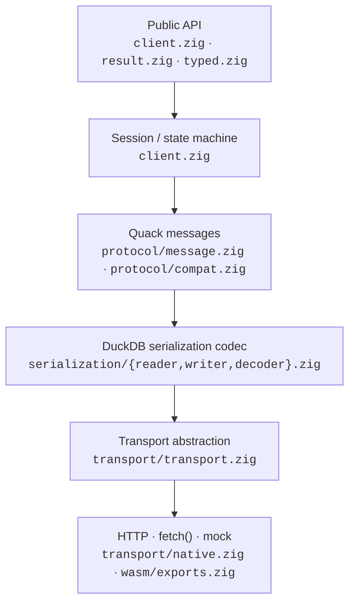
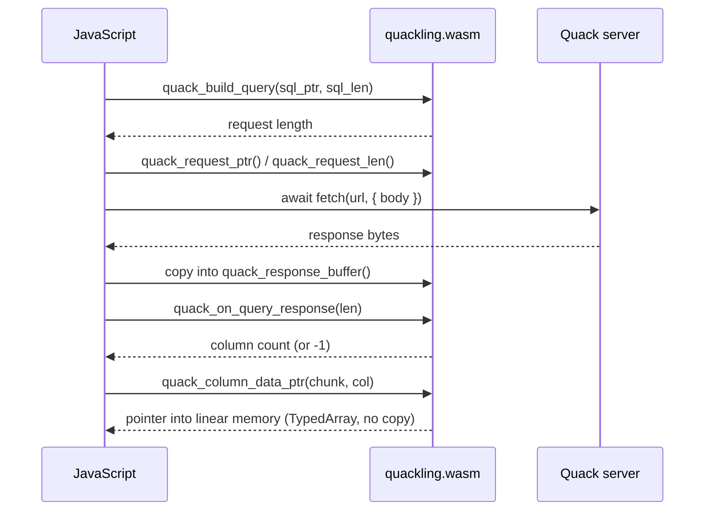
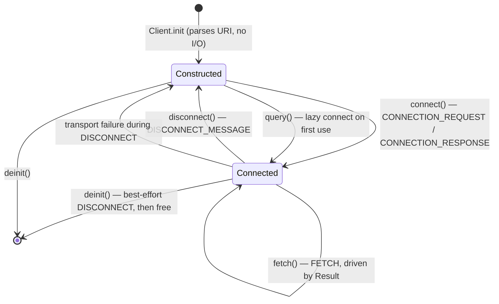
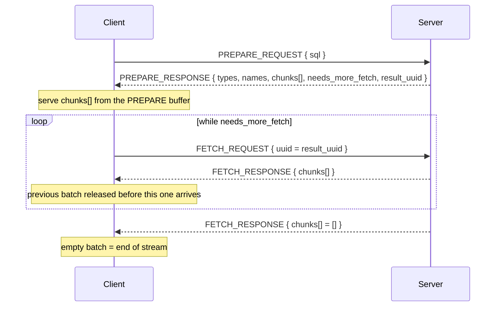

# Quackling アーキテクチャ

[English](../en/ARCHITECTURE.md) · **日本語**
→ [ドキュメント目次](./README.md)

本書は Quackling の構成を説明する。`wasm32-freestanding` ビルドを可能にしている
階層化 (layering) 規則、セッション状態機械 (session state machine)、
`error.ResultSuperseded` の背後にある単一カーソル (single cursor) の正しさ保証、
メモリの所有権 (ownership)、エラー分類 (error taxonomy)、そして拡張点
(extension points) を扱う。

ワイヤフォーマット (wire format) そのものは別文書
[`PROTOCOL.md`](./PROTOCOL.md) を参照。

---

## 1. 階層化規則

**各層 (layer) は直下の層にのみ依存する。プロトコルコア (protocol core) は
ソケット (socket) に一切触れない。**



[README](../../README.md) と同じ平文形式の図:

```
             Public API          client.zig, result.zig, typed.zig
                  ↓
        Session / state machine  client.zig
                  ↓
            Quack messages       protocol/message.zig, protocol/compat.zig
                  ↓
     DuckDB serialization codec  serialization/{reader,writer,decoder}.zig
                  ↓
       Transport abstraction     transport/transport.zig
                  ↓
      HTTP · fetch() · mock      transport/native.zig, src/wasm/exports.zig
```

### この規則が存在する理由

`protocol/` より下はすべて *バイトスライス上の純粋な計算* である。`[]const u8`
を受け取り、デコード済みの値か型付きエラー (typed error) を返す。システムコール
を行わず、ディスクリプタを開かず、スレッドを生成せず、libc をリンクしない。

これは美意識の問題ではなく、WASM ビルドの前提条件である。
`wasm32-freestanding` ターゲットには OS もソケットもファイルシステムも libc も
存在しない。デコーダがどこかで `std.net` や `std.http` を呼んでいれば、モジュール
はそのターゲットではそもそもコンパイルできない。I/O を *注入 (inject)* する設計
だからこそ、同一のデコーダソースがネイティブ Linux/macOS/Windows、WASI、そして
JavaScript が `fetch()` を担うブラウザタブのすべてに供せる。`build.zig` は
`quackling` モジュールのコメントでこの点を明記している
([`../../build.zig:9`](../../build.zig))。

### 何がこの規則を強制しているか

Zig にはモジュールを「I/O なし」と宣言する仕組みがないため、この規則は慣習だけ
でなく構造的・機械的に強制されている。

| 仕組み | 場所 | 効果 |
|---|---|---|
| import の向き | `src/protocol`, `src/serialization`, `src/types` は互いと `std` のみを import | 上位方向の import は import ブロックの 1 行 `grep` で可視化される |
| 条件付きエクスポート | [`../../src/root.zig:55`](../../src/root.zig) | wasm ターゲットでは `NativeTransport` が `@compileError` になり、wasm 側の利用者は名前を書くことすらできない |
| ソケットを知る唯一のファイル | [`../../src/transport/native.zig`](../../src/transport/native.zig) | 冒頭コメントに「ライブラリ中でソケットの存在を知る唯一の場所」と明記。プロトコルコアはこれを import しない |
| `zig build check` | [`../../build.zig:47`](../../build.zig) | ライブラリ *のみ* をビルド (CLI 抜き) するため、CLI が存在し得ないターゲットも含めて任意のターゲットでコンパイル可能 |
| `zig build wasm` | [`../../build.zig:214`](../../build.zig) | `src/wasm/exports.zig` を `wasm32-freestanding`・`entry = .disabled` でコンパイル。API 層より下にネイティブ専用依存があればこの段で失敗する |

規則の後半は README の design constraint 1 に対応する。コアライブラリは *上位*
にも依存しない。CLI ([`../../src/cli/main.zig`](../../src/cli/main.zig)) と WASM
ブリッジはいずれも `quackling` モジュールの *利用者 (consumer)* であり、
`build.zig` は外部プロジェクトと同じ
`.imports = &.{ .{ .name = "quackling", .module = quackling } }` で結線している。

---

## 2. `src/` ツリー

```
src/
├── root.zig            public surface: re-exports, nothing else
├── client.zig          connection identity + session state machine
├── result.zig          streaming cursor (chunks, rows, scalar, drain)
├── typed.zig           comptime struct mapping over a Result
├── params.zig          client-side `?` binding with strict escaping
├── pool.zig            mutex-guarded connection pool + Lease
├── uri.zig             quack:/http:/https: parsing + validation
├── error.zig           error taxonomy (the error sets, and ErrorInfo)
├── stats.zig           Stats counters + the Observer hook
├── protocol/
│   ├── message.zig     MessageType, MessageHeader, request/response bodies
│   └── compat.zig      every protocol constant, in one file
├── serialization/
│   ├── reader.zig      bounds-checked primitive decoding + Limits
│   ├── writer.zig      primitive encoding into a caller-owned ArrayList
│   └── decoder.zig     LogicalType / Vector / DataChunk + their field ids
├── types/
│   ├── logical_type.zig  LogicalTypeId wire enum, fixedWidth(), ExtraTypeInfo
│   ├── value.zig         flat Value union (ergonomic path)
│   ├── vector.zig        Vector, VectorType, Storage (vectorized path)
│   ├── data_chunk.zig    DataChunk, Row, RowIterator
│   └── validity.zig      ValidityMask over borrowed wire bytes
├── transport/
│   ├── transport.zig   Transport vtable + Request/Response + CancelToken + MockTransport
│   └── native.zig      std.http.Client (the only socket-aware file)
├── cli/main.zig        quackling — a consumer, not a special case
└── wasm/exports.zig    browser FFI: JS supplies fetch(), Zig decodes
```

ツリーから読み取るべき点:

- `root.zig` にロジックはない。公開名を再エクスポートし、`test` ブロックで全
  モジュールを明示的に `_ = @import(...)` して `zig build test` が各ファイルの
  テストを実際に走らせるようにしているだけである
  ([`../../src/root.zig:91`](../../src/root.zig))。
- 各層のモジュールは高度な用途とテスト向けに `serialization` / `protocol`
  名前空間で再エクスポートされており、クライアントを介さずコーデックを直接
  駆動できる。
- `params.zig` は `protocol/` ではなく API 層に置かれている。Quack v1 には
  パラメータのワイヤフォーマットが存在しないため、束縛 (binding) はメッセージ
  組み立て *より前* の SQL テキスト変換になる。

---

## 3. `Transport` の依存性注入 (dependency injection)

### インターフェイスの形

`Transport` は comptime インターフェイスではなく実行時 vtable である
([`../../src/transport/transport.zig:86`](../../src/transport/transport.zig))。

```zig
pub const Transport = struct {
    ptr: *anyopaque,
    vtable: *const VTable,

    pub const VTable = struct {
        send: *const fn (ptr: *anyopaque, allocator: std.mem.Allocator, req: Request) Error!Response,
        close: ?*const fn (ptr: *anyopaque) void = null,
    };

    pub fn send(self: Transport, allocator: std.mem.Allocator, req: Request) Error!Response { ... }
    pub fn close(self: Transport) void { ... }
};
```

必須メソッドは 1 つ。リクエストを 1 つ渡してレスポンスを 1 つ得る。`close` は
省略可能で既定は null。

vtable を選んだ理由はファイル自身に書かれている。comptime インターフェイスに
すると `Client` がトランスポートについてジェネリックになり、その型パラメータが
下流のあらゆるシグネチャ (`Result`, `RowStream`, `Pool`, `Lease`) に漏れる。
vtable なら *実行時* にトランスポートを選択することもできる。

`Request` と `Response`:

```zig
pub const Request = struct {
    url: []const u8,
    body: []const u8,
    content_type: []const u8,
    headers: []const Header = &.{},
    timeout_ms: ?u32 = null,
    cancel: ?*CancelToken = null,
};

pub const Response = struct {
    status: u16,
    body: []const u8,
    owned: bool = false,

    pub fn deinit(self: *Response, allocator: std.mem.Allocator) void { ... }
};
```

`Response.owned` は生存期間 (lifetime) の契約を明示化したものである
([`../../src/transport/transport.zig:74`](../../src/transport/transport.zig))。
自身のバッファの借用ビュー (borrowed view) を返せるトランスポートは
`owned = false` としてコピーを避け、割り当てを行うものは `owned = true` とし
呼び出し側が解放する。この 1 ビットがデコード経路全体をゼロコピー (zero-copy)
に保つ理由は §5 で述べる。

### ライブラリが自らソケットを開かない理由

`Client.Options.transport` は既定値のない必須フィールドであり
([`../../src/client.zig:35`](../../src/client.zig))、これを渡さずに `Client` を
構築することはできない。「既定のトランスポート」への fallback は存在せず、
したがってコアライブラリが自発的にネットワークへ手を伸ばす経路も存在しない。
帰結は 3 つ。

1. ネットワークスタックを一切持たないターゲットでもコアがコンパイルできる。
2. テストにサーバが不要になる (後述)。
3. 既存のイベントループを持つ呼び出し側は自分の `std.Io` を渡せる。何も強制され
   ない。`NativeTransport.initWithIo(allocator, io, .{})` がその継ぎ目 (seam)
   である ([`../../src/transport/native.zig:50`](../../src/transport/native.zig))。

### `NativeTransport`

ソケットを知る唯一のファイル。`std.http.Client` 上に構築され、純粋な Zig
標準ライブラリのみ — libcurl も C 依存もない。自ら生成した場合にのみ
`std.Io.Threaded` を所有し (`owned_io`)、`std.http` のエラーを `mapError` で
平坦な `transport.Error` 集合へ写像し、キャンセルトークンを接続前と fetch 復帰後
の両方で確認し、本体を返す前に `Options.max_response_bytes` を強制する。

### `MockTransport` — サーバ不要のテスト

`MockTransport` ([`../../src/transport/transport.zig:110`](../../src/transport/transport.zig))
は用意済みのレスポンス本体を順に再生する。

```zig
var mock = quackling.MockTransport{ .responses = &.{ connect_reply, prepare_reply } };
defer mock.deinit();

var client = try quackling.Client.init(.{
    .allocator = allocator,
    .endpoint = "quack:localhost:9494",
    .token = "t",
    .transport = mock.transport(),
});
defer client.deinit();
```

フィールドがそのままテスト面 (testing surface) になっている。

| フィールド | 用途 |
|---|---|
| `responses: []const []const u8` | `send` 1 回につき 1 本体を返す。末尾を越えた呼び出しは `error.NetworkError` |
| `status: u16 = 200` | 各本体と共に返す HTTP ステータス。非 2xx 経路の検証用 |
| `sent` + `record_allocator` | 各リクエスト本体を記録するので、実際に符号化されたバイト列をテストで検証できる |
| `fail_with: ?Error` | `send` がレスポンスの代わりにこのエラーを返す。トランスポート障害経路用 |

`owned = false` を返す (フィクスチャがレスポンスより長生きする) ため、モックは
コピーではなく借用バッファ経路 — ゼロコピートランスポートと同じ経路 — も検証する。
これによりハンドシェイク、エラー分類、複数バッチ FETCH、キャンセル、統計のすべて
が DuckDB を起動せずに網羅できる。`zig build test` はまさにこのために
`tests/client_test.zig` を含む ([`../../build.zig:102`](../../build.zig))。

### ブラウザ `fetch()` ブリッジ

[`../../src/wasm/exports.zig`](../../src/wasm/exports.zig) は同じ考え方の
ブラウザ側実装だが、I/O が *非同期でモジュール外部にある* 環境向けに構成されて
いる。ブロックせざるを得ない `send` を持つ `Transport` vtable を実装するのでは
なく、往復を 2 分割して中間を JavaScript に所有させる。



境界は意図的に狭い。JS は線形メモリ (linear memory) へバイト列を出し入れする
だけで、JSON を見ることはない。freestanding wasm には独自のアロケータがない
ため、モジュールは線形メモリから固定サイズ領域を切り出す — デコード用の 16 MiB
`std.heap.FixedBufferAllocator` に加え、リクエスト・符号化・入力・レスポンスの
各バッファを個別に持つ。これによりモジュールのフットプリントは予測可能で、
タブ内で無制限に増大し得ない。新しいクエリレスポンスごとの `fba.reset()` が
解放戦略の全部である。

---

## 4. セッション状態機械

`Client` は 1 つの論理的な Quack 接続である。グローバル状態を持たないため、
1 プロセス内に多数共存できる。



### `init` は I/O を行わない

`Client.init` はエンドポイントを解析しリクエスト URL を割り当てる。それだけで
ある ([`../../src/client.zig:77`](../../src/client.zig))。これは `Pool` にとって
重要で、`acquire` が *プールの mutex を保持したまま* `Client` を生成できるのは、
構築がネットワーク処理を伴わないからである
([`../../src/pool.zig:228`](../../src/pool.zig))。

### 初回クエリ時の遅延接続 (lazy connect)

`queryWithCancel` は次の行から始まる。

```zig
if (!self.isConnected()) try self.connect(cancel);
```

([`../../src/client.zig:190`](../../src/client.zig))。`connect` を明示的に呼ぶ
のは任意かつ冪等 (idempotent) で、既に接続済みなら即座に返る。

### ハンドシェイク (handshake)

`connect` は認証トークンと、クライアントのバージョン/プラットフォーム文字列、
`compat.zig` の対応バージョン範囲を載せた `CONNECTION_REQUEST` を符号化し、
続いて次を行う。

1. `MessageHeader` をデコード。ここでの `ERROR_RESPONSE` は分類され (後述)、
   それ以外の型は `error.UnexpectedMessageType`。
2. `body.quack_version` を `compat.min_supported_version` /
   `max_supported_version` に対して範囲検査する。**両端** を見るので、対応範囲
   を *下回る* サーバも受理せず拒否する
   ([`../../src/client.zig:145`](../../src/client.zig))。
3. 空でない `header.connection_id` を要求する。セッション id は本体ではなく
   *ヘッダ* に載る ([`../../src/client.zig:151`](../../src/client.zig))。
4. `connection_id`, `server_duckdb_version`, `server_platform` をクライアント
   所有のメモリへ複製する。レスポンスバッファは呼び出し終了時に解放されるため、
   借用はできない。

### セッション id

`connection_id` が *そのまま* セッションである。`isConnected()` は文字通り
`self.connection_id.len > 0` であり、ハンドシェイク後のすべてのメッセージ
(`PREPARE_REQUEST`, `FETCH_REQUEST`, `DISCONNECT_MESSAGE`) はこれをヘッダに
載せる。

### セッションを無効化するもの

| 事象 | セッションへの影響 |
|---|---|
| `disconnect()` | `connection_id` を解放しクリア → Constructed へ。以後の `query()` は *新しい* セッション id で遅延再接続する |
| `disconnect()` 内のトランスポート障害 | いずれにせよローカルでセッションを破棄した後にエラーを返す。後始末はベストエフォート ([`../../src/client.zig:167`](../../src/client.zig)) |
| それ以外の箇所でのトランスポート障害 | `connection_id` は *クリアされない*。クライアントは接続済みだと考え続ける。再試行は同じセッション id を再利用し、障害が一時的なら正しい挙動である。同期ずれ (desync) を疑う呼び出し側は `disconnect()`、プール利用時は `Lease.discard()` を使うべき |
| `deinit()` | ベストエフォートの `disconnect()` (エラーは無視) の後、所有物すべてを解放 |
| サーバ側のセッション喪失 | 次のリクエストで `ServerError` として現れ、サーバのテキストが `lastError()` に入る |

なお *新しいクエリ* はセッションを無効化 **しない**。無効化されるのは
*結果カーソル (result cursor)* である。これは別の性質であり、次節の主題である。

### セッション層でのエラー分類

サーバは不正なトークンを通常の `ERROR_RESPONSE` として報告するため、利用できる
手がかりはメッセージ本文だけである。`isAuthMessage`
([`../../src/client.zig:353`](../../src/client.zig)) は大文字小文字を無視して
`"authenticat"`, `"invalid token"`, `"unauthorized"` を照合し、一致すれば
`error.ServerError` ではなく `error.AuthenticationFailed` に写像する。照合は
意図的に狭い。偽陰性でも `ServerError` を報告するだけで、それも依然として正確
だからである。サーバのテキストは常に `Client.lastError()` に逐語的に保存される。

`roundTrip` はトランスポート層で分類する。非 2xx ステータスは
`last_error.http_status` を記録して `error.HttpError` を返し、
`options.max_response_bytes` を超える本体は `error.ResponseTooLarge` を返す。
いずれも `stats.transport_errors` を加算する。

---

## 5. 単一カーソル制約と `error.ResultSuperseded`

これは使い勝手上の制限ではなく実際の正しさ保証 (correctness property) なので、
正確に述べる価値がある。

### プロトコル上の事実

Quack の接続は **サーバ側の結果カーソルを厳密に 1 つだけ** 持つ。サーバは
`PREPARE_REQUEST` を *受理した* 時点で — SQL を実行する **前に** —
`duckdb_query_result.reset()` によってそれをリセットする。したがって新しい
クエリがその後失敗しても、以前のカーソルは既に失われている。

### 防御がなければ何が起きるか

`FETCH_REQUEST` は `result_uuid` を指定するが、実際に進むのは接続の *現在の*
カーソルである。2 つ目のクエリを発行した後も古い `Result` が FETCH を続けられて
しまうと、クライアントは新しいクエリのカーソルを進め、別のクエリの行を呼び出し側
に渡すことになる — 型は正しく見え、どこにもエラーは出ない。つまり静かなデータ
破損である。README が mutation testing で発見した欠陥として挙げているのが、まさに
これ (*「新しいクエリで結果が無効化されない — 古い結果が静かに次のクエリの行を
ストリームしていた」*) である。

### 仕組み

単調増加する世代カウンタ (generation counter) を FETCH 時に比較する。

`Client.query_generation` は 0 から始まり、`queryWithCancel` において
`PREPARE_REQUEST` を符号化した直後、往復完了 **より前** に加算される
([`../../src/client.zig:202`](../../src/client.zig))。

```zig
self.query_generation += 1;
```

この配置が要点であり、ソースのコメントが理由を明示している。サーバは PREPARE を
*受理した* 時点で古いカーソルを破棄するので、成功時に加算していたら、カーソルが
既に存在しない *失敗した* クエリの後で古い `Result` が有効に見えてしまう。

各 `Result` は生成時の世代を記録し
([`../../src/result.zig:99`](../../src/result.zig))、

```zig
.generation = client.query_generation,
```

`fetchNextBatch` が FETCH ごとにそれを検査する
([`../../src/result.zig:177`](../../src/result.zig))。

```zig
if (self.generation != self.client.query_generation) {
    self.finished = true;
    return errors.ProtocolError.ResultSuperseded;
}
```

同時に結果自身を `finished` にするので、エラーを無視した呼び出し側も誤った行を
読む二度目の機会を得ない。

### 呼び出し側が見るもの

```zig
var a = try client.query("SELECT * FROM big");
var b = try client.query("SELECT 1");   // discards a's cursor server-side
_ = try a.nextChunk();                  // error.ResultSuperseded
```

重要な境界事例が 2 つある。

- **既に手元にある** チャンクは読める。世代が参照されるのは *新たな* FETCH が
  必要になったときだけで、デコード済みのバッチは `a` がまだ所有するレスポンス
  バッファを借用している。失敗するのは新しいサーバ状態へ踏み込むときのみである。
- 全行が `PREPARE_RESPONSE` 内に収まった結果 (`needs_more_fetch == false`) は
  FETCH を一度も発行しないので、これを踏むことはない。小さな結果は後続クエリの
  影響を受けない。

対処は、次のクエリの前に結果を消費し終えるか `deinit` する、あるいは
[`Pool`](#10-並行性モデル) で同時クエリごとに接続を分けることである。

---

## 6. メモリの所有権と生存期間

中核となる規則は **バルクペイロード (bulk payload) はレスポンスバッファから
借用し、所有するのは小さな構造の骨組み (spine) だけ** である。

### 何を誰が所有するか

| データ | 所有 | 解放者 |
|---|---|---|
| HTTP レスポンス本体 | `Response.owned == true` なら呼び出し側の所有、false なら借用 | `Response.deinit(allocator)` |
| 固定幅ベクタのペイロード (`Storage.fixed`) | **借用** — レスポンス本体のスライス | なし |
| 文字列/BLOB のバイト列 (`Value.varchar`, `.blob`, `Enum.label`) | **借用** | なし |
| 有効性マスク (validity mask) のバイト列 | **借用** — `ValidityMask.bytes` はワイヤのバイト列を指す | なし |
| 列名 (`Result.names[i]`) | PREPARE レスポンス本体からの **借用** | なし |
| `MessageHeader.connection_id` (デコード時) | **借用** — ゆえに `Client` はハンドシェイクで複製する | なし |
| `[]const []const u8` の文字列スライス表 | `Vector` の所有 | `Vector.deinit` |
| 辞書インデックス配列、子ベクタ、LIST エントリ | `Vector` の所有 | `Vector.deinit` |
| `DataChunk.columns`, `DataChunk.types` | `DataChunk` の所有 | `DataChunk.deinit` |
| `PrepareResponse.types/names/chunks` の骨組み | `PrepareResponse` の所有 | `PrepareResponse.deinit` |
| `Client.url`, `connection_id`, `server_version`, `server_platform`, `send_buf` | `Client` の所有 | `Client.deinit` |
| `ErrorInfo.message` | `allocator` が設定されていれば所有 | `ErrorInfo.deinit` |

入れ子型 (nested type) における微妙な点が 1 つある。`Vector` の `type`
フィールドは **借用であって所有ではない**。列の型ツリー全体は `DataChunk` が
所有し、STRUCT/LIST/MAP の子ベクタはその部分木を共有する
([`../../src/types/vector.zig:80`](../../src/types/vector.zig))。自分の型を
解放するベクタがあれば、共有された子を二重解放してしまう。型の所有をただ 1 箇所
に集めていることが、入れ子型を安全に一度だけ解放できる理由である。

### 帰結: チャンクは次の `nextChunk` までのみ有効

`nextChunk` は `?*const DataChunk` — `Result` の現在のバッチを指すポインタ — を
返す。`fetchNextBatch` は次の FETCH を発行する *前に* `releaseFetch()` を呼び
([`../../src/result.zig:189`](../../src/result.zig))、前バッチのレスポンス
バッファを解放する。その瞬間に古いチャンク内のすべての借用スライスは無効になる。

つまり **`nextChunk` を再度呼ぶ前にチャンクを消費するかコピーせよ**。

```zig
while (try result.nextChunk()) |chunk| {
    const col = chunk.column(0).?;

    if (col.asSlice(i64)) |slice| {
        // Truly zero-copy: `slice` aliases the response buffer.
        for (slice) |v| consume(v);
    } else if (col.isFlat(i64)) {
        // Wire payloads carry no alignment guarantee; `at` is always safe.
        for (0..chunk.row_count) |i| consume(col.at(i64, i).?);
    }
}
```

`asSlice(T)` は、ベクタが `T` の平坦な連続 (flat run) であり *かつ* 借用バイト列
が偶然 `T` に整列 (alignment) している場合にのみ非 null を返す。ペイロードの
オフセットはその手前の varint 長に依存するため、整列は運任せである。非 null の
`asSlice` は最適化とみなし、通常経路は `at()` / `copySlice()` とすること
([`../../src/types/vector.zig:187`](../../src/types/vector.zig))。どちらも
有効性マスクを参照しないので、`Vector.isNull(i)` を併せて確認する。

対照的に意図して *遅く* 解放されるのが PREPARE レスポンスである。`types` と
`names` がそこを指しているため、`Result` は生存期間全体にわたり
`prepare_response` を保持する ([`../../src/result.zig:48`](../../src/result.zig))。

### 割り当てが行数に比例しない理由

バッチのデコードで割り当てるのは構造の骨組みだけ — チャンク配列、チャンクごとの
列配列、型ツリー、そして可変幅または圧縮列についてはベクタごとに 1 つのスライス表
かインデックス配列である。行のペイロードは決してコピーされない。ゆえに 5 000 行の
`BIGINT` も 1 行も 1 桁の割り当てで済み (README のベンチマーク表: 5 000 行で 9
割り当て、`SELECT 42` で 5)、MAP はキーと値が借用された子ベクタであるため
エントリ数に関係なく一定の 13 割り当てで済む。

同じ性質がストリーミング時のピークメモリを抑える。常駐する FETCH バッチは常に
1 つだけだからである。README の実測は 100 k 行 → 2.6 MB、1 M 行 → 2.7 MB、
5 M 行 → 2.9 MB。

圧縮エンコーディングもこれを補強する。`CONSTANT`, `DICTIONARY`, `SEQUENCE` は
展開されずインデックス間接参照としてデコードされるため、2048 行の定数ベクタでも
値 1 つ分のコストに留まる。

---

## 7. ストリーミングモデル



### 最初のチャンクは PREPARE と共に届く

`PREPARE_RESPONSE` は列メタデータ *と* 最初の `chunks` リスト、加えて
`needs_more_fetch` フラグと `result_uuid` を載せる
([`../../src/protocol/message.zig:193`](../../src/protocol/message.zig))。
`Result.init` は `pending` を `prepared.chunks` から直接初期化するので、小さな
クエリ — 一般的なケース — は FETCH ゼロで **1** 往復で完了する。

### `result_uuid` を鍵とする FETCH 往復

`pending` を使い切り `needs_more_fetch` が立っているとき、`fetchNextBatch` は
`Client.fetch(self.result_uuid, self.cancel)` を発行し、セッションの
`connection_id` の下に `FETCH_REQUEST { uuid }` を符号化する。レスポンスの
チャンクリストが新しい `pending` になる。

サーバ側のバッチサイズはサーバ設定である (`quack_fetch_batch_chunks`、既定 12
チャンク × 最大 2048 行)。クライアントは与えられたものを読むだけで、前提を置か
ない ([`../../src/protocol/compat.zig:54`](../../src/protocol/compat.zig))。

### ストリーム終端は *サーバ* の合図

`FETCH_RESPONSE` に `needs_more_fetch` フィールドは **ない**。終端の合図は
**空のチャンクリスト** である ([`../../src/result.zig:196`](../../src/result.zig))。

```zig
if (got.body.chunks.len == 0) {
    self.needs_more_fetch = false;
    self.finished = true;
}
```

したがって空でないバッチは常に「もう一度尋ねよ」を意味し、完走したストリームは
常に何も返さない追加の往復 1 回を要する。

### ゆえに FETCH 上限がある

終了判定が完全に相手側に委ねられているため、空バッチを決して送らないサーバは
クライアントを永久にループさせ得る。`Result.max_fetches` がその防御である
([`../../src/result.zig:82`](../../src/result.zig))。

```zig
max_fetches: u64 = 5_000_000,
```

各 FETCH の前に検査される ([`../../src/result.zig:181`](../../src/result.zig))。

```zig
if (self.fetches >= self.max_fetches) {
    self.finished = true;
    return errors.ProtocolError.FetchLimitExceeded;
}
```

文書化されたバッチサイズなら 10¹¹ 行を大きく超えて許容するので、正当な利用で
到達することはない。壊れた、あるいは敵対的な相手がハングさせるのを防ぐ純粋な
生存性 (liveness) 防御である。無制限 FETCH ループも README が mutation testing
で捕捉したと挙げる欠陥の 1 つである。定数ではなく `Result` ごとのフィールドな
ので、特殊なサーバを相手にする呼び出し側は上げ下げできる。

### 消費 API

3 つとも同じ `nextChunk` ループの上に載るので、ストリーミングと生存期間の規則は
同一に適用される。

| API | シグネチャ | 備考 |
|---|---|---|
| `nextChunk` | `fn (*Result) Error!?*const DataChunk` | 主 API。次の呼び出しで無効化される |
| `rows` | `fn (*Result) RowStream` | `RowStream.next()` はチャンク境界を透過的に跨ぐ。`Row` は `{ chunk, index }` で何もコピーしない |
| `drain` | `fn (*Result) Error!u64` | すべて消費し `rows_seen` を返す。DDL/DML 向け |
| `scalar` | `fn (*Result) Error!?Value` | 最初のチャンクの先頭行・先頭列。空なら null |
| `typed.iterator` | `fn (comptime T, *Result) Error!Iterator(T)` | comptime 構造体マッピング。`?T` フィールドは NULL を受け、非オプショナルフィールドの NULL はエラー |

`nextChunk` は反復ごとにキャンセルトークンも確認して `error.Cancelled` を返す
ので、トランスポートの支援がなくてもチャンク間でキャンセルが観測される
([`../../src/result.zig:152`](../../src/result.zig))。

結果ごとのカウンタ (`rows_seen`, `chunks_seen`, `fetches`) は、クライアント全体の
`Stats` と並行して維持される。

---

## 8. エラー分類

[`../../src/error.zig`](../../src/error.zig) はエラーを **原因** で分類する。
これにより呼び出し側は「ネットワークが壊れた」「サーバが SQL を拒否した」
「これは正当な Quack ではない」を区別して分岐できる。各グループは名前付き
エラー集合であり、`QueryError` はそれらの和である — 各層で `||` により組み立て
るのではなく、1 箇所で一度だけ定義する (さもなければ変種を 1 つ追加するたびに、
中間のあらゆるシグネチャを追いかけることになる)。

| 集合 | 意味 | メンバ | 呼び出し側の対応 |
|---|---|---|---|
| `TransportError` | プロトコルより下: DNS, TCP, TLS, HTTP ステータス, キャンセル | `ConnectionFailed`, `Timeout`, `HttpError`, `ResponseTooLarge`, `TlsError`, `InvalidUrl`, `Cancelled`, `Unsupported`, `NetworkError` | 原理的に再試行可能。HTTP の場合は `last_error.http_status` を確認。`Cancelled` は障害ではなく意図的なものとして扱う |
| `ProtocolError` | バイト列は整形式だが、やり取りとして意味を成さない | `UnexpectedMessageType`, `UnknownMessageType`, `UnsupportedProtocolVersion`, `NotConnected`, `ResultClosed`, `ResultSuperseded`, `FetchLimitExceeded` | 多くは一時的でなく呼び出し側かバージョンの不備。`ResultSuperseded` は呼び出し順序のバグ、`UnsupportedProtocolVersion` はサーバが範囲外 — 再試行しない |
| `SerializationError` | バイト列自体が不正 | `UnexpectedEndOfBuffer`, `VarIntOverflow`, `LengthLimitExceeded`, `UnexpectedFieldId`, `UnexpectedField`, `MalformedVector`, `RowCountTooLarge` | 敵対的/破損した相手か、上流のフォーマット変更。再試行せずエンドポイントを報告する |
| `AuthenticationError` | 資格情報が拒否された | `AuthenticationFailed` | トークンを直す。ループで再試行してはならない |
| `ServerError` | サーバがリクエストを実行し失敗を報告した (不正な SQL、制約違反) | `ServerError` | `Client.lastError()` を利用者に見せる — DuckDB 自身のテキストが最も有用な診断情報 |
| `UnsupportedError` | このクライアント版が実装していない型やエンコーディング | `UnsupportedType`, `UnsupportedVectorType` | データ側の問題ではなくクライアントの欠落。サーバ側でキャストするか issue を立てる |
| `UriError` | エンドポイント解析 | `InvalidUrl`, `EmptyHost`, `InvalidPort` | 設定の誤り。I/O 前に `Client.init` が返す |
| `ParameterError` | クライアント側の `?` 束縛 | `ParameterCountMismatch`, `UnsupportedParameter`, `InvalidUtf8` | 呼び出し側のバグ。送信前に返る |

`QueryError` はさらに `std.mem.Allocator.Error` と `error{ColumnOutOfRange}` を
含む。`Pool.Error` はこれを `PoolExhausted` と `PoolClosed` で拡張する
([`../../src/pool.zig:35`](../../src/pool.zig))。

### `ErrorInfo`: Zig のエラーが運べない情報

Zig のエラー値はペイロードを運べないため、詳細は `ErrorInfo` に併置される
([`../../src/error.zig:99`](../../src/error.zig))。サーバのメッセージ (複製して
所有し、`set` ごとに置換) と、任意の `http_status` である。`Client.lastError()`
から読む。トークンはログにも出力にもエラーメッセージにも決して含まれない。

### 実際の分岐

```zig
var result = client.query(sql) catch |err| switch (err) {
    error.ServerError => {
        // DuckDB's own text — the most useful thing a user gets.
        std.log.err("query failed: {s}", .{client.lastError()});
        return;
    },
    error.AuthenticationFailed => return err,       // config problem, do not retry
    error.ResultSuperseded => unreachable,          // caller-sequencing bug
    error.ConnectionFailed, error.NetworkError => { // transient: retry / re-lease
        return err;
    },
    else => return err,
};
defer result.deinit();
```

---

## 9. プロトコル定数の在処

Quack はベータであり上流は破壊的変更を予告しているため、ワイヤフォーマットが
依存するマジックナンバーはすべて 2 箇所に閉じ込められている。

- [`../../src/protocol/compat.zig`](../../src/protocol/compat.zig) — 64 行。
  プロトコルバージョン (`quack_version = 1` と、ハンドシェイクで広告する
  `min_supported_version` / `max_supported_version` の範囲)、記録用の
  `serialization_version = 7`、HTTP 面 (`http_path = "/quack"`,
  `content_type = "application/vnd.duckdb"`, `default_port = 9494`,
  `uri_scheme = "quack:"`)、ログ用に報告するクライアントのバージョン/プラット
  フォーム文字列、そして参考値の `default_fetch_batch_chunks = 12` を保持する。
- [`../../src/serialization/decoder.zig`](../../src/serialization/decoder.zig) —
  `LogicalType` / `Vector` / `DataChunk` の **フィールド id**。使用箇所に散らす
  のではなく、ファイル冒頭付近の 1 ブロックにまとめて宣言されている (`ty_id`,
  `vec_type`, `vec_validity`, `chunk_rows`, …)。

`client_platform` はビルドターゲットから comptime に導出されるため、ターゲット
ごとの表を持たずにクロスコンパイルや wasm ビルドでも正確である。

帰結は 2 つ。第一に、上流の変更追従が **局所的な編集** で済む。`compat.zig` の
バージョン範囲と HTTP 面、`decoder.zig` のフィールド id、そして
[`PROTOCOL.md`](./PROTOCOL.md) の対応更新だけであり、コーデック全体をなめる必要
はない。第二に、バージョンゲートは両端に対する *範囲* 検査である
([`../../src/client.zig:145`](../../src/client.zig)) ため、対応窓の外のサーバは
推測されるのではなく拒否される。

メッセージとヘッダのフィールド id は、それを使う構造体の近く
([`../../src/protocol/message.zig`](../../src/protocol/message.zig)) に置かれて
いる (`hdr_type = 1`, `hdr_connection_id = 2`, `hdr_client_query_id = 3`、および
各本体の `encode` / `decode` 内の小さなリテラル id)。これらは 1 つのメッセージ
形状の文脈でのみ意味を持つからである。

---

## 10. 並行性モデル

### 接続はシングルスレッド・単一カーソル

`Client` は内部ロックを持たず、リクエストごとに `send_buf`, `stats`,
`last_error`, `query_generation` を変更し、サーバ側で有効な結果カーソルを
厳密に 1 つしか持てない。**1 つの `Client` をスレッド間で共有してはならない。**
スレッドごとに 1 つ、あるいは実行中のクエリごとに 1 つが正しいモデルである。

並行に触ってよいものは 2 つある。

- `CancelToken` — acquire/release 順序を持つ素の
  `std.atomic.Value(bool)` である
  ([`../../src/transport/transport.zig:42`](../../src/transport/transport.zig))。
  別スレッドやシグナルハンドラから `cancel()` して安全で、非同期モデルを何も
  強制しない。`nextChunk` はチャンク間でポーリングし、`NativeTransport` は接続前
  と fetch 復帰後に確認する。
- 粗い計測目的で `Client.stats` を読むこと。ただしカウンタは素の `u64` であり
  同期されていない点を承知の上で。

### 並行性は `Pool` が与える

[`../../src/pool.zig`](../../src/pool.zig) が接続を貸し出し、回収する。
`std.Io.Mutex` で保護され、接続が idle に戻るたびに通知される
`std.Io.Condition` を備え ([`../../src/pool.zig:132`](../../src/pool.zig))、
グローバル状態を持たず、スレッド間で共有して安全である。

`Options` の全容 ([`../../src/pool.zig:51`](../../src/pool.zig)):

| フィールド | 既定値 | 備考 |
|---|---|---|
| `allocator` | — | プールされる `Client` とプール自身の配列に使用 |
| `endpoint` | — | すべてのプール接続で同一エンドポイント |
| `token` | `""` | すべてのプール接続で同一の資格情報 |
| `transport` | — | すべてのプール接続で **共有** されるため、プールがスレッドセーフであるならそれ自体もスレッドセーフでなければならない。`NativeTransport` は該当する。`std.http.Client` がソケットをスレッドセーフにプールするため |
| `io` | — | プール自身のブロッキング待機に使用。トランスポートと同じ `Io` を渡すこと。通常は `std.Io.Threaded` |
| `headers` | `&.{}` | 各 `Client` へ転送 |
| `timeout_ms` | `null` | 各 `Client` へ転送 |
| `max_response_bytes` | 256 MiB | 各 `Client` へ転送 |
| `observer` | `null` | 各 `Client` へ転送 |
| `max_connections` | 8 | 生存接続数の上限。`init` は 0 を `error.PoolExhausted` で拒否する |
| `min_connections` | 0 | `init` 時に先行して開く数 (`max_connections` に切り詰め)。残りは要求に応じて生成 |
| `wait_policy` | `.wait` | `.wait` は接続が空くまでブロック、`.fail` は即座に `error.PoolExhausted` — 待ち行列を作りたくないリクエストハンドラのための負荷制御 (load shedding) |
| `on_deinit_wait` | `null` | `deinit` がブロックせざるを得ないとき、未返却リース数と共に呼ばれる |
| `observer_ctx` | `null` | `on_deinit_wait` に渡す不透明なコンテキスト |

ライフサイクル:

- **`acquire(cancel)`** — mutex を取り、次をループする。キャンセルトークンを
  尊重する (`error.Cancelled`)、idle 接続があれば取り出す、なければ
  `max_connections` 未満なら生成する (`Client.init` は I/O を行わないのでロック下
  でも安全)、それでもなければ `wait_policy` を適用する — `error.PoolExhausted`
  を返すか、条件変数で待って起床時に `closed` を再検査する。`deinit` 後の
  `acquire` は `error.PoolClosed` を返す。
- **`Lease.release()`** — 接続を `idle` に戻し待機者に通知する。`released`
  フラグにより二重解放が no-op になる。さもなければフリーリストが壊れる。
  シャットダウン中は `deinit` が破棄するために接続は `owned` に留まり、
  `release` はリースが戻ったことだけを報告する。
- **`Lease.discard()`** — 再利用せず接続を退役させる。呼び出し側が不良状態
  (プロトコルの同期ずれ、トランスポート障害) を知っている場合に用いる。新しい
  接続が枠を取れるよう `owned` から外し、ロックの *外側* で破棄する。
- **`snapshot()`** — mutex 下で取得する一貫した `Stats` ビュー (`total`,
  `in_use`, `idle`, `acquires`, `creates`, `discards`, `waits`, `timeouts`)。

### `Pool.deinit` が待つ理由

`deinit` は `closed` を立て、`acquire` でブロックしている者を起こすため
broadcast し、その後 `leased > 0` の間ブロックする
([`../../src/pool.zig:192`](../../src/pool.zig))。

理由は use-after-free である。`Lease` は `*Client` を保持する。リースがまだそれ
を指しているうちにクライアントを解放すれば、リースは宙に浮く — README はこれを
mutation testing で発見した欠陥として挙げている (「リースが未返却のままプールを
閉じると、使用中の接続が解放された」)。すべてのリースに参照カウントを持たせない
限り、待つことが唯一の安全な選択である。

罠は、**リースを保持したままそのスレッドから `deinit` を呼ぶと自分自身を待つ**
点である。プールは内部からこれを可搬に検出できず、ライブラリが stderr に書く
筋合いもないため、それを表面化させるために `on_deinit_wait` フックがある。

```zig
fn onDeinitWait(ctx: ?*anyopaque, outstanding: usize) void {
    _ = ctx;
    std.log.warn("Pool.deinit blocked on {d} outstanding lease(s)", .{outstanding});
}

var pool = try quackling.Pool.init(.{
    // ...
    .on_deinit_wait = onDeinitWait,
});
```

null のままなら `deinit` は静かに待つ。リースは先に解放すること。

すべてのリースが戻ったら、`deinit` は接続リストの所有権を取り、mutex を解放し、
その後で各 `Client` を破棄する — 各デストラクタがベストエフォートの
`DISCONNECT` を送るため、意図してロックの外で行う。

> 注: `Pool.deinit` の doc コメント
> ([`../../src/pool.zig:174`](../../src/pool.zig)) は、安全検査付きビルドでは
> 自己デッドロックを「ハングではなく明確な panic で捕捉する」と述べている。
> 現在の実装にはそのような検査はなく、どのビルドモードでも待機する。実際の挙動
> は待機であると理解すること。

README のロードマップにあるとおり、プール接続を跨ぐ並行 FETCH は未実装である。
現時点では 1 つの結果は 1 つの接続上でストリームされる。

---

## 11. 拡張点

### 独自 `Transport` の実装

リクエスト本体をレスポンス本体に変えられるものは何でも該当する。ゲートウェイ
クライアント、プロセス内ループバック、記録プロキシ、再試行ラッパなど。関数 1 つ
を実装して vtable を渡すだけである。`root.zig` はまさにこの用途でモジュールを
`transport_mod` として再エクスポートしている
([`../../src/root.zig:51`](../../src/root.zig))。

```zig
const quackling = @import("quackling");
const tr = quackling.transport_mod;

const LoggingTransport = struct {
    inner: quackling.Transport,
    total_bytes: usize = 0,

    fn sendFn(ptr: *anyopaque, allocator: std.mem.Allocator, req: tr.Request) tr.Error!tr.Response {
        const self: *LoggingTransport = @ptrCast(@alignCast(ptr));
        if (req.cancel) |c| if (c.isCancelled()) return tr.Error.Cancelled;
        const res = try self.inner.send(allocator, req);
        self.total_bytes += res.body.len;
        return res;
    }

    pub fn transport(self: *LoggingTransport) quackling.Transport {
        return .{ .ptr = self, .vtable = &.{ .send = sendFn } };
    }
};
```

実装が守るべき契約:

1. `owned` ビットが真実である `Response` を返す。`send` に渡されたアロケータで
   呼び出し側が `body` を解放すべきなら `owned = true`、本体が呼び出しより長生き
   する (静的フィクスチャ、あるいはトランスポートが保持するバッファ) なら
   `false`。ここを誤るとリークか二重解放になる。
2. 実際の HTTP `status` を報告する。`roundTrip` は非 2xx を `error.HttpError`
   として扱い、ステータスを `ErrorInfo` に記録する。
3. `req.cancel` を尊重する。最低でも入口で確認し、理想的には
   `NativeTransport` のように往復後にも確認する。
4. 障害を `transport.Error` に写像する。任意の `anyerror` を漏らさず、
   `NativeTransport.mapError` に倣う。
5. `req.body` を `req.content_type` と `req.headers` を付けて `POST` で送る。
6. 解放すべきものがある場合にのみ `close` を提供する。

同じ継ぎ目が非同期化もカバーする。`Transport.send` は現状同期的だが、
`NativeTransport.initWithIo` における `std.Io` の受け渡しが io_uring/epoll/kqueue
バックエンドの到来点であり、README のロードマップはこのインターフェイス上での
非同期 I/O を挙げている。

### observer フック

[`../../src/stats.zig`](../../src/stats.zig) は依存性のない仕組みを 2 つ提供する。
ロギングフレームワークは import されず、既定では何もどこにも書かれない。

`Stats` は好きなときに読める素のカウンタ構造体である — `connects`, `requests`,
`queries`, `fetches`, `chunks_received`, `rows_received`, `bytes_sent`,
`bytes_received`, `server_errors`, `transport_errors`, `protocol_errors` — に
`reset()` と `{f}` 用の `format` メソッドが付く。

`Observer` はインターフェイスではなく任意の関数ポインタの構造体なので、
気にするフックだけを渡せる
([`../../src/stats.zig:47`](../../src/stats.zig))。

```zig
const Metrics = struct {
    var requests: usize = 0;
    var rows: usize = 0;

    fn onStart(_: ?*anyopaque, bytes: usize) void { _ = bytes; requests += 1; }
    fn onChunk(_: ?*anyopaque, n: usize) void { rows += n; }
};

var client = try quackling.Client.init(.{
    .allocator = allocator,
    .endpoint = "quack:localhost:9494",
    .token = token,
    .transport = http.transport(),
    .observer = .{
        .on_request_start = Metrics.onStart,
        .on_chunk = Metrics.onChunk,
    },
});
```

| フック | シグネチャ | 発火 |
|---|---|---|
| `on_request_start` | `fn (ctx: ?*anyopaque, bytes: usize) void` | 毎回の往復の前、リクエストサイズと共に ([`../../src/client.zig:320`](../../src/client.zig)) |
| `on_request_end` | `fn (ctx: ?*anyopaque, bytes: usize, failed: bool) void` | 毎回の往復の後。トランスポート障害時は `failed = true`, `bytes = 0` |
| `on_chunk` | `fn (ctx: ?*anyopaque, rows: usize) void` | `nextChunk` が呼び出し側にチャンクを渡すたび ([`../../src/result.zig:161`](../../src/result.zig)) |

クライアントは呼ぶ前に各ポインタを確認するので、部分的にしか埋めていない
`Observer` も安全である。`Observer` は `Pool.Options` から各プール接続の
`Client` へ転送され、`ctx` がコールバックの必要な状態を運ぶ。

### その他の継ぎ目

- **型付きマッピング** — `typed.Mapping(T)`, `typed.iterator(T, *Result)`,
  `typed.collect(...)`, `typed.convert(T, Value)` は公開された `Result` / `Row`
  API のみに依存するので、呼び出し側は同じやり方で独自のマッパを書ける。
- **コーデックへの直接アクセス** —
  `quackling.serialization.{Reader, Writer, decoder}` と
  `quackling.protocol.{message, compat}` は公開されているため、ツールは
  `Client` なしで Quack メッセージを符号化・復号できる。フィクスチャ、
  ベンチマーク、WASM ブリッジはいずれもまさにこの面を使っている。
- **Reader の上限** — `Reader.initWithLimits` は `Limits` 構造体
  (`max_byte_length`, `max_list_length`, `max_depth`) を受け取るので、信頼できない
  バイト列をデコードする呼び出し側は既定より厳しく絞れる。

---

## 12. ビルドグラフ

[`../../build.zig`](../../build.zig) はモジュール 1 つと複数の利用者を宣言する。

| ステップ | ビルド対象 | 存在理由 |
|---|---|---|
| (既定) | `quackling`、ネイティブターゲットのみ | ネイティブ HTTP トランスポートを持たない wasm ではスキップ |
| `check` | ライブラリ単体 (static) | CLI が存在し得ないターゲットも含め、プロトコルコアが *任意の* ターゲットでコンパイルできることを証明する |
| `test` | ライブラリテスト + golden + decoder guard + client + fuzz (ネイティブでは CLI テストも) | サーバ不要 |
| `test-integration` | 実サーバに対する `tests/integration_test.zig` | サーバのない CI を green に保つため既定ステップから外す。エンドポイント/トークンは `-Dquack-endpoint` / `-Dquack-token` |
| `wasm` | `wasm32-freestanding` 向けの `src/wasm/exports.zig` | `entry = .disabled`, `rdynamic = true` — reactor 形式のモジュール。実効性のある階層化検査 |
| `test-wasm` | `node tests/wasm/boundary_test.mjs` | 敵対的な引数で FFI 境界を検査する |
| `examples` | `query`, `streaming`, `typed_result`, `pooled` | 各例は外部利用者と同様にライブラリを import する |
| `bench` | `bench/bench.zig` | 最上位モードが Debug のとき、ハーネスと *ライブラリの両方* を `ReleaseFast` に強制する — Debug ビルドの計測は別のものを測ってしまう |

ビルド上の 2 点が本質的である。

- `quackling` モジュールは `b.addModule` で一度だけ生成され、CLI・examples・各
  テスト実行ファイルが名前で import する
  (`.imports = &.{ .{ .name = "quackling", .module = quackling } }`)。よって
  利用者は外部プロジェクトが見るのと厳密に同じ公開面を見る。
- fuzz スイートは既定で `ReleaseSafe` の専用ライブラリモジュールを得る
  (`-Dfuzz-optimize` で上書き可)。変異入力の約 25 000 回のデコードは Debug で
  約 14 秒、最適化時は約 0.2 秒であり、`ReleaseSafe` は fuzzing が依拠する検査
  — 境界、オーバーフロー、`unreachable` — をすべて保持する。

`wasm` ステップはコアモジュールを *2 回* ビルドする。ブリッジ用と、その
`quackling` import 用であり、いずれも wasm ターゲットである。これがホストビルド
のコンパイルではなく本物のターゲット検査になっている理由である。

---

## 13. 設計上の制約、再掲

[README](../../README.md#design-constraints) の 2 つの規則と、本書がそれらの働き
を示している箇所:

1. **コアライブラリは上位に一切依存しない。** CLI・WASM・フレームワークの関心事
   が `src/protocol`, `src/serialization`, `src/types` に入り込むことはない
   (§1, §2, §12)。
2. **信頼できないバイト列は信頼できないものとして扱う。** デコーダは値か型付き
   エラーのいずれかを生む。推測せず、ワイヤデータをネイティブ構造体として
   再解釈しない (§8、とくに `SerializationError` / `UnsupportedError`)。

アーキテクチャの残りすべて — 依存性注入、世代カウンタ、FETCH 上限、借用ペイロード
と所有される骨組みという所有権の分割 — は、この 2 つと、接続あたりカーソル 1 つ
というプロトコルの現実から導かれる。
