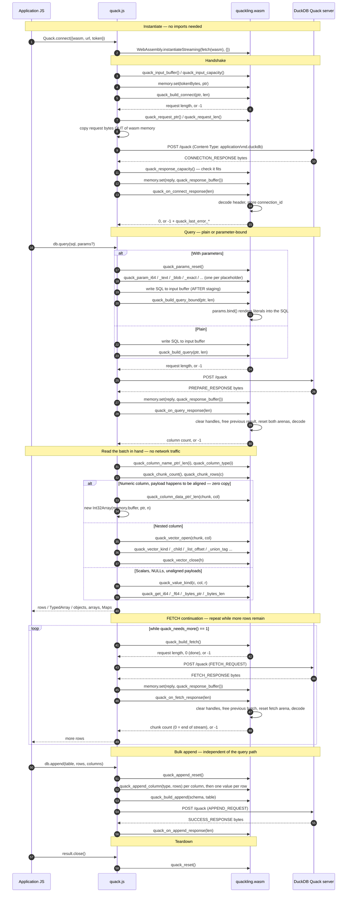

# WebAssembly — ブラウザビルドと FFI リファレンス

[English](../en/WASM.md) · **日本語**

→ [ドキュメント目次](./README.md)

Quackling は `wasm32-freestanding` にコンパイルされ、Quack プロトコルのデコーダを
ブラウザのタブ内で実行する。JavaScript が提供するのは `fetch()` だけであり、
それ以外 — フレーミング、デコード、DuckDB の型システム、パラメータのエスケープ、
ネスト型 — はすべて WASM 側で処理される。

ブリッジは [`../../src/wasm/exports.zig`](../../src/wasm/exports.zig)
(**73 個のエクスポート関数**) と [`../../web/quack.js`](../../web/quack.js)
(JS 側。型宣言は [`../../web/quack.d.ts`](../../web/quack.d.ts)) である。

---

## 1. Why this exists

プロトコルのコアはバイトスライス (byte slice) に対する純粋な計算である。ソケットも
libc もスレッドもファイルシステムも OS 呼び出しもない。トランスポート (transport)
は呼び出し側が注入する。この単一の制約 — [`../../build.zig`](../../build.zig) が
このモジュール構成の理由として明記しているもの — こそが、ブラウザビルドを可能に
している。移植作業は一切不要だった。`quack-cli` が使うものと同じデコーダを別の
ターゲット向けにコンパイルしているだけで、ホストが提供しなければならないのは
リクエストのバイト列をレスポンスのバイト列に変換する関数だけである。ブラウザに
おいて、その関数が `fetch()` にあたる。

freestanding wasm には独自のアロケータがないため、モジュールはコンパイル時に線形
メモリ (linear memory) から固定サイズのバッファを切り出す (§11 参照)。`malloc` も
`WASI` インポートもなく、モジュールが依存する JS グルーコードも存在しない。
つまり **何もインポートしない**。空のインポートオブジェクトを渡した
`WebAssembly.instantiate(bytes, {})` がセットアップのすべてであり、
[`../../tests/wasm/boundary_test.mjs`](../../tests/wasm/boundary_test.mjs) が
それを実証している。

### Contrast with DuckDB-Wasm

両者は競合するものではなく、解決する問題が異なる。

|                | DuckDB-Wasm | Quackling (wasm) |
|----------------|-------------|------------------|
| 正体 | DuckDB **エンジン** を WASM にコンパイルしたもの | リモートの DuckDB に対する **クライアント** |
| SQL の実行場所 | ブラウザ内のローカル | サーバ側 |
| ペイロード | 数十 MB のエンジン | **約 73 KB** の WASM モジュール |
| データの所在 | ブラウザまで届ける必要がある | サーバに留まる |
| データセットサイズの上限 | ブラウザのメモリ / ダウンロード予算 | サーバが保持できる限り |
| 鮮度 | 出荷または取得したスナップショット | 毎クエリでライブ |
| アクセス制御 | 出荷したものはすべて読み取り可能 | トークンによりサーバ側で強制 |
| 拡張機能・メモリ超過データ・アタッチファイル | ローカル実行。ブラウザの制限を受ける | サーバが持つものすべて |
| オフライン動作 | 可 | 不可 — サーバが必要 |
| 使いどころ | ローカルでオフラインの分析をしたいとき | 共有された、あるいは大規模なリモート DB があるとき |

分岐点はデータがどこにあるかである。DuckDB-Wasm はクライアントへ出荷できるデータの
ところへエンジンを持ち込む。Quackling はサーバに留まるデータへクエリを送る。数
ギガバイトのテーブルに対するダッシュボードや、クエリが返す以上の行を露出させて
はならないケースでは、エンジンをダウンロードするのは形が合っていない。データ自体も
ダウンロードすることになるからだ。SQL を POST して結果の列だけを受け取る約 73 KB
のクライアントこそが、正しい形である。

その裏返しとして、ブラウザ上の Quackling はオフラインでは無用であり、レイテンシは
ネットワークのラウンドトリップになる。DuckDB-Wasm はその逆だ。サイズではなく、
これらの性質で選ぶこと。

---

## 2. Building

```sh
zig build wasm
```

[`../../build.zig`](../../build.zig) に基づく出力:

| 項目 | 値 |
|---|---|
| パス | `zig-out/bin/quackling.wasm` **および** `web/quackling.wasm` |
| サイズ | ここでのビルドで **74,904 バイト** (約 73 KiB) |
| ターゲット | `wasm32-freestanding` |
| 最適化 | トップレベルが `Debug` のときは `ReleaseSmall`、それ以外は指定したモード |
| エントリポイント | 無効 (`wasm.entry = .disabled`) — reactor 形式のモジュール |
| シンボルエクスポート | `wasm.rdynamic = true` |
| インポート | なし |

`wasm` ステップはモジュールを 2 か所にインストールする。`addInstallArtifact` で
`zig-out/bin/` へ、`addInstallFile` で `../web/quackling.wasm` へ。これにより
[`../../web/`](../../web/) は手動コピー不要でそのまま公開できる npm パッケージに
なっている。

`examples/browser/quackling.wasm` はビルドが書き出すものでは **ない**。PoC ページは
自分自身から見た相対パスで `./quackling.wasm` を読み込むため、一度だけ手でコピー
する必要がある。ページ自身のヘッダコメント
([`../../examples/browser/index.html`](../../examples/browser/index.html) の 9〜10
行目) に書かれている手順と同じである。

```sh
zig build wasm                            # writes web/quackling.wasm
cp web/quackling.wasm examples/browser/   # manual: the build does not do this
```

ターゲットは `wasm` ステップ内 (`b.resolveTargetQuery`) にハードコードされている
ため、`zig build wasm` は `-Dtarget=` に関係なく同じターゲットを生成する。
*ライブラリ* が別の非ネイティブターゲットでコンパイルできることだけを確認したい
場合は `zig build check -Dtarget=wasm32-wasi` を使う。

トップレベルの `Debug` ビルドはここでは暗黙に `ReleaseSmall` になるため、上記の
サイズは素の `zig build wasm` で得られる値である。別のモードが欲しいときは明示的に
指定する。

```sh
zig build wasm -Doptimize=small   # smallest
zig build wasm -Doptimize=fast    # faster decode, larger module
```

この層に関係するテストステップ:

```sh
zig build test-wasm   # tests/wasm/boundary_test.mjs — hostile FFI arguments (needs node)
zig build test-web    # web/test/*.test.mjs — the JS binding (needs node + a live server)
```

`test-wasm` は `zig-out/bin` へのインストールに依存し、`web/quackling.wasm` を読む。
`test-web` は `web/` へのインストールに依存し、
[`../../web/test/binding.test.mjs`](../../web/test/binding.test.mjs) (31 テスト) と
[`../../web/test/worker.test.mjs`](../../web/test/worker.test.mjs) (6 テスト) の
両方を実行する。どちらもサーバに到達できない場合はきれいにスキップされる。

---

## 3. Export families

[`../../src/wasm/exports.zig`](../../src/wasm/exports.zig) の全エクスポートを
役割ごとに分類したもの。

| # | ファミリ | 個数 | 用途 |
|---|---|---|---|
| 1 | [Lifecycle & buffers](#4-lifecycle--buffers) | 7 | バッファのアドレス、容量、モジュールのリセット |
| 2 | [Connect](#5-connect) | 2 | ハンドシェイク: `CONNECTION_REQUEST` の構築と応答の取り込み |
| 3 | [Query & parameters](#6-query-plain--bound--parameters) | 11 | プレーンおよびパラメータ束縛済みの `PREPARE_REQUEST`、パラメータのステージング |
| 4 | [FETCH continuation](#7-fetch-continuation) | 3 | 大きな結果の残りをストリーミングする |
| 5 | [Result inspection](#8-result-inspection) | 6 | 列名・型、チャンク数・行数 |
| 6 | [Flat value access](#9-flat-value-access) | 8 | `(chunk, col, row)` によるスカラー読み出し、ゼロコピー列ペイロード |
| 7 | [Nested/vector access](#10-nestedvector-access) | 21 | ハンドル (handle) 経由の STRUCT/LIST/ARRAY/MAP/UNION 走査 |
| 8 | [Bulk append](#11-bulk-append) | 13 | `APPEND_REQUEST` の DataChunk の構築と送信 |
| 9 | [Errors](#12-errors) | 2 | 直近のエラーメッセージ |
|   | **合計** | **73** | |

個数は自分で確認できる。

```sh
grep -c 'export fn' src/wasm/exports.zig   # 73
```

すべてのインデックスは信頼できない入力として扱われ、境界チェックされる。トラップ
するものは一つもない。
[`../../tests/wasm/boundary_test.mjs`](../../tests/wasm/boundary_test.mjs) は
アクセサ群を `0xFFFFFFF`、`0xFFFFFFFF`、でたらめなレスポンス本体、順序を無視した
呼び出しで叩き、いずれもトラップや領域外読み取りを起こさず、文書化されたセンチネル
値を返すことを検証する。さらに、敵対的な呼び出しから返されたポインタが線形メモリの
内側にあることも検証する。

### The status-code convention

一貫して適用される規約は一つだけである。

| 戻り値の形 | 意味 |
|---|---|
| `i32 >= 0` | 成功。値自体に意味がある: リクエスト長、列数、チャンク数、パラメータ数、列インデックス、または「成功したが報告すべき値はない」を表す `0` |
| `i32 == -1` | 失敗。`quack_last_error_ptr`/`_len` でメッセージを読む |
| `quack_build_fetch` の `i32 == 0` | 失敗ではない。取得すべきものがもう無いという意味 |
| `usize` | 個数または長さ。範囲外の入力では `0` を返し、エラーは設定しない |
| `?[*]const u8` | 線形メモリ内へのポインタ。値にバイト列が無い場合は `null` (JS では `0`) |
| `[*]const u8` | 常に有効なポインタ。対応する `_len` が、読むものが無いときに `0` になる |
| vector アクセサの `i64` | 実データでは負値があり得ない箇所 (`list_offset`、`list_length`、`array_size`) で「該当しない / 無効なハンドル」を表す `-1` |
| `void` | 失敗しない |

アクセサ群は範囲外インデックスに対して意図的にエラーを **設定しない**。黙って
センチネル値を返す。`0..quack_chunk_rows(c)` を反復する呼び出し側は構造上つねに
範囲内であり、そこにエラーチャネルを設けてもノイズになるだけだからだ。一方
`quack_build_*` と `quack_on_*_response` はエラーを設定する。こちらの失敗は実際に
起きるものであり、対処可能だからである。

---

## 4. Lifecycle & buffers

| エクスポート | シグネチャ | 戻り値 | 敵対的入力 |
|---|---|---|---|
| `quack_input_buffer` | `() [*]u8` | JS が入力文字列を書き込むアドレス | — |
| `quack_input_capacity` | `() usize` | `262144` (256 KiB) | — |
| `quack_request_ptr` | `() [*]const u8` | エンコード済みリクエストのアドレス | — |
| `quack_request_len` | `() usize` | エンコード済みリクエストの長さ。未構築なら `0` | — |
| `quack_response_buffer` | `() [*]u8` | JS が HTTP 応答を書き込むアドレス | — |
| `quack_response_capacity` | `() usize` | `16777216` (16 MiB) | — |
| `quack_reset` | `() void` | — | 失敗しない。いつ呼んでも安全 |

`quack_reset` は vector ハンドルテーブルをクリアし、現在の結果と現在の FETCH バッチ
を解放し、両方のアリーナ (arena) をリセットし、接続 ID、リクエスト長、レスポンス長、
直近のエラーを破棄する。インスタンス化直後の状態にモジュールを戻すため、次の呼び出しは
`quack_build_connect` でなければならない。境界テストはこれを呼んだ後にアクセサを
読み直し、再利用が安全であることを確認している。

4 つのバッファアドレスはインスタンスの寿命を通じて定数である — アロケーションでは
なくモジュールレベルの静的変数のアドレスだからだ。それでも JS は使用ごとに
`memory.buffer` を読み直さなければならない。メモリ成長イベントが古い
`ArrayBuffer` をデタッチするからである (§10.3、§11)。

---

## 5. Connect

| エクスポート | シグネチャ | 戻り値 | 敵対的入力 |
|---|---|---|---|
| `quack_build_connect` | `(token_ptr: [*]const u8, token_len: usize) i32` | エンコード済みリクエスト長 | `token_len > 262144` のとき `-1` + `"token too large"`、エンコード結果が 1 MiB のリクエストバッファを超えると `-1` + `"request too large"` |
| `quack_on_connect_response` | `(len: usize) i32` | 成功時 `0` | `len > capacity`、不正なヘッダ、`ERROR_RESPONSE` (メッセージはそのまま転送)、想定外のメッセージ型、接続 ID の欠落や過大のとき `-1` |

`quack_build_connect` は `auth_string` が `token_ptr[0..token_len]` である
`CONNECTION_REQUEST` をエンコードする。この領域はあらかじめ線形メモリに書き込まれて
いなければならない。長さはスライスを読む **前** に `input_buf.len` と照合されるため、
`0x7FFFFFFF` のような長さは領域外読み取りではなくきれいな拒否になる。境界テストは
まさにこれを検証している。

`quack_on_connect_response` はサーバのセッション ID を 64 バイトの静的変数に保存する。
それが設定されるまで、以降の `quack_build_*` はすべて `"not connected"` で拒否する。
これが境界テストの「build_query before connect」プローブが `-1` を返す理由である。

ここでの `ERROR_RESPONSE` は不正なトークンの現れ方そのものだ。メッセージはエラー
バッファにコピーされるため、JS には DuckDB 自身のテキストが表出する。
`binding.test.mjs` は拒否が `/auth/i` にマッチすることを検証している。

---

## 6. Query (plain + bound) & parameters

### 6.1 Plain query

| エクスポート | シグネチャ | 戻り値 | 敵対的入力 |
|---|---|---|---|
| `quack_build_query` | `(sql_ptr: [*]const u8, sql_len: usize) i32` | エンコード済みリクエスト長 | `-1` + `"not connected"`、`"query too large"` (`sql_len > 262144`)、`"failed to encode query"` |
| `quack_on_query_response` | `(len: usize) i32` | 列数 (`>= 0`) | 容量超過の `len`、不正なヘッダ、`ERROR_RESPONSE`、想定外の型、`"failed to decode result"` で `-1` |

`quack_on_query_response` は前の結果が解放される地点である。ハンドルテーブルを
クリアし、現在の FETCH バッチと PREPARE レスポンスを deinit し、**両方の** アリーナを
リセットし、チャンクカーソル、`needs_more`、`result_uuid` をゼロにしてから、デコード
する。したがって、モジュールがそれまでに渡したポインタはすべてここで無効になり、
デコードに失敗しても古い結果が残ることはない。

戻り値は `current.types.len`、つまり列数である。列数ゼロも正当な結果なので、
負値だけがエラーを意味する。

### 6.2 Parameter staging

Quack プロトコルバージョン 1 には束縛パラメータの **ワイヤ表現が存在しない**。
`PREPARE_REQUEST` が運ぶのは SQL 文字列という 1 フィールドだけである
([`PROTOCOL.md`](./PROTOCOL.md) §10)。したがってパラメータは SQL テキストへ
レンダリングされ、そのレンダリングが SQL インジェクションの境界となる。

エスケープ処理は **JavaScript 側で再実装されていない**。JS はパラメータを 1 つずつ
モジュールへステージングし、モジュールがネイティブクライアントと同じ
[`quackling.params.bind`](../../src/params.zig) を呼ぶ。監査済みの実装が 1 つだけ
あり、ミューテーションテストスイートで網羅され、両方のクライアントが共有する
— [`SECURITY.md`](./SECURITY.md) の "SQL injection boundary" を参照。

| エクスポート | シグネチャ | 戻り値 | 敵対的入力 |
|---|---|---|---|
| `quack_params_reset` | `() void` | — | 失敗しない |
| `quack_param_null` | `() i32` | 更新後のパラメータ数 | `-1` + `"too many parameters (max 128)"` |
| `quack_param_bool` | `(v: i32) i32` | 更新後のパラメータ数 | `v` が非ゼロなら `true` |
| `quack_param_i64` | `(v: i64) i32` | 更新後のパラメータ数 | パラメータ 128 個を超えると `-1` |
| `quack_param_f64` | `(v: f64) i32` | 更新後のパラメータ数 | パラメータ 128 個を超えると `-1` |
| `quack_param_text` | `(ptr: [*]const u8, len: usize) i32` | 更新後のパラメータ数 | ステージング済みバイトが 256 KiB を超えると `-1` + `"parameter storage exhausted"` |
| `quack_param_blob` | `(ptr: [*]const u8, len: usize) i32` | 更新後のパラメータ数 | 同上 |
| `quack_param_exact` | `(ptr: [*]const u8, len: usize) i32` | 更新後のパラメータ数 | `-1` + `"malformed exact number"` / `"empty exact number"` |
| `quack_build_query_bound` | `(sql_ptr: [*]const u8, sql_len: usize) i32` | エンコード済みリクエスト長 | `-1` + `"not connected"`、`"query too large"`、`"parameter binding failed: <ErrorName>"` |

text と blob のバイト列は `stageBytes` によってモジュール所有の 256 KiB ストアへ
**コピー** される。これによりステージング済みスライスは次の
`quack_params_reset` まで有効なままになる。これは重要である。JS はすべての
パラメータを *同一の* `quack_input_buffer()` アドレス経由でステージングするため、
コピーがなければパラメータ *n* がパラメータ *n−1* を上書きしてしまう。

**`quack_param_exact` は広い数値のための経路である。** `HUGEINT` や
`DECIMAL(30,2)` は値を失わずに `i64` や `f64` として境界を越えられない。そこで JS は
その数値を十進 **テキスト** として渡し、モジュールはそれを `Param.raw_sql` —
そのまま挿入される事前レンダリング済みリテラル — としてステージングする。それが
インジェクションの穴にならないよう、このエクスポート自身がステージング前にバイト列を
検証する。数字のみ、先頭に `-` または `+` が最大 1 個、`.` が最大 1 個、かつ空でない
こと。それ以外はすべて `-1` になる。JavaScript から `raw_sql` に到達できるのはここ
だけであり、この検証こそが安全性を担保している。下層のバリアント自体には
[`SECURITY.md`](./SECURITY.md) の "⚠️ WARNING: `.raw_sql`" に警告がある。

### 6.3 The bound-query call sequence

パラメータと SQL が入力バッファを共有するため、順序が重要である。

```js
w.quack_params_reset();                    // 1. discard the previous set
// 2. stage each parameter, in placeholder order
w.quack_param_i64(42n);
mem.set(enc.encode("o'brien"), w.quack_input_buffer());
w.quack_param_text(w.quack_input_buffer(), 7);   // bytes are copied out
w.quack_param_null();
// 3. NOW write the SQL — it may reuse the input buffer
mem.set(enc.encode('SELECT ?::INTEGER, ?, ?'), w.quack_input_buffer());
const n = w.quack_build_query_bound(w.quack_input_buffer(), 23);
if (n < 0) throw new Error(lastError());
```

`quack.js` は `#bindParams` の後に `#writeString` を呼ぶという形でまさにこれを
行っており、そこのコメントが順序が偶然ではない理由を説明している。プレースホルダ数と
引数数の不一致は、リクエスト送信 **前** に `bind()` が捕捉し、サーバエラーではなく
`"parameter binding failed: ParameterCountMismatch"` として表出する。
`binding.test.mjs` は引数が少なすぎる場合と多すぎる場合の両方が拒否されることを
検証している。

JavaScript からこれらを直接呼ぶことはない。配列を渡すだけである。

```js
const [row] = await db.queryAll(
  `SELECT ?::INTEGER a, ? b, ? c, ?::BOOLEAN d, ?::DOUBLE e,
          ?::BIGINT f, ?::HUGEINT g, ?::BLOB h`,
  [42, "o'brien", null, true, 1.5, 9223372036854775807n,
   170141183460469231731687303715884105727n, new Uint8Array([0, 1, 255])],
);
```

`quack.js` は JS の型を次のようにエクスポートへ対応づける。

| JS の値 | 使われるエクスポート |
|---|---|
| `null`、`undefined` | `quack_param_null` |
| `boolean` | `quack_param_bool` |
| `bigint` | `quack_param_exact` (厳密な十進テキスト — 精度を失わない) |
| `number`、整数かつ `MAX_SAFE_INTEGER` 以内 | `quack_param_i64` |
| `number`、それ以外 | `quack_param_f64` |
| `string` | `quack_param_text` |
| `Uint8Array` | `quack_param_blob` |
| `Date` | ISO テキストで `quack_param_text`。サーバ側で解析させる |
| それ以外 | `QuackError: unsupported parameter type` |

---

## 7. FETCH continuation

`PREPARE_RESPONSE` は最初のバッチだけを運ぶ。`SELECT ... FROM range(1000000)` では
それは全行の約 2% にすぎない — そしてサーバはそのことについて何のエラーも報告しない。
FETCH を無視する呼び出し側は結果を黙って切り詰めてしまう。だからこそ
`quack_needs_more` が明示的なゲートとして存在する。

| エクスポート | シグネチャ | 戻り値 | 敵対的入力 |
|---|---|---|---|
| `quack_needs_more` | `() i32` | 行が残っていれば `1`、なければ `0` | — |
| `quack_build_fetch` | `() i32` | リクエスト長。**取得すべきものが無いときは `0`** | `-1` + `"not connected"` または `"failed to encode fetch request"` |
| `quack_on_fetch_response` | `(len: usize) i32` | このバッチ内のチャンク数 | 容量超過の `len`、`"no active result"`、不正なヘッダ、`ERROR_RESPONSE` (`needs_more` もクリアする)、想定外の型、`"failed to decode fetch batch"` で `-1` |

`quack_build_fetch` が `0` を返すのは、非負値が「停止」を意味する唯一の箇所である。
`quack.js` はそれを明示的にそう扱う (`if (built === 0) return 0`)。エラーと混同すれば
正常なストリーム終端が例外送出に化けてしまうからだ。

`quack_on_fetch_response` は次をデコードする **前に** ハンドルテーブルをクリアし、
前のバッチを解放してから `fetch_fba` をリセットする。したがって常駐メモリは累積した
結果ではなく 1 バッチ分を追跡し、前のバッチのポインタとハンドルはすべてその時点で
死ぬ。`FETCH_RESPONSE` には `needs_more_fetch` フィールドが無いため、空のバッチ
(`0` チャンク) がサーバのストリーム終端シグナルであり、`needs_more` をクリアする
([`PROTOCOL.md`](./PROTOCOL.md) §8)。

ループの形:

```js
do {
  for (let c = 0; c < w.quack_chunk_count(); c++) { /* read chunk c */ }
  if (!w.quack_needs_more()) break;
  const req = w.quack_build_fetch();
  if (req <= 0) break;                       // 0 = done, <0 = error
  // POST, then:
  if (w.quack_on_fetch_response(replyLen) < 0) throw new Error(lastError());
} while (true);
```

サーバ側のバッチサイズは DuckDB の設定 `quack_fetch_batch_chunks` で調整できる。
これはサーバが 1 つの `FETCH_RESPONSE` に詰め込むチャンク数を制御する — バッチを
大きくすればラウンドトリップは減り、1 バッチあたりのメモリは増える。これはサーバ
設定であり、エクスポートではない。

---

## 8. Result inspection

| エクスポート | シグネチャ | 戻り値 | 敵対的入力 |
|---|---|---|---|
| `quack_column_count` | `() usize` | 列数 | クエリ前は `0` |
| `quack_column_name_ptr` | `(i: usize) [*]const u8` | 列名バイト列へのポインタ | `i` が範囲外または結果が無い場合 `""` (有効なポインタで長さ `0`) |
| `quack_column_name_len` | `(i: usize) usize` | 列名のバイト長 | `0` |
| `quack_column_type` | `(i: usize) i32` | DuckDB の `LogicalTypeId` | `-1` |
| `quack_chunk_count` | `() usize` | 手元のバッチ内のチャンク数 | `0` |
| `quack_chunk_rows` | `(chunk: usize) usize` | そのチャンクの行数 | `0` |

列メタデータは各バッチではなく **PREPARE** レスポンス側に結果全体を通じて存在する。
名前と型のスライスがそのバッファを借用しているからだ。`quack.js` はこれを一度だけ
`QuackResult.columns` に読み込み、すべての FETCH バッチをまたいで再利用する。
`quack_on_query_response` が両方のアリーナをリセットするのに対し
`quack_on_fetch_response` が `fetch_fba` だけをリセットするのも同じ理由である。

`quack_chunk_count` とすべてのチャンクアクセサは、内部の `activeChunks()` が解決する
**手元にあるバッチ** に対して働く。最初の FETCH までは PREPARE バッチ、その後は
各 FETCH バッチが順に対象になる。チャンクインデックスはバッチごとに `0` から
やり直しになる。

---

## 9. Flat value access

スカラー列については、まずセルをどう読むべきかをモジュールに問い、それから読む。
`quack_column_type` だけから推測するのは劣った方法である。値が実際にスカラーとして
表現可能かどうかを知っているのはモジュール側だからだ。

| エクスポート | シグネチャ | 戻り値 | 敵対的入力 |
|---|---|---|---|
| `quack_value_kind` | `(chunk, col, row: usize) i32` | `ValueKind` (下の表) | `5` (`unsupported`) |
| `quack_is_null` | `(chunk, col, row: usize) i32` | NULL なら `1`、それ以外 `0` | `1` — 範囲外のセルは NULL として読まれ、データとして読まれることはない |
| `quack_get_i64` | `(chunk, col, row: usize) i64` | 整数値 | `0` |
| `quack_get_f64` | `(chunk, col, row: usize) f64` | 浮動小数点値 | `0` |
| `quack_get_bytes_ptr` | `(chunk, col, row: usize) ?[*]const u8` | バイト列へのポインタ | `null` |
| `quack_get_bytes_len` | `(chunk, col, row: usize) usize` | バイト長 | `0` |
| `quack_column_data_ptr` | `(chunk, col: usize) ?[*]const u8` | フラットな固定幅ペイロードへのポインタ | `null`。`fixed` 以外のストレージでも `null` |
| `quack_column_data_len` | `(chunk, col: usize) usize` | ペイロードのバイト長 | `0` |

### 9.1 `ValueKind`

`quack_value_kind` はどのアクセサが適用されるかを返す。番号は連続していない —
位置ではなく enum の定義から読むこと。

| 値 | 種別 | 読み方 | 対象 |
|---|---|---|---|
| `0` | `is_null` | 何も読まない | NULL のセルすべて |
| `1` | `integer` | `quack_get_i64` | BOOLEAN、TINYINT〜BIGINT、UTINYINT〜UBIGINT |
| `2` | `float` | `quack_get_f64` | FLOAT、DOUBLE |
| `3` | `text` | `quack_get_bytes_*` で UTF-8 デコード | VARCHAR、ENUM、UUID、INTERVAL、DATE、TIME、TIMESTAMP |
| `4` | `bytes` | `quack_get_bytes_*` でバイト列として保持 | BLOB |
| `5` | `unsupported` | vector API (§10) | STRUCT、LIST、ARRAY、MAP、UNION、VARIANT |
| `6` | `exact_number` | `quack_get_bytes_*` で十進テキストを解析 | HUGEINT、UHUGEINT、DECIMAL |

ここには 2 つの設計判断が現れている。

**広い数値は数値ではなくテキストである。** `HUGEINT` の最大値は `asI64` を
オーバーフローさせ — 以前は `0` として返っていた — `DECIMAL(30,2)` は double を
経由すると桁を失う。どちらも黙ったデータ破壊であり、エラーより悪く、バイナリ
プロトコルの意義を損なう。そこでモジュールはそれらを厳密にフォーマットし、JS が
`BigInt` (整数) を組み立てるか `string` (小数) をそのまま保持する。
`binding.test.mjs` はこれを名前付きのリグレッションテストとして守っている。

**時刻型と識別子型は正規化テキストである。** 生の日数やマイクロ秒値は暦計算を
すべての呼び出し側に押しつけることになるため、DATE、TIME、TIMESTAMP、UUID、
INTERVAL はフォーマット済みで返る (`"2024-03-15"`、`"2024-03-15 12:34:56"`)。
ENUM は辞書インデックスではなく **ラベル** に解決される。

種別 `3`、`4`、`6` は 1 つのバイトチャネルを共有する。ワイヤ上に既にバイト列を持つ値
(VARCHAR、BLOB、ENUM のラベル) はレスポンスバッファから **借用** され、それ以外は
256 バイトの静的な `text_scratch` にフォーマットされる。つまりフォーマットされた値は、
同じくフォーマットを必要とする次の `quack_get_bytes_ptr` 呼び出しまでしか有効でない。
すぐにデコードすること。

**`unsupported` はエラーではない。** 「これはスカラーではないので vector API を
使え」という意味である。`quack.js` はこれを `0` で返すのではなく `#nested()` に
振り分ける。

### 9.2 Zero-copy: when it actually works

フラットな固定幅列については、デコード済みペイロードが既に、JS の TypedArray が
期待するレイアウトのまま WASM 線形メモリ上に置かれている。したがって JS は値ごとの
マーシャリングをせず、その上に **ビュー** を構築できる。

```js
array(col) {
  const Ctor = TYPED_ARRAY_FOR_TYPE[this.columns[col]?.type];
  if (!Ctor) return null;                                   // not a numeric type
  const ptr = this.#w.quack_column_data_ptr(this.#index, col);
  const len = this.#w.quack_column_data_len(this.#index, col);
  if (!ptr || len === 0) return null;                        // not flat fixed-width
  if (ptr % Ctor.BYTES_PER_ELEMENT !== 0) return null;       // unaligned
  return new Ctor(this.#w.memory.buffer, ptr, len / Ctor.BYTES_PER_ELEMENT);
}
```

3 つのガードがあり、いずれも必須で、それぞれ実在する失敗モードに対応している。

**ガード 1 — 型が TypedArray に対応していなければならない。**
[`../../web/quack.js`](../../web/quack.js) の `TYPED_ARRAY_FOR_TYPE` は 13 個の
`LogicalTypeId` を覆う。BOOLEAN、TINYINT、SMALLINT、INTEGER、BIGINT、DATE、
TIMESTAMP、FLOAT、DOUBLE、UTINYINT、USMALLINT、UINTEGER、UBIGINT である。
それ以外 — VARCHAR、BLOB、DECIMAL、HUGEINT、UUID、INTERVAL、すべてのネスト型 —
は構造上 `null` を返す。

**ガード 2 — ストレージが `fixed` でなければならない。** `Vector.Storage` には
10 個のバリアントがあり、`quack_column_data_ptr` が非 `null` を返すのはそのうち
ちょうど 1 つだけである。`strings`、`constant`、`sequence`、`dictionary`、
`children`、`list`、`array`、`unsupported` のベクタは `null` になる。DuckDB は
`sequence` や `constant` エンコーディングを日常的に出力するため、このガードは
ネスト型に限らず普通のデータでも発火する。

**ガード 3 — アライメント (alignment)。これが最も微妙であり、ごく普通の INTEGER
列に対して `array()` がしばしば `null` を返す理由である。**

`fixed` ペイロードはアリーナへコピーされるのではなく **ワイヤバッファから借用** され
ている。デコーダは `Reader.readRaw(n)` を呼び、これは JS が
`quack_response_buffer()` へ書き込んだバイト列のスライスをそのまま返す。したがって

```
payload address = quack_response_buffer() + (byte offset of the data field in the message)
```

両方の項がアライメントに対して敵対的である。このビルドでの実測値:

```console
quack_response_buffer() = 34608977      # base % 4 = 1,  base % 8 = 1
```

`response_buf` のベースアドレス自体が奇数である。そしてメッセージ内のオフセットは、
先行する varint フレーム付きフィールドが占める長さで決まり、それは列数、各列名の
長さ、型記述子、行数に依存する。ワイヤ形式にはこれを整列させるものが何もない。
ライブの DuckDB v1.5.5 + quack サーバに対する実測:

```console
$ # SELECT i::INTEGER AS i FROM range(N) t(i),  N = 1..40
INTEGER single column, ptr % 4 distribution:  {1: 31,  2: 9}   # never 0

$ # SELECT i::INTEGER a, i::INTEGER b FROM range(3000) t(i)
chunk0 col0  ptr%4=1  array() -> null
chunk0 col1  ptr%4=1  array() -> Int32Array(2048)   # a different chunk/col pair aligns
chunk1 col0  ptr%4=1  array() -> Int32Array(952)
chunk1 col1  ptr%4=3  array() -> null
```

したがって正直な規則は「ゼロコピー (zero-copy) は効く」でも「ゼロコピーは決して
効かない」でもない。

- **1 バイト要素型は常に成功する** (`ptr % 1 == 0` は恒真である)。TINYINT、
  UTINYINT、BOOLEAN は無条件に高速経路に乗る。実測:
  `SELECT i::TINYINT FROM range(120)` → `Int8Array(120)`。
- **それより広い要素型は、ペイロードのバイトオフセットが偶然整列したときだけ成功
  する。** これは個々の (バッチ, チャンク, 列) の性質であり、クエリや型や列の性質
  ではない。同じ列の隣接する 2 つのチャンクで結果が食い違うことも、同じチャンクの
  2 つの列で食い違うこともある。
- **`SELECT i::INTEGER FROM range(N)` を単一列で実行すると、このビルドでは確実に
  失敗する。** メッセージのプレフィックスと奇数のバッファベースにより、実測したすべての
  `N` でペイロードが `ptr % 4 ∈ {1, 2}` に着地するからである。

これこそが、[`../../web/test/binding.test.mjs`](../../web/test/binding.test.mjs) の
成功しているテスト `'numeric columns expose a TypedArray over WASM memory'` が
あの書き方になっている理由である。*条件付きで* 検証している。

```js
const arr = chunk.array(0);
if (arr) {
  assert.ok(arr instanceof Int32Array, 'INTEGER should map to Int32Array');
  assert.equal(arr.length, chunk.rowCount);
  for (let r = 0; r < chunk.rowCount; r++) assert.equal(arr[r], chunk.value(0, r));
  checked = true;
}
// Alignment is not guaranteed by the wire format, so a null view is a valid
// outcome; the test asserts agreement only when the fast path is available.
assert.ok(checked || true);
```

このテストは高速経路が取られることを証明していない — 最後のアサーションは無条件に
真である。証明しているのは実際に重要な性質、すなわち **ビューが存在するときには
それが正しいコンストラクタ、正しい長さを持ち、値ごとの経路と要素単位で一致する** と
いうことだ。このビルドでこのクエリではビューは存在しないため、本体は実行されない。

**コードへの帰結: `array()` が `null` を返すのは正常な結果であり、エラーではない。
必ず `else` 側を書くこと。** 同梱のすべての例がそうしている — ストリーミングテスト、
Worker の `sum` オペレーション、そして `fastPath/chunks` を表示して比率をその場で
確認できる PoC ページである。

```js
for await (const chunk of result.chunks()) {
  const arr = chunk.array(0);
  if (arr) {
    for (const v of arr) sum += BigInt(v);              // zero copy
  } else {
    for (let r = 0; r < chunk.rowCount; r++)            // per-value fallback
      sum += BigInt(chunk.value(0, r));
  }
}
```

確率的ではなく確実に高速経路が必要なら、修正すべきは JS ではなくモジュール側である
— `response_buf` を 8 バイト境界に整列させ、自然に整列していないペイロードを整列済み
のアリーナアドレスへコピーすればよい。JS 側では、整列していないバイトオフセットに
`TypedArray` を作ることはできない。コンストラクタが `RangeError` を投げるため、
ガードは試みる代わりに `null` を返している。

高速経路で起きて *いない* こと: `JSON.parse` なし、値ごとの FFI 呼び出しなし、
中間配列なし、バイトオーダー変換なし (wasm と JS の TypedArray はいずれも
リトルエンディアン)、コピーなし。100 万要素の `INTEGER` 列のコストは FFI 呼び出し
2 回と `Int32Array` の構築 1 回である。

### 9.3 Lifetime hazard

**WASM メモリ上の TypedArray ビューは、所有者が移動または再利用しうるバッファへの
生のエイリアスである。** これを無効化するものが 2 つある。

1. **メモリ成長。** 線形メモリが成長すると `WebAssembly.Memory.buffer` が差し替えられ、
   古い `ArrayBuffer` は **デタッチ** される。既存のビューは長さゼロになり、アクセス
   すると `TypeError` を投げる。`quack.js` がキャッシュせず使用ごとに
   `new Uint8Array(this.#w.memory.buffer)` を読み直すのはこのためである。

2. **`quack_reset()`、次の `quack_on_query_response()`、次の
   `quack_on_fetch_response()`。** 3 つはいずれもアリーナをリセットして *同じ*
   アドレスを再利用し、さらに `fixed` ペイロードは `response_buf` から借用されている
   ため、次の応答がそれらを直接上書きする。ビューは JS オブジェクトとしては有効な
   まま、他人のデータを黙って読む — 何も投げられないため、これが危険な失敗モードで
   ある。イテレータを 1 つ進めるだけでこれが起きる。

規則: **ビュー、バイトポインタ、vector ハンドルは、次に WASM を呼ぶまで、とくに次の
反復ステップまでしか有効でないものとして扱う。** 保持したいものはコピーする。

```js
for await (const chunk of result.chunks()) {
  const view = chunk.array(0);       // aliases wasm memory
  const owned = view?.slice();       // copies out — safe past this loop
}
```

同じことが `quack_get_bytes_ptr`、`quack_column_name_ptr`、
`quack_vector_get_bytes_ptr` にも当てはまる。`quack.js` はそれらを即座にデコード
またはコピーして扱っており、`new TextDecoder().decode(...)` は独立した文字列を作り、
`bytes` の場合は `.slice()` する。また `#post()` は `fetch()` を await する *前* に
`.slice()` でリクエストのバイト列をコピーして取り出す。バッファを `await` をまたいで
エイリアスしてはならないからである。

---

## 10. Nested/vector access

ネストした値は `(chunk, col, row)` だけでは指し示せない。STRUCT のフィールドや
LIST の要素は **子** ベクタの中にあり、その行インデックスは親しか知らない。
モジュール内でネストデータを JS オブジェクトに平坦化すればコピーが発生し、
その場でデコードする意義が失われる。

そこでモジュールはベクタごとに不透明な **ハンドル (handle)** を JS に渡し、JS 自身が
木を辿る。これは [`TYPES.md`](./TYPES.md) §7 で説明されている Zig の vector アクセサ
の、ブラウザ側の対応物である。

### 10.1 The handle model

ハンドルは `?*const Vector` の **固定 64 エントリのテーブルへのインデックス** であり、
無効なハンドルは参照解決される前に拒否される。`handleGet` は
`h < 0 or h >= 64` を境界チェックし、空スロットには `null` を返す。以降すべての
アクセサはそこからセンチネル値を返す。

```
h = quack_vector_open(chunk, col)     // the column's vector
quack_vector_kind(h)                  // flat / struct / list / array / map / union
c = quack_vector_child(h, i)          // descend — a NEW handle
...
quack_vector_close(c)                 // release, in reverse order
quack_vector_close(h)
```

寿命管理の規律を、破られやすい順に挙げる。

1. **開いたハンドルは子を含めてすべて閉じる。** テーブルは 64 エントリしかない。
   満杯になると `handlePut` は `-1` を返し `"too many open vector handles"` を
   設定する。深くネストした値に対する再帰的な走査は、子がリークすればすぐに
   使い切ってしまう。`quack.js` が子ハンドルを `finally` で閉じているのはまさに
   このためで、走査中の例外でもリークしないようにしている。
2. **ハンドルはバッチとともに死ぬ。** `handlesClear()` は
   `quack_on_query_response` と `quack_on_fetch_response` の両方の先頭で呼ばれ、
   指している先のバッチが解放される *前* にテーブル全体を空にする。FETCH をまたいで
   保持されたハンドルはダングリングにはならない — `null` になり、アクセサは
   センチネル値を返す。これは意図的なトレードオフである。黙って誤ったデータを返す
   よりセンチネル値のほうがよい。
3. **結果ごとに一度ではなく、行ごとに開き直す。** `binding.test.mjs` にはこれ専用の
   テストがある (`'nested values stream correctly across many rows'`、5000 行)。
   ハンドルは現在のバッチを指すため、バッチ境界をまたいでキャッシュすることが
   このテストが守っているバグである。
4. **範囲外ハンドルに対する `quack_vector_close` は黙って何もしない。** 失敗しない
   ので、`-1` を閉じてしまう `finally` は無害である。
5. **`quack_reset()` もテーブルをクリアする。**

### 10.2 The export table

| エクスポート | シグネチャ | 戻り値 | 敵対的入力 |
|---|---|---|---|
| `quack_vector_open` | `(chunk: usize, col: usize) i32` | `0..63` のハンドル | `-1` + `"chunk index out of range"` / `"column index out of range"` / `"too many open vector handles"` |
| `quack_vector_close` | `(h: i32) void` | — | `h` が範囲外なら黙って何もしない |
| `quack_vector_kind` | `(h: i32) i32` | `VectorShape` (下の表) | `-1` (`invalid`) |
| `quack_vector_type` | `(h: i32) i32` | DuckDB の `LogicalTypeId` | `-1` |
| `quack_vector_row_count` | `(h: i32) usize` | このベクタの行数 | `0` |
| `quack_vector_child` | `(h: i32, i: usize) i32` | 子 `i` に対するハンドル | `-1` + `"invalid vector handle"` / `"child index out of range"` / `"vector has no children"` |
| `quack_vector_child_count` | `(h: i32) i32` | 子の数 | ハンドル不正で `-1`、子を持たないベクタで `0` |
| `quack_vector_child_name_ptr` | `(h: i32, i: usize) [*]const u8` | フィールド名へのポインタ | `""` |
| `quack_vector_child_name_len` | `(h: i32, i: usize) usize` | フィールド名の長さ | `0` |
| `quack_vector_is_null` | `(h: i32, row: usize) i32` | NULL なら `1`、それ以外 `0` | `1` — 不正なハンドルは NULL として読まれる |
| `quack_vector_value_kind` | `(h: i32, row: usize) i32` | `ValueKind` (§9.1) | `5` (`unsupported`) |
| `quack_vector_get_i64` | `(h: i32, row: usize) i64` | 整数値 | `0` |
| `quack_vector_get_f64` | `(h: i32, row: usize) f64` | 浮動小数点値 | `0` |
| `quack_vector_get_bytes_ptr` | `(h: i32, row: usize) ?[*]const u8` | バイト列へのポインタ | `null` |
| `quack_vector_get_bytes_len` | `(h: i32, row: usize) usize` | バイト長 | `0` |
| `quack_vector_data_ptr` | `(h: i32) ?[*]const u8` | ゼロコピー用のフラット固定幅ペイロード | `fixed` 以外のストレージでは `null` |
| `quack_vector_data_len` | `(h: i32) usize` | ペイロードのバイト長 | `0` |
| `quack_vector_list_offset` | `(h: i32, row: usize) i64` | 子ベクタ内で行 `row` の要素が始まる位置 | `-1` |
| `quack_vector_list_length` | `(h: i32, row: usize) i64` | 行 `row` の要素数 | `-1` |
| `quack_vector_array_size` | `(h: i32) i64` | 1 行あたりの固定要素数 (ARRAY) | `-1` |
| `quack_vector_union_tag` | `(h: i32, row: usize) i32` | どのメンバがアクティブか | `-1` |

以上 21 個である。`quack_value_kind` はハンドルではなく `(chunk, col, row)` を取る
ため §9 に数えている。`quack_vector_value_kind` はそのハンドル版の双子である。
両者は同じ内部関数 `classify()` に委譲するため、型の読み方について 2 つの経路が
食い違うことは起こり得ない。

`quack_vector_data_ptr`/`_len` は `quack_column_data_ptr`/`_len` のハンドル版であり、
**同じアライメントの注意点** (§9.2) を持つ。LIST の平坦化された数値の子を要素ごとに
ではなく 1 つの TypedArray として読みたい場合に使う。

### 10.3 `VectorShape`

`quack_vector_kind` はどの走査呼び出しが適用されるかを JS に伝える。

| 値 | 形状 | 物理レイアウト | 走査に使うもの |
|---|---|---|---|
| `0` | `flat` | スカラーの連続 | `quack_vector_value_kind` と値アクセサ群 |
| `1` | `struct` | フィールドごとに 1 つの子。すべてのフィールドが親の行インデックスを共有 | `child_count`、`child`、`child_name_*` |
| `2` | `list` | 全行の要素を平坦化して保持する子 1 つ | `list_offset`、`list_length`、`child(h, 0)` |
| `3` | `array` | 子 1 つ。1 行あたり固定 `array_size` 要素 | `array_size`、`child(h, 0)`、基点 `row * size` |
| `4` | `map` | STRUCT(key, value) の LIST | `list_offset`/`list_length`、次に list の子の子 `0`/`1` |
| `5` | `union` | 子 `0` が隠れた UTINYINT タグである STRUCT | `union_tag`、次に子 `tag + 1` |
| `-1` | `invalid` | — | 不正なハンドル |

VARIANT は `struct` に対応づけられ、それ以外のすべての型 ID は `flat` になる。

### 10.4 Worked examples

以下は [`../../web/quack.js`](../../web/quack.js) の `#readVector` を反映している。
出力はすべて `binding.test.mjs` がライブサーバに対して検証しているものである。

**STRUCT** — `SELECT {'a': 1, 'b': 'x'} AS s` → `{ a: 1, b: 'x' }`

フィールドは子であり親の行インデックスを共有するので、オフセット計算は不要である。

```js
const h = w.quack_vector_open(chunk, col);
const out = {};
for (let i = 0; i < w.quack_vector_child_count(h); i++) {
  const child = w.quack_vector_child(h, i);
  if (child < 0) continue;
  try {
    const p = w.quack_vector_child_name_ptr(h, i);
    const l = w.quack_vector_child_name_len(h, i);
    const key = l ? dec.decode(mem.subarray(p, p + l)) : String(i);
    out[key] = readVector(child, row);          // same row index
  } finally {
    w.quack_vector_close(child);                // always, even on throw
  }
}
w.quack_vector_close(h);
```

**LIST** — `SELECT [10, 20, 30] AS l` → `[10, 20, 30]`

唯一の子が全行の要素を連結して保持し、親が窓を与える。

```js
const offset = Number(w.quack_vector_list_offset(h, row));
const length = Number(w.quack_vector_list_length(h, row));
if (offset < 0 || length < 0) return null;      // sentinel, not data
const child = w.quack_vector_child(h, 0);       // index ignored: one child
try {
  const out = new Array(length);
  for (let i = 0; i < length; i++) out[i] = readVector(child, offset + i);
  return out;
} finally {
  w.quack_vector_close(child);
}
```

`SELECT [1, NULL, 3]` → `[1, null, 3]`。`quack_vector_is_null(child, offset + i)` が
NULL 要素とゼロを区別するため、有効性マスク (validity mask) は走査を通じて保たれる。

**ARRAY** — `SELECT [1, 2, 3]::INTEGER[3] AS arr` → `[1, 2, 3]`

固定サイズの連続なので、基点は読み取るのではなく計算する。

```js
const size = Number(w.quack_vector_array_size(h));
const child = w.quack_vector_child(h, 0);
for (let i = 0; i < size; i++) out[i] = readVector(child, row * size + i);
```

**MAP** — `SELECT MAP{'k': 1, 'j': 2} AS m` → `Map { 'k' => 1, 'j' => 2 }`

物理的には `LIST(STRUCT(key, value))` なので、list の走査の後に struct への降下が続き、
ハンドルは 3 段の深さになる。

```js
const offset = Number(w.quack_vector_list_offset(h, row));
const length = Number(w.quack_vector_list_length(h, row));
const entries = w.quack_vector_child(h, 0);        // the STRUCT(key, value)
try {
  const keys = w.quack_vector_child(entries, 0);
  const vals = w.quack_vector_child(entries, 1);
  try {
    const out = new Map();                          // a real Map: non-string keys survive
    for (let i = 0; i < length; i++) {
      out.set(readVector(keys, offset + i), readVector(vals, offset + i));
    }
    return out;
  } finally {
    w.quack_vector_close(keys);
    w.quack_vector_close(vals);
  }
} finally {
  w.quack_vector_close(entries);
}
```

入れ子の `finally` ブロックこそが要点である。2048 行に対する 3 段の走査は、どこか
1 段でもリークすればほぼ即座に 64 エントリのテーブルを使い切ってしまう。

**UNION** — `SELECT union_value(n := 5) AS u` → `5`

子 `0` は隠れたタグベクタであり、タグ付けされたメンバは子 `tag + 1` である。

```js
const tag = w.quack_vector_union_tag(h, row);
if (tag < 0) return null;
const member = w.quack_vector_child(h, tag + 1);
if (member < 0) return null;
try {
  return readVector(member, row);
} finally {
  w.quack_vector_close(member);
}
```

**再帰は組み合わせ可能である。** `readVector` が各段で `quack_vector_kind` に
ディスパッチするため、任意のネストが特別扱いなしに動作する。`binding.test.mjs` が
検証している内容:

| SQL | JS の結果 |
|---|---|
| `{'inner': [1, 2], 'name': 'x'}` | `{ inner: [1, 2], name: 'x' }` |
| `[{'a': 1}, {'a': 2}]` | `[{ a: 1 }, { a: 2 }]` |
| `MAP{'k': [1, 2]}` | `Map { 'k' => [1, 2] }` |

JavaScript からハンドルを触ることはない。`chunk.value(col, row)` が
`ValueKind.unsupported` を検出して木を辿り、オブジェクト、配列、`Map`、あるいは
UNION のメンバの値を返してくれる。

---

## 11. Bulk append

`APPEND_REQUEST` は INSERT 文ではなく DataChunk 全体を DuckDB に渡す。モジュール自身の
コメントが実測値を記録している。**1 行ごとのパラメータ化 INSERT に対して約 370 倍の
スループット。** データが既に型付けされており、サーバが SQL を再パースしないからだ。
値はバイナリで運ばれるため、この経路には **SQL エスケープが一切存在しない** —
§6 とは異なり、インジェクションの面は無い。

> **トップレベル README についての注記。** その Roadmap には
> *"Client-to-server bulk append (`APPEND_REQUEST` is decoded but not yet
> exposed)"* と書かれている。WASM 層についてはこれはもう正確ではない。append は
> ここで **完全に公開されている**。下記 13 個のエクスポートと、
> [`../../web/quack.d.ts`](../../web/quack.d.ts) で宣言された公開メソッド
> `db.append()` を通じてであり、`worker.test.mjs` が 3000 行 (DataChunk 2 つ分に
> わたる) でエンドツーエンドに動作を確認している。

### 11.1 The export table

| エクスポート | シグネチャ | 戻り値 | 敵対的入力 |
|---|---|---|---|
| `quack_append_reset` | `() void` | — | 失敗しない |
| `quack_append_column` | `(type_id: i32, rows: usize) i32` | 新しい列の **インデックス** | `-1` + `"too many append columns (max 64)"`、`"append chunk limited to N rows"`、`"column row counts differ (X vs Y)"`、`"append value storage exhausted"` |
| `quack_append_decimal_info` | `(col: usize, width: u8, scale: u8) i32` | `0` | `-1` + `"column index out of range"` |
| `quack_append_null` | `() i32` | `0` | `-1` + `"no append column open"` / `"more values than the column's declared row count"` |
| `quack_append_bool` | `(v: i32) i32` | `0` | 同上。`v` が非ゼロなら `true` |
| `quack_append_i64` | `(v: i64) i32` | `0` | 同上 |
| `quack_append_f64` | `(v: f64) i32` | `0` | 同上 |
| `quack_append_text` | `(ptr: [*]const u8, len: usize) i32` | `0` | 4 MiB を超えると `-1` + `"append byte storage exhausted"` |
| `quack_append_blob` | `(ptr: [*]const u8, len: usize) i32` | `0` | 同上 |
| `quack_append_hugeint` | `(hi: i64, lo: u64) i32` | `0` | 同上 |
| `quack_append_decimal` | `(hi: i64, lo: u64, width: u8, scale: u8) i32` | `0` | 同上 |
| `quack_build_append` | `(schema_ptr, schema_len, table_ptr, table_len) i32` | エンコード済みリクエスト長 | `-1` + `"not connected"`、`"no columns staged"`、`"column N has X of Y values"`、`"failed to encode append: <ErrorName>"` |
| `quack_on_append_response` | `(len: usize) i32` | `SUCCESS_RESPONSE` で `0` | 容量超過の `len`、不正なヘッダ、`ERROR_RESPONSE` (メッセージを転送)、想定外の型で `-1` |

`quack_append_hugeint` と `quack_append_decimal` は 128 ビット値を **2 つの半分**
(`hi: i64`、`lo: u64`) として受け取る。wasm32 に `i128` の ABI が無いためである。
モジュールは `(i128(hi) << 64) | i128(lo)` として再構成する。

### 11.2 The row/column building protocol

append は **列ごとに、各列内では行順の値で** 構築する — 列指向チャンクにとって自然な
形であり、呼び出し側が普段行について考える形とは逆である。この順序は任意ではない。

```
quack_append_reset()                          // 1. once per chunk
  for each column c, left to right:
    idx = quack_append_column(typeId, rows)   // 2. declare it — returns c
    [ quack_append_decimal_info(idx, w, s) ]  // 3. DECIMAL only, on the column just opened
    for each row r, 0..rows-1:
      quack_append_<kind>(...)                // 4. exactly `rows` values, in row order
quack_build_append(schema, table)             // 5. -> request bytes
// POST, then:
quack_on_append_response(replyLen)            // 6. 0 = committed
```

モジュールが信頼せず自ら強制する不変条件が 5 つある。

1. **`quack_append_column` が先に来なければならない。** `append_cols == 0` のとき
   `appendValue` は `"no append column open"` で失敗する。
2. **値は最後に開いた列に入る。** `quack_append_*` に列引数は無い。対象は常に
   `append_cols - 1` である。列を交互に埋めることはできない。
3. **すべての列が同じ行数を宣言する。** 2 番目以降の `quack_append_column` 呼び出しは
   最初のものと比較し、不揃いな入力を `"column row counts differ"` で拒否する —
   サーバが拒否するようなチャンクを送るのではなく。
4. **超過は拒否される。** 宣言した行数を超える値は
   `"more values than the column's declared row count"` になる。
5. **不足はビルド時に拒否される。** `quack_build_append` はすべての列について
   `append_filled[i] == append_values[i].len` を確認し、
   `"column N has X of Y values"` を報告する。これが無ければ、値の足りない列が
   **未定義** の値をデータベースへ運び込んでしまう。値ストアが `undefined` 初期化の
   静的メモリであるからこそ、この検査が存在する。

`quack_append_reset` は列数、行数、値カーソル、バイトカーソル、列ごとの充填カウンタを
クリアする。チャンクごとに一度呼ぶ。`quack.js` は `#appendChunk` の先頭でそうしている。

行数は `quackling.serialization.encoder.max_rows` — DataChunk 1 つ分 — で上限が
決まる。`quack.js` は入力を 2048 行のチャンクに切り分け、チャンクごとに 1 つの
キュー投入オペレーションを発行するため、3000 行の append は 2 回のラウンドトリップ
になる。

### 11.3 From JavaScript

`db.append()` がそのすべてをラップする。`columns` は **必須で、推論されない**。
サーバは型の不一致を拒否するし、最初の行に `NULL` があると推論の手がかりになる型
情報が無いからである。

```js
import { Quack, TYPE } from 'quackling';

await db.queryAll('CREATE OR REPLACE TABLE events (id INTEGER, name VARCHAR)');
await db.append('events', [
  { id: 1, name: 'a' },
  { id: 2, name: 'b' },
], [
  { name: 'id',   type: TYPE.INTEGER },
  { name: 'name', type: TYPE.VARCHAR },
]);
```

`TYPE` は [`../../web/quack.js`](../../web/quack.js) から 19 個の `LogicalTypeId`
定数としてエクスポートされており、ワイヤ上の数値をハードコードせずに型を名前で
指定できる。行はオブジェクト (`column.name` をキーとする) でも配列 (位置指定) でも
よい。`schema` は既定で `'main'`。上書きするには `{ schema }` を渡す。DECIMAL では
列に `width` と `scale` を設定する — `quack.js` がそれらを
`quack_append_decimal_info` へ転送し、`bigint` 値を `quack_append_hugeint` ではなく
`quack_append_decimal` へ振り分ける。

`#stageAppendValue` に基づく JS の値からエクスポートへの対応:

| JS の値 | 使われるエクスポート |
|---|---|
| `null`、`undefined` | `quack_append_null` |
| `boolean` | `quack_append_bool` |
| `bigint`、列に `width` がある場合 | `quack_append_decimal(hi, lo, width, scale)` |
| `bigint`、それ以外 | `quack_append_hugeint(hi, lo)` |
| `number`、整数かつ `MAX_SAFE_INTEGER` 以内 | `quack_append_i64` |
| `number`、それ以外 | `quack_append_f64` |
| `string` | `quack_append_text` |
| `Uint8Array` | `quack_append_blob` |
| `Date` | ISO テキストで `quack_append_text` |
| それ以外 | `QuackError: unsupported append value type` |

---

## 12. Errors

| エクスポート | シグネチャ | 戻り値 | 敵対的入力 |
|---|---|---|---|
| `quack_last_error_ptr` | `() [*]const u8` | 512 バイトのエラーバッファのアドレス | 常に有効 |
| `quack_last_error_len` | `() usize` | メッセージ長。無い場合は `0` | — |

バッファは 512 バイトの静的変数である。`setError` が `bufPrint` でそこへフォーマットし、
フォーマットがあふれた場合はリテラル `"error"` にフォールバックするため、メッセージは
切り詰められても領域を越えることはない。すべての `quack_build_*` と
`quack_on_*_response` は `clearError()` から始まるので、成功した呼び出しの後に古い
メッセージが残ることはない。

```js
#lastError() {
  const ptr = this.#w.quack_last_error_ptr();
  const len = this.#w.quack_last_error_len();
  return len ? new TextDecoder().decode(this.#memory.subarray(ptr, ptr + len))
             : 'unknown error';
}
```

```js
if (this.#w.quack_build_query(ptr, len) < 0) throw new QuackError(this.#lastError());
const n = await this.#post({ signal });
const ncols = this.#w.quack_on_query_response(n);
if (ncols < 0) throw new QuackError(this.#lastError());
```

サーバ側の失敗も同じチャネルで届く。`ERROR_RESPONSE` はデコードされ、そのテキストが
エラーバッファへコピーされるため、不正なトークンや不正な `SELECT` は汎用コードでは
なく DuckDB 自身のメッセージとして JS に届く。`binding.test.mjs` は
`SELECT * FROM definitely_missing_xyz` がテーブル名を含むメッセージの `QuackError`
を生じ、その後も接続が使用可能であることを検証している。

HTTP の失敗が WASM に届くことはない。`#post()` は `!res.ok` および `fetch()` の
リジェクトで `QuackError` を投げ、`AbortError` はラップせず再送出して
`AbortSignal` の意味論を保つ。容量を超える応答はコピー前に JS 側で、両方のサイズを
明示したメッセージとともに拒否される。

freestanding wasm ではモジュールが有用な形で panic できないため、パニックハンドラは
どこにも書けないメッセージを整形しようとせず `@trap()` する。トラップは JS 側で
`RuntimeError` として現れ、インスタンスは使用不能になる。それは定義上バグであり、
だからこそ
[`../../tests/wasm/boundary_test.mjs`](../../tests/wasm/boundary_test.mjs) が存在する。
すべてのエクスポートを敵対的な引数で叩き、どれもトラップしないことを検証する。

---

## 13. Call sequence

フローは JS 側では非同期、WASM 内部では完全に同期である。WASM は I/O を一切行わない。
送るべきバイト列を生成し、受け取ったバイト列を消費するだけである。



同じことを [`../../web/quack.js`](../../web/quack.js) に沿って散文で辿る。

1. **インスタンス化。** `Quack.connect({ wasm, url, token })` が `wasm` ソース
   (URL、`Response`、生バイト列、あるいは既にコンパイル済みの
   `WebAssembly.Module`) を空のインポートオブジェクトで解決する。まずストリーミング
   インスタンス化を試み、失敗すればバッファ経路にフォールバックする。
   `instantiateStreaming` は `Content-Type: application/wasm` を要求するが、多くの
   静的サーバはそれを設定しないからである。`url` は正規化される —
   `quack:` / `quack://` / 素のホスト名はいずれも `http://host:9494/quack` になり、
   ポートが無ければ `9494` が補われる。
2. **トークンのステージング。** `#writeString` が UTF-8 にエンコードし、
   `quack_input_capacity()` と照合して `quack_input_buffer()` にコピーする。
3. **構築。** `quack_build_connect(ptr, len)`。負値なら `quack_last_error_*` を読んで
   `QuackError` を投げる。
4. **ラウンドトリップ。** `#post()` が `quack_request_ptr/_len` を読み、await の前に
   `.slice()` で **バイト列をコピーして取り出し**、
   `Content-Type: application/vnd.duckdb` で POST し、
   `quack_response_capacity()` を確認したうえで応答を
   `quack_response_buffer()` にコピーする。
5. **取り込み。** `quack_on_connect_response(n)`。`0` は接続 ID が保存されたことを
   意味する。
6. **クエリ。** パラメータがあればまずステージングし、次に SQL を書き込んで
   `quack_build_query_bound` または `quack_build_query` を呼ぶ → `#post()` →
   `quack_on_query_response(n)` が列数を返す。列名と型は一度だけ読まれ、
   `QuackResult.columns` に入る。
7. **読み出し。** 反復は必要に応じて次のバッチを引き寄せる。`chunks()` は手元の
   バッチのチャンクごとに `QuackChunk` を yield し、その後 `quack_needs_more()` を
   参照して FETCH のラウンドトリップを行う (§7)。チャンク内では、利用可能なときは
   `array(col)` がゼロコピー経路、`value(col, row)` / `rows()` が値ごとの経路であり、
   ネスト列は vector ハンドル経由で走査される (§10)。
8. **解放。** `close()` が結果を完了扱いにし、接続が次のクエリを受け付けられるように
   する。`quack_reset()` はモジュール全体を初期状態に戻す。

モジュールがバッファを **1 組** しか持たず、現在の結果も **1 つ** しか持たないことから、
ブリッジには 2 つの構造的性質が導かれる。

- すべての操作は内部の Promise キュー (`#run`) で直列化されるため、2 つの重なった
  `query()` 呼び出しが互いのリクエストバイト列を POST し合うことはない。キューは
  リジェクトを生き延びる。`#tail` はエラーを飲み込むハンドラで再武装されるので、
  1 つの失敗でキューが詰まることはなく、呼び出し側にはエラーが見える。
  `binding.test.mjs` は 16 個の `queryValue` を同時に発行し、それぞれが自分の答えを
  得ることを検証している。
- 同時に開ける結果は 1 つだけである。最初の結果を消費しきる (または `close()` する)
  前に 2 つ目のクエリを始めると、誤った行を黙って返すのではなく
  `'a previous result is still open'` を投げる。そのため `queryAll` と
  `queryValue` は 1 つのキュー投入操作の中で結果を開き **かつ** 閉じ、
  `_fetchNextBatch` は `#depth > 0` のときには自分が既に保持しているキューで
  デッドロックせずに直接再入する。

HTTP のラウンドトリップが起きるのは `quack_build_*` と対応する
`quack_on_*_response` の **間だけ** である。WASM はネットワークの存在を知らない。

---

## 14. Memory model

すべてのバッファは [`../../src/wasm/exports.zig`](../../src/wasm/exports.zig) 内で
コンパイル時に線形メモリから切り出された固定サイズの静的変数である。`malloc` は無く、
成長もしないため、長寿命のタブでも膨れ上がらない予測可能なフットプリントになる。

| バッファ | サイズ | 所有者 | 用途 |
|---|---|---|---|
| `heap_buf` (アリーナ) | 16 MiB | WASM | PREPARE レスポンスと列メタデータの backing store |
| `response_buf` | 16 MiB | JS が書き WASM が読む | HTTP 応答本体。`fixed` ペイロードはここから借用される |
| `fetch_heap` (アリーナ) | 16 MiB | WASM | FETCH レスポンス用のバッチ単位アリーナ。バッチごとにリセット |
| `append_bytes` | 4 MiB | WASM | append チャンク用にステージングされた text/blob ペイロード |
| `request_buf` | 1 MiB | WASM が書き JS が読む | POST するエンコード済みリクエスト |
| `encode_buf` | 1 MiB | WASM のみ | メッセージエンコードと `params.bind` 出力用のスクラッチ |
| `bound_encode_buf` | 1 MiB | WASM のみ | 2 つ目のエンコードアリーナ。1 つ目と衝突しないため |
| `append_value_buf` | 2 MiB | WASM | append ステージング用の 65,536 個の `Value` スロット |
| `input_buf` | 256 KiB | JS が書き WASM が読む | 入力文字列 (トークン、SQL、パラメータ、スキーマ/テーブル名) |
| `param_bytes` | 256 KiB | WASM | コピーされた text/blob パラメータのバイト列。`quack_params_reset` まで有効 |
| `param_list` | 4 KiB | WASM | ステージング済み `Param` 128 スロット |
| `text_scratch` | 256 B | WASM が書き JS が読む | フォーマットされた時刻/広い数値のテキスト |
| `handles` | 256 B | WASM | vector ハンドル 64 スロット |
| `connection_id_buf` | 64 B | WASM のみ | サーバからのセッション ID |
| `last_error_buf` | 512 B | WASM が書き JS が読む | 直近のエラーメッセージ |

**実測合計: 62,455,808 バイト = 59.56 MiB の線形メモリ (953 ページ)。** 新しく
インスタンス化したモジュールの `memory.buffer.byteLength` から読み取った値である。
上の名前付きバッファ 9 個の合計は 55.50 MiB で、残りの約 4 MiB は
`append_value_buf`、小さなテーブル群、wasm スタック、モジュール自身のデータ
セグメントである。

> **本ドキュメントの旧版に対する訂正。** 以前は *「およそ 49 MiB」* と記載していた。
> その数値はパラメータ束縛、append、vector ハンドルの各ファミリより前のものであり、
> 10 MiB 以上ずれている。引用すべき値は **59.56 MiB** であり、再導出の方法は次の
> とおりである。
>
> ```js
> const { instance } = await WebAssembly.instantiate(readFileSync('web/quackling.wasm'), {});
> instance.exports.memory.buffer.byteLength;   // 62455808
> ```
>
> そこで述べられていた `fetch_heap` アリーナは今も存在し、今も 16 MiB である。
> 2 つ目のアリーナが差異の原因だったことは一度もない。append
> (`append_bytes` + `append_value_buf` = 6 MiB) と `bound_encode_buf` (1 MiB) が
> 増加分の大半を占める。

`encode_buf` とその同類がローカル変数ではなく静的変数であるのは、wasm のスタックが
既定で 64 KiB であり、大きなスタック配列は関数入口でトラップするからである。

3 組のアリーナ/バッファはそれぞれ特定のエイリアシング (aliasing) の危険に対して
意図的に分離されている。

- **`heap_buf` と `fetch_heap`。** 列名と型は PREPARE レスポンスのバッファを借用して
  おり結果全体を通じて有効でなければならない一方、各 FETCH バッチは次がデコードされる
  前に解放される。したがって常駐メモリは累積した結果ではなく 1 バッチ分を追跡する。
- **`input_buf` と `response_buf`。** JS は入力文字列を応答とは別にステージングする
  ため、進行中のエンコードが自分が書き込んでいるメモリを読むことはない。
- **`encode_buf` と `bound_encode_buf`。** `params.bind` は束縛済み SQL を 1 つ目の
  アリーナに書く。続いてメッセージエンコーダは、自分が読んでいる文字列を壊さない
  アロケータを必要とするため、2 つ目を受け取る。

**所有権はバッファごとに一方向であり、JS は境界を越えるたびにコピーしなければ
ならない。**

- *WASM へ:* 自分のバイト列を `quack_input_buffer()` (上限は
  `quack_input_capacity()`) または `quack_response_buffer()` (上限は
  `quack_response_capacity()`) にコピーする。WASM が JS のヒープメモリを読むことは
  ない — 読めない。
- *WASM から:* `quack_request_ptr()` のリクエストバイト列は `await` の前に
  (`.subarray()` ではなく `.slice()` で) コピーして取り出さなければならない。結果の値は
  次に WASM を呼ぶ前にデコードまたはコピーすること。

容量超過はオーバーフローではなくきれいな拒否である。`-1` とエラーメッセージが返る。
JS は書き込む *前* に容量を確認すべきであり、`quack.js` はそうしている。コピーの後に
確認しても遅すぎるからだ。

アリーナが制限するのは結果全体ではなく単一バッチのサイズである。デコード後の形が
16 MiB を超える `PREPARE_RESPONSE` は `"failed to decode result"` で失敗し、過大な
FETCH バッチは `"failed to decode fetch batch"` で失敗する。各バッチが収まる限り
大きな結果でも問題ない。単一バッチが収まらないなら射影を狭めること。

すべてが静的かつシングルスレッドであるため、**1 インスタンスはちょうど 1 セッション
を保持する**。vector ハンドル (モジュールグローバルなテーブルへのインデックス) を
除き、どのエクスポートにもハンドル引数は無い — `current`、`fetched`、
`connection_id_buf`、パラメータリスト、append ステージング領域、アリーナは
すべてモジュールレベルの状態である。同時セッションが必要なら、モジュールを複数回
インスタンス化する (各 `WebAssembly.Instance` が独自の線形メモリを持つ)。ただし
1 つあたり約 59.6 MiB かかる点に注意。`quack.js` は内部の操作キューと、2 つ目の
同時結果を拒否することで 1 セッション規則を強制している。

---

## 15. Running the browser PoC

JS バインディングは [`../../web/`](../../web/) にあり、`quackling` という名前の
そのまま公開できる npm パッケージになっている
([`../../web/README.md`](../../web/README.md) と
[`../../web/package.json`](../../web/package.json) を参照)。

| ファイル | 役割 |
|---|---|
| `web/quack.js` | ブリッジ — `Quack`、`QuackResult`、`QuackChunk`、`QuackError`、`TYPE` |
| `web/quack.d.ts` | TypeScript 型宣言 — 公開 API の正典 |
| `web/quackling.wasm` | モジュール。`zig build wasm` がここに書き出す |
| `web/package.json` | `"type": "module"`。`exports` が `.` と `./quackling.wasm` を対応づける |
| `web/test/binding.test.mjs` | 31 テスト: 値、ストリーミング、パラメータ、直列化、エラー、ゼロコピー |
| `web/test/worker.test.mjs` | 6 テスト: Web Worker レシピ。3000 行の append を含む |

`zig build wasm` はモジュールを `zig-out/bin/quackling.wasm` と
`web/quackling.wasm` の **両方** にインストールする。`examples/browser/quackling.wasm`
は書き出さ **ない**。

[`../../examples/browser/index.html`](../../examples/browser/index.html) は実行可能な
PoC である。クエリフォーム、サンプルボタン、結果テーブル、そしてベクトル化経路を
有効にして `fastPath/chunks` を表示するチェックボックスを備える — §9.2 のアライメント
ガードがゼロコピーを通す頻度をその場で読み取れる。ブリッジは `../../web/quack.js`
からインポートし、自身から見た相対パスで `./quackling.wasm` を読み込む。だから
コピー手順が存在する。

ページと `web/` の両方に到達できるよう、リポジトリのルートを配信する。

```sh
zig build wasm                            # writes web/quackling.wasm
cp web/quackling.wasm examples/browser/   # manual step — the build does not do this
python3 -m http.server 8080 --directory .
# then open http://localhost:8080/examples/browser/
```

**静的ファイルサーバが必須である。** `WebAssembly.instantiateStreaming` は
`file://` URL から読み込めず、ES モジュールは CORS 規則により `file://` からブロック
される。任意の静的サーバで動く。`python3 -m http.server` は単に最も短い方法である。

別のターミナルで、開いたままにできるセッションでサーバを起動する。

```sh
duckdb
```
```sql
LOAD quack;
CALL quack_serve('quack:localhost:9494', token => 'super_secret', disable_ssl => true);
```

DuckDB Quack サーバが `Access-Control-Allow-Origin: *` を送るため、クロスオリジンは
設定なしで動作する。`localhost:8080` のページと `localhost:9494` のサーバは (ポートが
異なるため) 別オリジンであり、ブラウザはプリフライトを送る — サーバは
`OPTIONS /quack` に **204 No Content** で応答する。ライブサーバに対する実測:

```console
$ curl -s -i -X OPTIONS http://localhost:9494/quack
HTTP/1.1 204 No Content
Access-Control-Allow-Headers: *
Access-Control-Allow-Origin: *
Content-Length: 0
Access-Control-Allow-Methods: GET, POST, OPTIONS
```

プリフライトの引き金は `Content-Type: application/vnd.duckdb` であり、これは CORS の
セーフリスト値ではない。

自作ページからブリッジを最小限に使う例。ここに現れるメソッドはすべて
[`../../web/quack.d.ts`](../../web/quack.d.ts) で宣言されている。

```html
<script type="module">
  import { Quack, TYPE } from './quack.js';

  const db = await Quack.connect({
    wasm: './quackling.wasm',   // or: import wasmUrl from 'quackling/quackling.wasm?url'
    url: 'quack:localhost:9494',
    token: 'super_secret',
  });

  // One value.
  console.log(await db.queryValue('SELECT 42'));                  // 42

  // Small result, collected.
  console.log(await db.queryAll('SELECT i FROM range(3) t(i)'));  // [{i:0},{i:1},{i:2}]

  // Parameters — escaped in WASM, never in JS.
  console.log(await db.queryValue('SELECT ?::INTEGER', [99]));    // 99

  // Nested types come back as real JS shapes.
  const [n] = await db.queryAll("SELECT {'a': 1} s, [10, 20] l, MAP{'k': 1} m");
  console.log(n.s, n.l, [...n.m]);        // {a:1}  [10,20]  [['k',1]]

  // Large result, streamed row by row across FETCH batches.
  const result = await db.query('SELECT i FROM range(1000000) t(i)');
  let rows = 0;
  for await (const row of result) rows++;
  console.log(rows);                                              // 1000000

  // Vectorized. `array()` may return null — always handle it.
  const wide = await db.query('SELECT i FROM range(100000) t(i)');
  let sum = 0n;
  for await (const chunk of wide.chunks()) {
    const view = chunk.array(0);
    if (view) for (const v of view) sum += BigInt(v);
    else for (let r = 0; r < chunk.rowCount; r++) sum += BigInt(chunk.value(0, r));
  }
  console.log(sum);

  // Bulk append.
  await db.queryAll('CREATE OR REPLACE TABLE t (i INTEGER)');
  await db.append('t', [{ i: 1 }, { i: 2 }], [{ name: 'i', type: TYPE.INTEGER }]);
</script>
```

`Quack.connect()` がハンドシェイクを行うため、トークンが拒否された場合は最初の
クエリではなくそこで例外になる。`wasm` ソースには `Response`、生バイト列、
コンパイル済み `WebAssembly.Module` も渡せるので、バンドラに解決させられる。
`fetch` と `AbortSignal` はテストや非ブラウザホスト向けに注入できる — Node の
テストスイートがブラウザ用パッケージを無改変で動かしているのはその仕組みである。

次のクエリの前に結果を消費しきる (または `close()` する) こと。同時に開ける結果は
1 つだけである。

### In a Web Worker

[`../../examples/browser/worker.js`](../../examples/browser/worker.js) は組み込みの
RPC 層ではなく **レシピ** であり、それは意図的である。汎用の `postMessage` ブリッジは
すべての値をスレッド境界越しに structured clone することになり、このクライアントを
使う理由であるその場でのデコードを台無しにしてしまう。したがって Worker が接続を
所有し、**スレッド内で集約** して答えだけを post する。

[`../../web/test/worker.test.mjs`](../../web/test/worker.test.mjs) は同梱のレシピを
本物の worker スレッドで実行することによって (インポートと `self` シムだけを書き
換えて) この設計が実際に成り立つことを証明する。1,000,000 行が worker 内部で合計され、
返ってくるのは 1 つの文字列だけである。さらに `page`、`exec`、`append` の各
オペレーションを駆動し、未知のオペレーションとサーバエラーがいずれも飲み込まれずに
報告されることを検証している。

> `Access-Control-Allow-Origin: *` は、到達可能なサーバに **どのページからでも**
> 到達できることを意味する。アクセス制御はトークンだけであり、それはリクエスト本体で
> 運ばれる — したがって localhost を超えるブラウザ配備には TLS とプロキシが必要である。
> [`SERVER_SETUP.md`](./SERVER_SETUP.md) と
> [`SECURITY.md`](./SECURITY.md) の "Token handling" を参照。またページの
> JavaScript に埋め込まれたトークンは、そのページを読み込んだ誰にでも読めることを
> 忘れないこと。

---

## 16. Limitations

**wasm には `NativeTransport` が無い。** [`../../src/root.zig`](../../src/root.zig)
はこれをリンク失敗ではなくコンパイル時エラーにしている。

```
NativeTransport is unavailable on wasm; provide a Transport (e.g. the browser
fetch bridge in src/wasm)
```

トランスポートは呼び出し側が提供しなければならない。wasm ではそれは、build/ingest
エクスポートの周りで JS が `fetch()` を呼ぶことを意味する — モジュールはバイト列を
生成し消費するだけである。[`../../build.zig`](../../build.zig) が wasm ターゲットで
`quack-cli` 実行ファイルをスキップするのも同じ理由であり、ライブラリ自体は今も
ビルドできる (`zig build check`)。

**シングルスレッド。** スレッド、共有メモリ、アトミック操作はいずれも無い。モジュールの
状態 (`current`、`fetched`、アリーナ、接続 ID、パラメータリスト、append ステージング
領域、ハンドルテーブル) はすべてグローバルであるため、1 インスタンスは 1 セッション
であり、呼び出しを交互に行ってはならない。JS ではそれは部分的に自動である —
エクスポートは同期的でプリエンプトされない — が、それでも 2 つの `db.query()`
呼び出しが重なってはならない。2 番目の `quack_on_query_response` が最初の結果を
解放するからである。`quack.js` は操作キューでこれを強制する。並行性には複数の
インスタンス (各約 59.6 MiB) が必要であり、これはプロトコル自体を反映している。
1 接続が保持する結果カーソルは 1 つである。

**ゼロコピーは機会主義的であり、保証されない。** §9.2 のアライメントガードは普通の
データでも発火し、このビルドでは単一列の素の `INTEGER` 結果でも発火する。
`array()` が `null` を返すのは正常である。常に動くのは値ごとの経路のほうだ。
確実に高速なのは 1 バイト要素型だけである。

**FETCH はサポートされているが、1 バッチはバッファに収まらなければならない。**
バッチをまたぐストリーミングは動作する (§7) ので、大きな結果それ自体は問題ではない。
制限されるのは単一バッチであり、16 MiB のレスポンスバッファとそのアリーナに収まる
必要がある。

**1 インスタンスあたり 1 セッション、開ける結果は 1 つ。** `quack.js` は 2 つ目の
同時結果を拒否し、操作をキューで直列化する。FFI レベルにセッションハンドルは無いので、
これはブリッジではなくモジュールの性質である。

**固定容量。** SQL またはステージング入力 256 KiB、リクエスト 1 MiB、レスポンス
16 MiB、デコードアリーナ 16 MiB、パラメータ 128 個、パラメータバイト 256 KiB、
append 列 64 個、append バイト 4 MiB、同時 vector ハンドル 64 個、エラーメッセージ
512 バイト、フォーマット済みテキストのスクラッチ 256 バイト。いずれも
`src/wasm/exports.zig` のコンパイル時定数である。ワークロードに別の上限が必要なら
変更して再ビルドすること。

**パラメータはワイヤ上で束縛されるのではなく SQL へレンダリングされる。** Quack
プロトコルバージョン 1 には束縛パラメータのワイヤ表現が無いため、
`quack_build_query_bound` はエスケープ済みリテラルをクライアント側で置換する。
エスケープはネイティブクライアントと共有され、ミューテーションテストスイートで
網羅されているが、それでも文字列置換であることに変わりはない。`bind()` が何を保証し
何を保証しないかは [`SECURITY.md`](./SECURITY.md) の "SQL injection boundary" を
参照。また `quack_param_exact` が数字のみのバリデータの背後でエスケープされない
`.raw_sql` バリアントに到達することにも注意。

**接続プーリングは無い。** プーリング
([`../../examples/pooled.zig`](../../examples/pooled.zig)) はネイティブ専用である。

**FSST やその他の圧縮ベクタエンコーディングはデコードされない。** 未実装の
エンコーディングで届いた列は `unsupported` ストレージとして現れる。
`quack_column_data_ptr` は `null` を返し、値アクセサはセンチネル値を返す。
[`TYPES.md`](./TYPES.md) §8 を参照。
